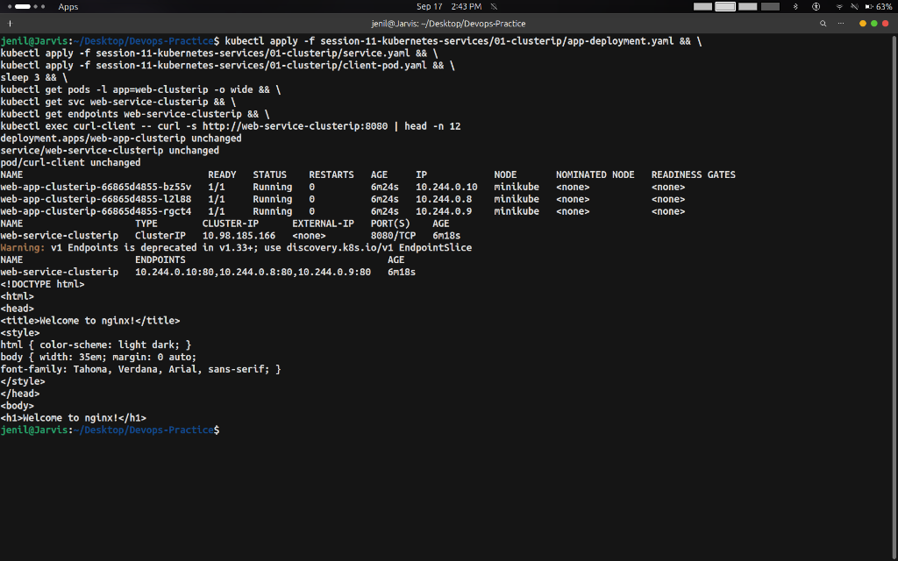
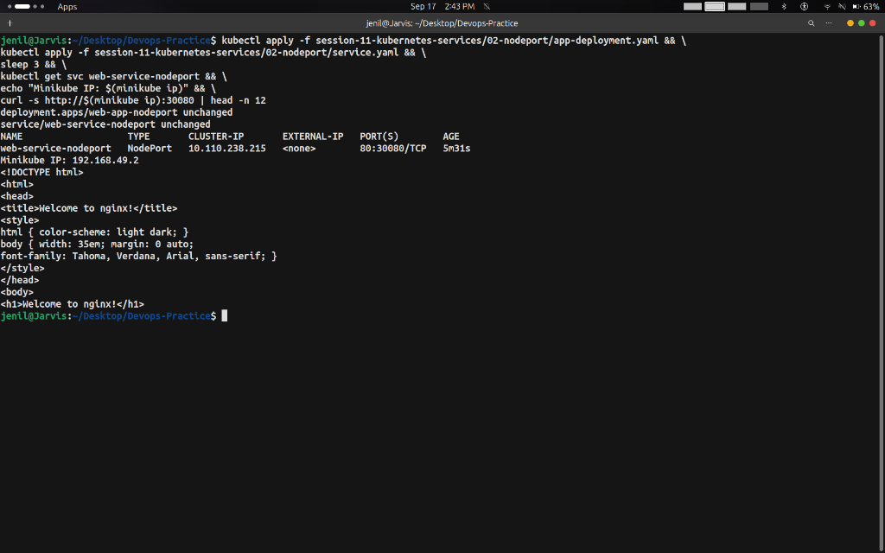
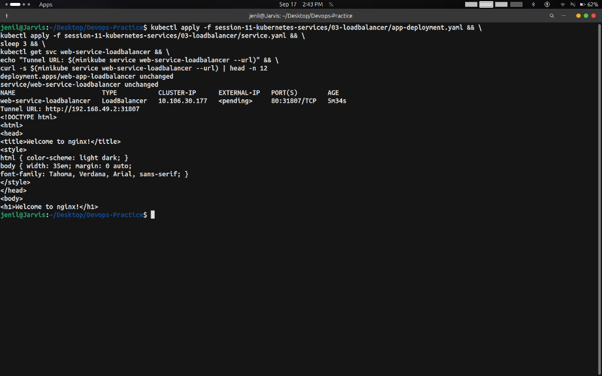
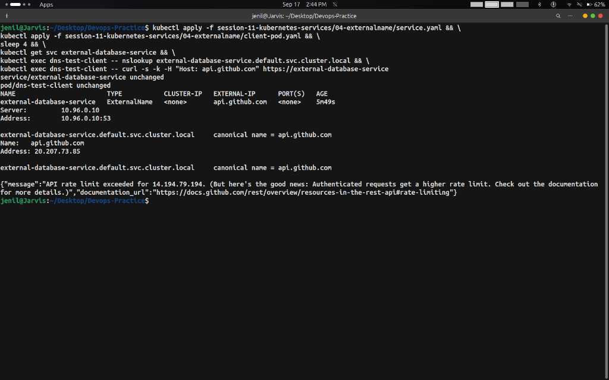
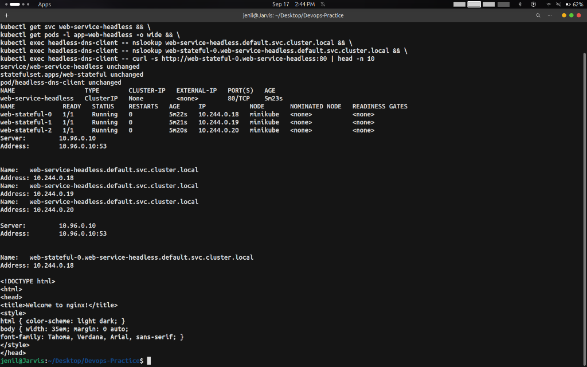
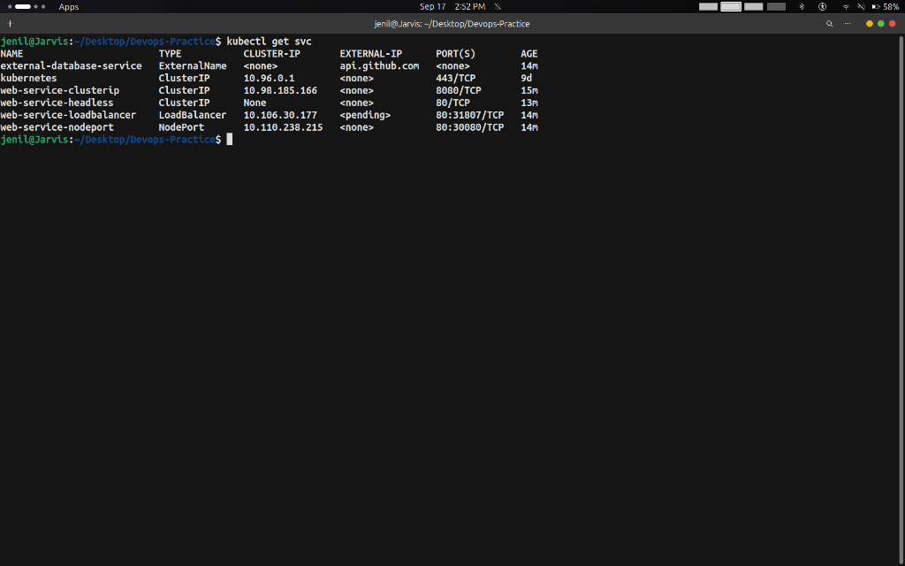

# Session 11: Kubernetes Services Tasks

- **Name**: Jenil
- **Enrollment No**: 10323
- **Branch**: `task`

---

## Overview

In this session, we explored and implemented all **5 types of Kubernetes Services** to manage internal, external, DNS-based, and direct pod-to-pod networking:

1. **ClusterIP Service** (Default internal microservice VIP)
2. **NodePort Service** (Host-level external entrypoint on high ports)
3. **LoadBalancer Service** (Production public cloud ingress)
4. **ExternalName Service** (Internal DNS CNAME alias to external services)
5. **Headless Service** (`clusterIP: None` for direct pod-to-pod discovery in StatefulSets)

---

## Task 1: ClusterIP Service (`01-clusterip`)

### Description
`ClusterIP` is the default Kubernetes service type. It creates a stable internal Virtual IP (VIP) accessible **only within the Kubernetes cluster**. It load-balances traffic across matching backend pods automatically via `kube-proxy`.

### Manifests Applied
- `01-clusterip/app-deployment.yaml`: Deploys 3 replicas of Nginx.
- `01-clusterip/service.yaml`: Creates `web-service-clusterip` on port `8080` targeting container port `80`.
- `01-clusterip/client-pod.yaml`: Deploys a `curl-client` pod for internal network testing.

### Commands Used
```bash
# 1. Apply Deployment, Service, and Client Pod
kubectl apply -f 01-clusterip/app-deployment.yaml
kubectl apply -f 01-clusterip/service.yaml
kubectl apply -f 01-clusterip/client-pod.yaml

# 2. Inspect Pods, Service, and Endpoints
kubectl get pods -l app=web-clusterip -o wide
kubectl get svc web-service-clusterip
kubectl get endpoints web-service-clusterip

# 3. Test Internal Traffic from Client Pod
kubectl exec curl-client -- curl -s http://web-service-clusterip:8080
kubectl exec curl-client -- curl -s http://10.98.185.166:8080
kubectl exec curl-client -- curl -s http://web-service-clusterip.default.svc.cluster.local:8080
```

### Execution Outputs

1. **Pods Status**:
   ```text
   NAME                                 READY   STATUS    RESTARTS   AGE   IP            NODE
   web-app-clusterip-66865d4855-bz55v   1/1     Running   0          12s   10.244.0.10   minikube
   web-app-clusterip-66865d4855-l2l88   1/1     Running   0          12s   10.244.0.8    minikube
   web-app-clusterip-66865d4855-rgct4   1/1     Running   0          12s   10.244.0.9    minikube
   ```

2. **ClusterIP Service**:
   ```text
   NAME                    TYPE        CLUSTER-IP      EXTERNAL-IP   PORT(S)    AGE
   web-service-clusterip   ClusterIP   10.98.185.166   <none>        8080/TCP   10s
   ```

3. **Endpoints List**:
   ```text
   NAME                    ENDPOINTS                                    AGE
   web-service-clusterip   10.244.0.10:80,10.244.0.8:80,10.244.0.9:80   15s
   ```

4. **Curl Verification**:
   ```html
   <!DOCTYPE html>
   <html>
   <head>
   <title>Welcome to nginx!</title>
   ...
   <h1>Welcome to nginx!</h1>
   <p>If you see this page, the nginx web server is successfully installed and working.</p>
   </html>
   ```

### Task 1 Screenshot


---

## Task 2: NodePort Service (`02-nodeport`)

### Description
`NodePort` exposes an internal service on a dedicated static port across all worker nodes in the cluster (range `30000–32767`). External clients reach the workload using `http://<Node-IP>:<NodePort>`.

### Manifests Applied
- `02-nodeport/app-deployment.yaml`: Deploys 2 replicas of Nginx (`app: web-nodeport`).
- `02-nodeport/service.yaml`: Exposes port `80` externally on NodePort `30080`.

### Commands Used
```bash
# 1. Apply Deployment and Service
kubectl apply -f 02-nodeport/app-deployment.yaml
kubectl apply -f 02-nodeport/service.yaml

# 2. Inspect Service and Node IP
kubectl get svc web-service-nodeport
minikube ip

# 3. Test External Traffic
curl http://$(minikube ip):30080
minikube service web-service-nodeport --url
```

### Execution Outputs

1. **NodePort Service Status**:
   ```text
   NAME                   TYPE       CLUSTER-IP       EXTERNAL-IP   PORT(S)        AGE
   web-service-nodeport   NodePort   10.110.238.215   <none>        80:30080/TCP   8s
   ```

2. **Minikube IP**:
   ```text
   192.168.49.2
   ```

3. **URL Access Result (`http://192.168.49.2:30080`)**:
   ```html
   <!DOCTYPE html>
   <html>
   <head>
   <title>Welcome to nginx!</title>
   ...
   <h1>Welcome to nginx!</h1>
   <p>If you see this page, the nginx web server is successfully installed and working.</p>
   </html>
   ```

### Task 2 Screenshot


---

## Task 3: LoadBalancer Service (`03-loadbalancer`)

### Description
`LoadBalancer` automatically provisions an external cloud load balancer (e.g. AWS ELB/NLB, GCP Load Balancer) in cloud environments. On local Minikube development, traffic is exposed via `minikube service` or `minikube tunnel`.

### Manifests Applied
- `03-loadbalancer/app-deployment.yaml`: Deploys 3 replicas of Nginx (`app: web-loadbalancer`).
- `03-loadbalancer/service.yaml`: Creates `type: LoadBalancer` service on port `80`.

### Commands Used
```bash
# 1. Apply Deployment and Service
kubectl apply -f 03-loadbalancer/app-deployment.yaml
kubectl apply -f 03-loadbalancer/service.yaml

# 2. Inspect Service
kubectl get svc web-service-loadbalancer

# 3. Access Minikube Tunnel / Service URL
minikube service web-service-loadbalancer --url
curl http://192.168.49.2:31807
```

### Execution Outputs

1. **LoadBalancer Service Status**:
   ```text
   NAME                       TYPE           CLUSTER-IP      EXTERNAL-IP   PORT(S)        AGE
   web-service-loadbalancer   LoadBalancer   10.106.30.177   <pending>     80:31807/TCP   10s
   ```

2. **Service Tunnel URL**:
   ```text
   http://192.168.49.2:31807
   ```

3. **Webpage Response**:
   ```html
   <!DOCTYPE html>
   <html>
   <head>
   <title>Welcome to nginx!</title>
   ...
   <h1>Welcome to nginx!</h1>
   <p>If you see this page, the nginx web server is successfully installed and working.</p>
   </html>
   ```

### Task 3 Screenshot


---

## Task 4: ExternalName Service (`04-externalname`)

### Description
`ExternalName` maps an internal Kubernetes service name to an external DNS domain name (CNAME record) without using selectors, pods, or proxying. It creates a seamless alias for external databases (e.g., AWS RDS) or external APIs.

### Manifests Applied
- `04-externalname/service.yaml`: Maps `external-database-service` to `api.github.com`.
- `04-externalname/client-pod.yaml`: Deploys `dns-test-client` pod to verify DNS resolution.

### Commands Used
```bash
# 1. Apply Service and Client Pod
kubectl apply -f 04-externalname/service.yaml
kubectl apply -f 04-externalname/client-pod.yaml

# 2. Verify Service Details
kubectl get svc external-database-service

# 3. Test DNS CNAME Resolution & External API Call
kubectl exec dns-test-client -- nslookup external-database-service.default.svc.cluster.local
kubectl exec dns-test-client -- curl -s -k -H "Host: api.github.com" https://external-database-service
```

### Execution Outputs

1. **ExternalName Service**:
   ```text
   NAME                        TYPE           CLUSTER-IP   EXTERNAL-IP      PORT(S)   AGE
   external-database-service   ExternalName   <none>       api.github.com   <none>    12s
   ```

2. **DNS CNAME Resolution (`nslookup`)**:
   ```text
   Server:         10.96.0.10
   Address:        10.96.0.10:53

   external-database-service.default.svc.cluster.local     canonical name = api.github.com
   Name:   api.github.com
   Address: 20.207.73.85
   ```

3. **External API Response**:
   ```json
   {
     "message": "API rate limit exceeded for 14.194.79.194...",
     "documentation_url": "https://docs.github.com/rest/overview/resources-in-the-rest-api#rate-limiting"
   }
   ```

### Task 4 Screenshot


---

## Task 5: Headless Service (`05-headless`)

### Description
A `Headless Service` (`spec.clusterIP: None`) disables single Virtual IP allocation and `kube-proxy` load balancing. When queried, CoreDNS returns the **list of all individual Pod IPs directly**, allowing direct pod-to-pod addressing required by stateful clustered workloads (Kafka, MongoDB, Redis, PostgreSQL Master-Replica).

### Manifests Applied
- `05-headless/service.yaml`: Creates Headless Service (`clusterIP: None`).
- `05-headless/app-statefulset.yaml`: Deploys a 3-replica `StatefulSet` (`web-stateful-0`, `web-stateful-1`, `web-stateful-2`).
- `05-headless/client-pod.yaml`: Deploys `headless-dns-client` for testing.

### Commands Used
```bash
# 1. Apply Service, StatefulSet, and Client Pod
kubectl apply -f 05-headless/service.yaml
kubectl apply -f 05-headless/app-statefulset.yaml
kubectl apply -f 05-headless/client-pod.yaml

# 2. Inspect Service and Stateful Pods
kubectl get svc web-service-headless
kubectl get pods -l app=web-headless -o wide

# 3. Perform DNS Lookup on Headless Service (All Pod IPs)
kubectl exec headless-dns-client -- nslookup web-service-headless.default.svc.cluster.local

# 4. Perform Direct DNS Lookup for Pod 0
kubectl exec headless-dns-client -- nslookup web-stateful-0.web-service-headless.default.svc.cluster.local

# 5. Direct HTTP Request to Pod 0
kubectl exec headless-dns-client -- curl -s http://web-stateful-0.web-service-headless:80
```

### Execution Outputs

1. **Headless Service Status**:
   ```text
   NAME                   TYPE        CLUSTER-IP   EXTERNAL-IP   PORT(S)   AGE
   web-service-headless   ClusterIP   None         <none>        80/TCP    10s
   ```

2. **StatefulSet Pods**:
   ```text
   NAME             READY   STATUS    RESTARTS   AGE   IP            NODE
   web-stateful-0   1/1     Running   0          25s   10.244.0.18   minikube
   web-stateful-1   1/1     Running   0          20s   10.244.0.19   minikube
   web-stateful-2   1/1     Running   0          15s   10.244.0.20   minikube
   ```

3. **CoreDNS Return for Headless Service (All Pod IPs)**:
   ```text
   Server:         10.96.0.10
   Address:        10.96.0.10:53

   Name:   web-service-headless.default.svc.cluster.local
   Address: 10.244.0.19
   Name:   web-service-headless.default.svc.cluster.local
   Address: 10.244.0.18
   Name:   web-service-headless.default.svc.cluster.local
   Address: 10.244.0.20
   ```

4. **Direct DNS Lookup for Pod 0 (`web-stateful-0`)**:
   ```text
   Server:         10.96.0.10
   Address:        10.96.0.10:53

   Name:   web-stateful-0.web-service-headless.default.svc.cluster.local
   Address: 10.244.0.18
   ```

5. **Direct Curl to Pod 0**:
   ```html
   <!DOCTYPE html>
   <html>
   <head>
   <title>Welcome to nginx!</title>
   ...
   <h1>Welcome to nginx!</h1>
   <p>If you see this page, the nginx web server is successfully installed and working.</p>
   </html>
   ```

### Task 5 Screenshot


---

## Summary Comparison Matrix

| Service Type | Virtual IP Allocated? | Exposing Target | Main Use Case |
| :--- | :--- | :--- | :--- |
| **ClusterIP** | Yes (Internal VIP) | Internal Cluster | Microservice-to-Microservice communication |
| **NodePort** | Yes (Internal VIP + Host Port) | `http://<Node-IP>:30000-32767` | Bare-metal / Dev testing without cloud APIs |
| **LoadBalancer** | Yes (Internal VIP + Cloud LB IP) | External Public IP / DNS | Internet-facing cloud applications |
| **ExternalName** | No (DNS CNAME record only) | External FQDN (e.g. RDS/API) | Referencing outside databases/APIs without code changes |
| **Headless** | **No** (`clusterIP: None`) | Direct Pod IPs & FQDNs | Stateful clustered databases (Kafka, Mongo, Redis) |

---

## All 5 Active Services (`kubectl get svc`)

```bash
kubectl get svc
```

### Output
```text
NAME                        TYPE           CLUSTER-IP       EXTERNAL-IP      PORT(S)        AGE
external-database-service   ExternalName   <none>           api.github.com   <none>         14m
kubernetes                  ClusterIP      10.96.0.1        <none>           443/TCP        9d
web-service-clusterip       ClusterIP      10.98.185.166    <none>           8080/TCP       15m
web-service-headless        ClusterIP      None             <none>           80/TCP         13m
web-service-loadbalancer    LoadBalancer   10.106.30.177    <pending>        80:31807/TCP   14m
web-service-nodeport        NodePort       10.110.238.215   <none>           80:30080/TCP   14m
```

### All Services Screenshot


