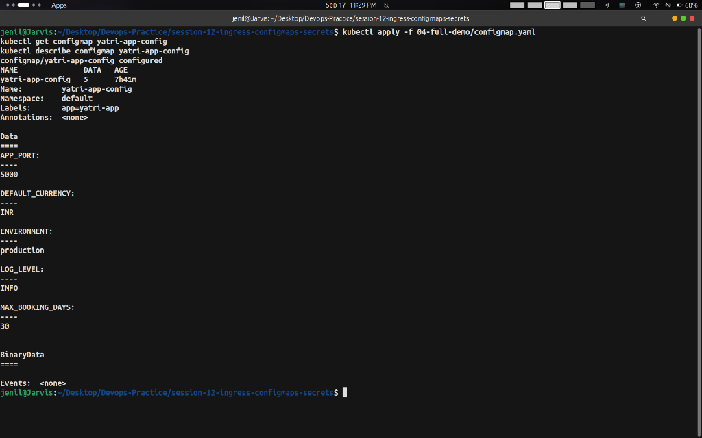
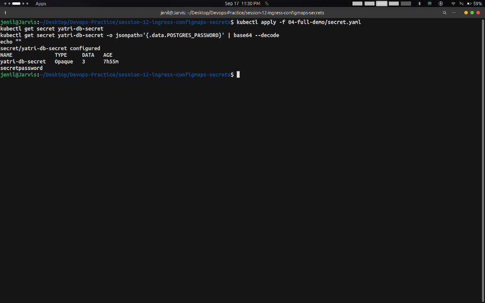
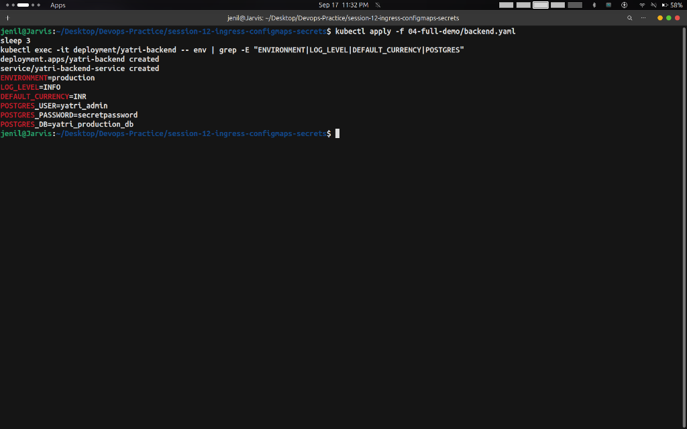
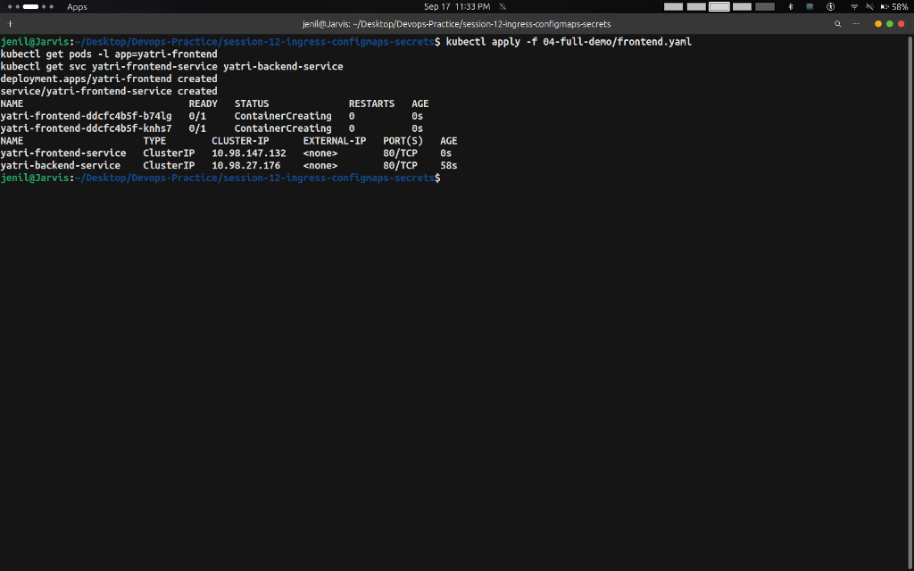
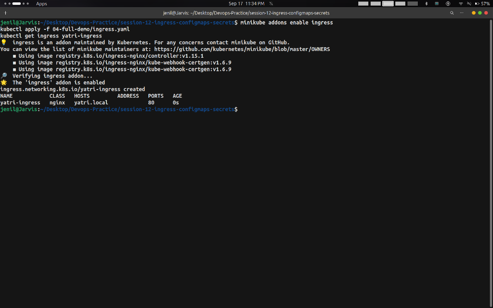
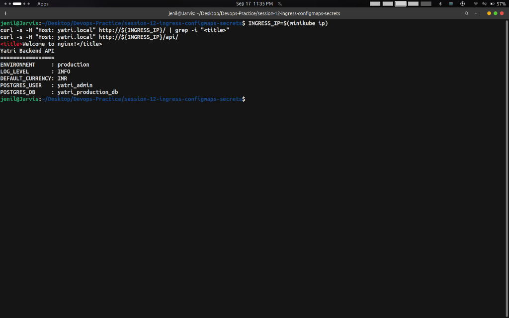

# Session 12 Task: Kubernetes Ingress, ConfigMaps & Secrets — Hands-on Output Report

- **Student Name:** Jenil
- **Session:** Session 12 — Kubernetes Ingress, ConfigMaps & Secrets

---

## Overview

This report documents the hands-on implementation of **Kubernetes Configuration & Networking**:
1. **ConfigMaps**: Managing non-sensitive environment configuration.
2. **Secrets**: Storing base64-encoded credentials (PostgreSQL user/password).
3. **Application Deployments**: Injecting ConfigMaps and Secrets into application workloads.
4. **Ingress Controller**: Routing external HTTP traffic (`/` and `/api/`) via a single entrypoint with host-based rules.

---

## Part 1: ConfigMap — Storing Plain-Text Configuration

### Commands Executed
```bash
kubectl apply -f 04-full-demo/configmap.yaml
kubectl get configmap yatri-app-config
kubectl describe configmap yatri-app-config
```

### Output Screenshot


---

## Part 2: Secret — Storing Sensitive Database Credentials

### Commands Executed
```bash
kubectl apply -f 04-full-demo/secret.yaml
kubectl get secret yatri-db-secret
kubectl get secret yatri-db-secret -o jsonpath='{.data.POSTGRES_PASSWORD}' | base64 --decode
```

### Output Screenshot


---

## Part 3: Deploy Backend — Injecting ConfigMap & Secret

### Commands Executed
```bash
kubectl apply -f 04-full-demo/backend.yaml
kubectl exec -it deployment/yatri-backend -- env | grep -E "ENVIRONMENT|LOG_LEVEL|DEFAULT_CURRENCY|POSTGRES"
```

### Output Screenshot


---

## Part 4: Deploy Frontend & Verify ClusterIP Services

### Commands Executed
```bash
kubectl apply -f 04-full-demo/frontend.yaml
kubectl get pods -l app=yatri-frontend
kubectl get svc yatri-frontend-service yatri-backend-service
```

### Output Screenshot


---

## Part 5: NGINX Ingress Controller & Routing Rules

### Commands Executed
```bash
minikube addons enable ingress
kubectl apply -f 04-full-demo/ingress.yaml
kubectl get ingress yatri-ingress
```

### Output Screenshot


---

## Part 6: Test Ingress Routing (`/` and `/api/`)

### Commands Executed
```bash
INGRESS_IP=$(minikube ip)
curl -s -H "Host: yatri.local" http://${INGRESS_IP}/ | grep -i "<title>"
curl -s -H "Host: yatri.local" http://${INGRESS_IP}/api/
```

### Output Screenshot


---

## Key Takeaways

1. **ConfigMaps**: Decouple configuration artifacts from container image content.
2. **Secrets**: Store confidential data; values are masked in `kubectl describe` but require RBAC as base64 is encoding, not encryption.
3. **Ingress**: Acts as a Layer 7 HTTP/HTTPS reverse proxy, routing multiple path rules (`/` and `/api/`) behind a single IP address.
