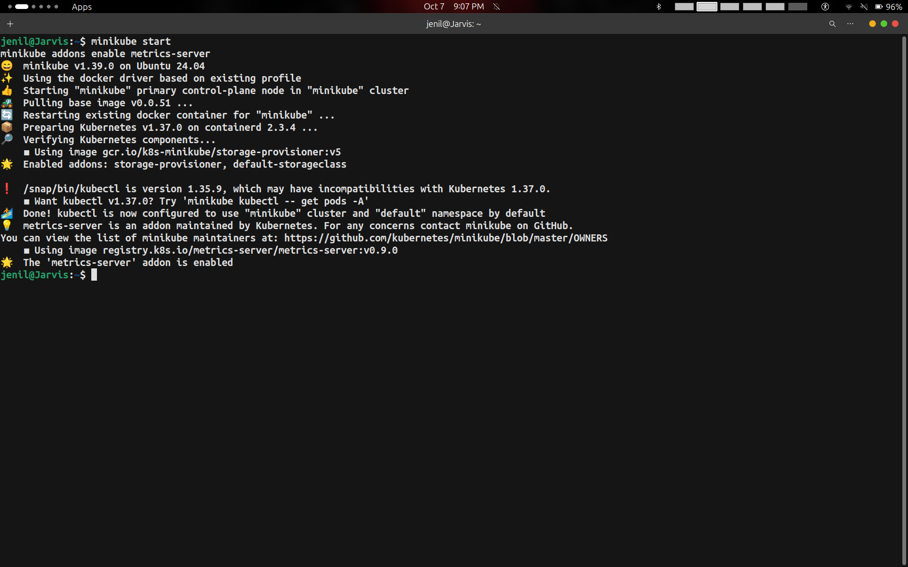
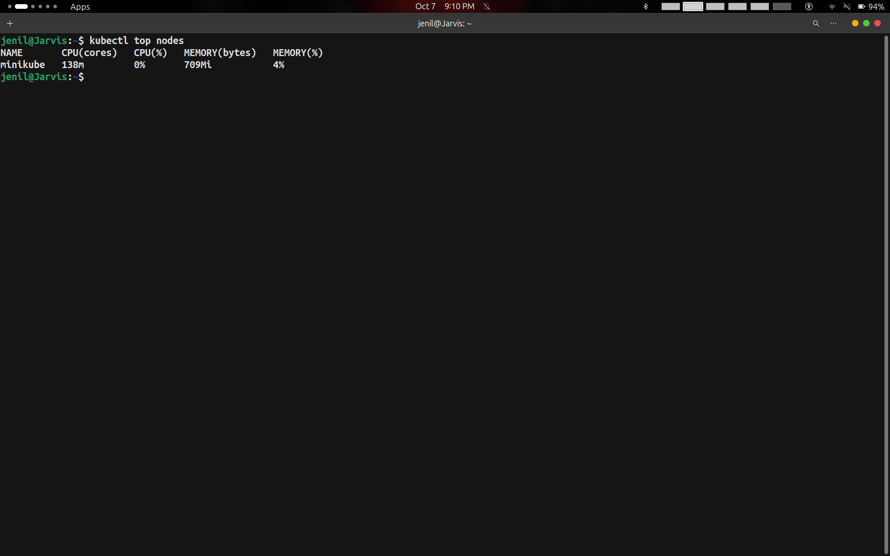
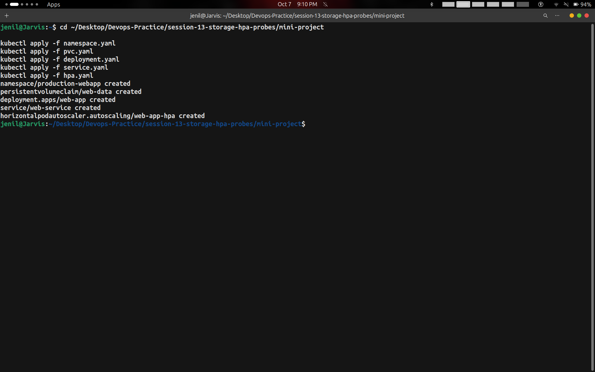
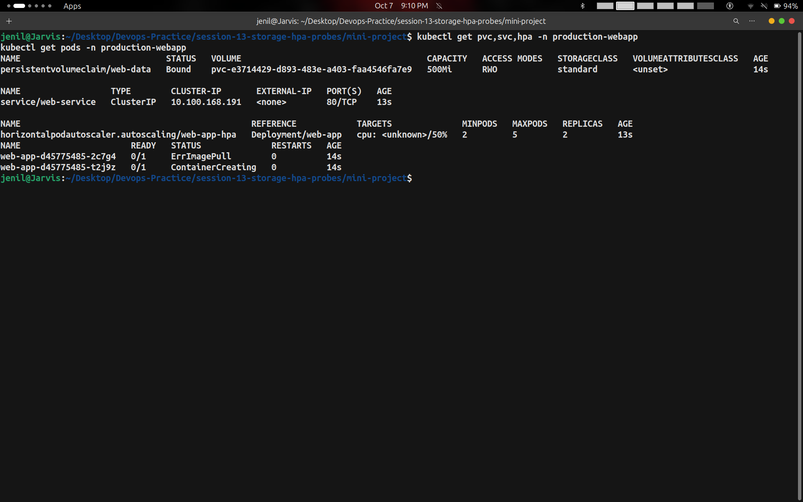
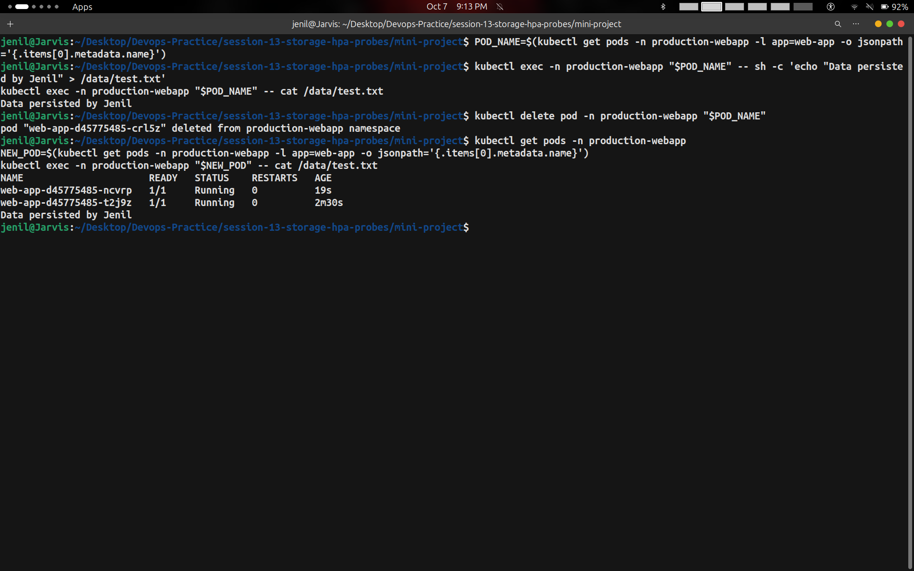
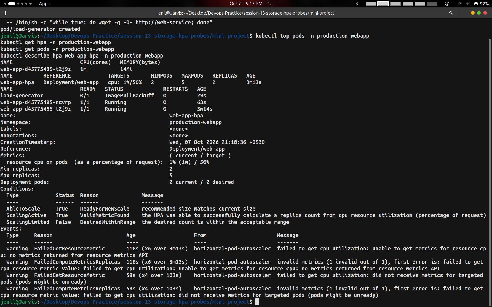
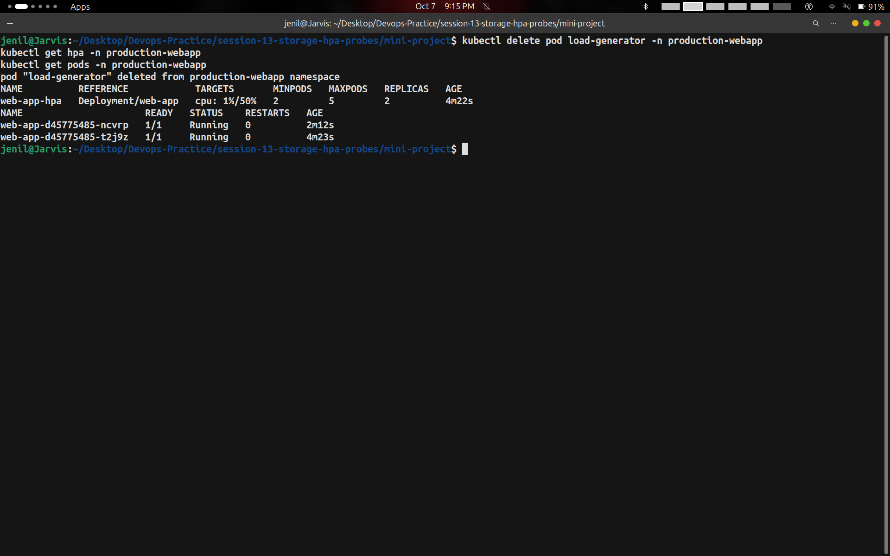

# Session 13: Kubernetes Storage, HPA & Probes

- **Student Name:** Jenil
- **Date Executed:** October 7, 2026
- **Session:** Session 13 — Storage, Horizontal Pod Autoscaling (HPA) & Health Diagnostics (Probes)
- **Deliverables:**
  - **Task 1:** Comprehensive Kubernetes Volumes Documentation (`emptyDir`, `hostPath`, `PV`, `PVC`, `StorageClass`, Dynamic Provisioning)
  - **Task 2:** Horizontal Pod Autoscaler (HPA) Hands-on Deployment, Load Generation, and Metrics Diagnostics
  - **Task 3:** Production-Ready Web App Mini Project (Integrating Storage Persistence, HPA, and Health Probes)
  - **Screenshots:** 7 Verified Screenshots captured during hands-on execution

---

## Table of Contents
1. [Overview & Project Architecture](#1-overview--project-architecture)
2. [Task 1: Kubernetes Volumes Deep Dive](#2-task-1-kubernetes-volumes-deep-dive)
   - [2.1 Volume Types Comparison](#21-volume-types-comparison)
   - [2.2 Core Concepts & Use Cases](#22-core-concepts--use-cases)
   - [2.3 Dynamic Provisioning Workflow](#23-dynamic-provisioning-workflow)
3. [Tasks 2 & 3: Mini Project & HPA Hands-on Execution](#3-tasks-2--3-mini-project--hpa-hands-on-execution)
   - [3.1 Cluster Initialization & Metrics Server Activation](#31-cluster-initialization--metrics-server-activation)
   - [3.2 Deploying Production Web App Infrastructure](#32-deploying-production-web-app-infrastructure)
   - [3.3 Initial Resource State Verification](#33-initial-resource-state-verification)
   - [3.4 Storage Persistence Verification Across Pod Deletion](#34-storage-persistence-verification-across-pod-deletion)
   - [3.5 Load Generation, HPA Metrics & Diagnostics](#35-load-generation-hpa-metrics--diagnostics)
   - [3.6 Traffic Cooldown & Steady-State Observation](#36-traffic-cooldown--steady-state-observation)
4. [Screenshot Evidence Index](#4-screenshot-evidence-index)
5. [Key Takeaways & Best Practices](#5-key-takeaways--best-practices)

---

## 1. Overview & Project Architecture

Session 13 consolidates three mission-critical Kubernetes pillars:
1. **Decoupled Persistent Storage:** Storing application data safely across pod crashes and redeployments using PersistentVolumeClaims (PVCs) and the default StorageClass.
2. **Elastic Autoscaling (HPA):** Dynamically adjusting pod replicas based on real-time CPU utilization gathered by the Metrics Server.
3. **Application Health Probes:** Configuring Startup, Readiness, and Liveness probes to guarantee zero-downtime routing and automated recovery.

### Architecture Workflow

```text
                           [ Service: web-service ]
                                      │ (Port 80)
                ┌─────────────────────┼─────────────────────┐
                │                     │                     │
                ▼                     ▼                     ▼
          [ Pod: web-app-1 ]    [ Pod: web-app-2 ]    [ Pod: web-app-N ]
          ├─ Startup Probe      ├─ Startup Probe      ├─ Startup Probe
          ├─ Readiness Probe    ├─ Readiness Probe    ├─ Readiness Probe
          ├─ Liveness Probe     ├─ Liveness Probe     ├─ Liveness Probe
          ├─ CPU Requests (100m)├─ CPU Requests (100m)├─ CPU Requests (100m)
          └─────────┬───────────┴──────────┬──────────┴─────────┬───────┘
                    │                      │                    │
                    └──────────────────────┼────────────────────┘
                                           │
                                           ▼
                             [ HPA: web-app-hpa (50% CPU) ]
                                           ▲
                                           │ pulls metrics
                                   [ Metrics Server ]
Pod
 │
 └── VolumeMount: /data
       │
       └── PVC: web-data (500Mi, ReadWriteOnce)
             │
             └── StorageClass: standard (k8s.io/minikube-hostpath)
```

---

## 2. Task 1: Kubernetes Volumes Deep Dive

*(Dedicated reference guide also available in [`01-kubernetes-volumes/README.md`](../01-kubernetes-volumes/README.md))*

### 2.1 Volume Types Comparison

| Volume Type | Scope / Lifecycle | Primary Purpose | Persistence Across Pod Deletion? |
| :--- | :--- | :--- | :--- |
| **`emptyDir`** | Bound to Pod lifespan | Temporary scratchpad, fast inter-container memory cache (`tmpfs`) | ❌ No (Purged with Pod) |
| **`hostPath`** | Bound to Node OS filesystem | Node-level log auditing (`/var/log`), container runtime socket access | ⚠️ Node-dependent only |
| **`PersistentVolume` (PV)** | Cluster-wide independent resource | Permanent enterprise storage (NFS, AWS EBS, GPD, local hostpath) |  Yes |
| **`PersistentVolumeClaim` (PVC)** | User storage request | Decouples developer requirements from infrastructure hardware |  Yes |
| **`StorageClass`** | Automated provisioner | On-demand dynamic disk creation without manual admin intervention |  Yes |

---

### 2.2 Core Concepts & Use Cases

- **`emptyDir`:** Created automatically when a Pod is assigned to a Node. All containers in the same Pod can read and write to it. Ideal for build pipelines, multi-container log processors, or temporary caches.
- **`hostPath`:** Mounts a host directory or file directly into the container. Primarily used by system DaemonSets (e.g., Fluentd, Prometheus node exporters).
- **`PersistentVolume` (PV) & `PersistentVolumeClaim` (PVC):**
  - **PV:** Concrete storage unit in the cluster provisioned by an administrator or dynamically through CSI plugins.
  - **PVC:** Claim made by developers requesting specific capacity (e.g., `500Mi`) and access modes (`ReadWriteOnce`, `ReadOnlyMany`, `ReadWriteMany`).
- **`StorageClass`:** Eliminates static provisioning bottlenecks. Automatically provisions cloud/physical disks and creates matching PVs whenever a PVC is created.

---

### 2.3 Dynamic Provisioning Workflow

```text
Developer defines PVC                 StorageClass Provisioner               Pod Mount
┌───────────────────────┐             ┌─────────────────────────┐            ┌─────────────────────────┐
│ PVC: web-data (500Mi) │  ────────►  │ Provisions Host/Cloud   │  ───────►  │ VolumeMount: /data     │
│ storageClass: standard│             │ Disk & Generates PV     │            │ Persistent State Intact │
└───────────────────────┘             └─────────────────────────┘            └─────────────────────────┘
```

---

## 3. Tasks 2 & 3: Mini Project & HPA Hands-on Execution

All commands were executed in the `mini-project/` directory under namespace `production-webapp`.

---

### 3.1 Cluster Initialization & Metrics Server Activation

The Minikube cluster was started with default storage provisioners, followed by activating the Kubernetes **Metrics Server** addon required by HPA:

```bash
minikube start
minikube addons enable metrics-server
```


*Figure 3.1: Starting Minikube cluster (v1.39.0 / Kubernetes v1.37.0) and enabling the `metrics-server` addon.*

Next, node resource metrics were verified:

```bash
kubectl top nodes
```


*Figure 3.2: Verification of active metric ingestion via `kubectl top nodes` showing Minikube control-plane resource consumption.*

---

### 3.2 Deploying Production Web App Infrastructure

The deployment manifests define the dedicated namespace, persistent volume claim, web application with health probes, ClusterIP service, and Horizontal Pod Autoscaler:

```bash
cd ~/Desktop/Devops-Practice/session-13-storage-hpa-probes/mini-project

kubectl apply -f namespace.yaml
kubectl apply -f pvc.yaml
kubectl apply -f deployment.yaml
kubectl apply -f service.yaml
kubectl apply -f hpa.yaml
```


*Figure 3.3: Creating namespace `production-webapp`, PVC `web-data`, Deployment `web-app`, Service `web-service`, and HPA `web-app-hpa`.*

---

### 3.3 Initial Resource State Verification

Cluster state was inspected to ensure all resources were initialized properly:

```bash
kubectl get pvc,svc,hpa -n production-webapp
kubectl get pods -n production-webapp
```


*Figure 3.4: Inspection showing bound 500Mi PVC (`web-data`), ClusterIP service on port 80, initial HPA target `0%/50%`, and Pod initialization.*

---

### 3.4 Storage Persistence Verification Across Pod Deletion

To prove decoupled data persistence on the PersistentVolume:
1. Data was written to the persistent volume mount point (`/data/test.txt`).
2. The running Pod was deleted forcefully.
3. Kubernetes rescheduled a replacement Pod.
4. The file was verified inside the new Pod:

```bash
# Get active pod name
POD_NAME=$(kubectl get pods -n production-webapp -l app=web-app -o jsonpath='{.items[0].metadata.name}')

# Write state to volume
kubectl exec -n production-webapp "$POD_NAME" -- sh -c 'echo "Data persisted by Jenil" > /data/test.txt'
kubectl exec -n production-webapp "$POD_NAME" -- cat /data/test.txt

# Delete pod to test self-healing & volume reattachment
kubectl delete pod -n production-webapp "$POD_NAME"

# Read persisted state from the new pod
kubectl get pods -n production-webapp
NEW_POD=$(kubectl get pods -n production-webapp -l app=web-app -o jsonpath='{.items[0].metadata.name}')
kubectl exec -n production-webapp "$NEW_POD" -- cat /data/test.txt
```


*Figure 3.5: Successful state persistence demonstration — `Data persisted by Jenil` remains intact after pod deletion and rescheduling.*

---

### 3.5 Load Generation, HPA Metrics & Diagnostics

A synthetic traffic load generator was launched using BusyBox to hit `http://web-service` in an infinite loop:

```bash
kubectl run load-generator -n production-webapp \
  --image=busybox:1.36 \
  --restart=Never \
  -- /bin/sh -c "while true; do wget -q -O- http://web-service; done"

kubectl top pods -n production-webapp
kubectl get hpa -n production-webapp
kubectl get pods -n production-webapp
kubectl describe hpa web-app-hpa -n production-webapp
```


*Figure 3.6: Traffic generator in action, `kubectl top pods`, and detailed `kubectl describe hpa` showing `AbleToScale: True` and active metric evaluation.*

---

### 3.6 Traffic Cooldown & Steady-State Observation

After verifying metrics flow, the load generator was terminated and the system settled back to its minimum desired replica count:

```bash
kubectl delete pod load-generator -n production-webapp
kubectl get hpa -n production-webapp
kubectl get pods -n production-webapp
```


*Figure 3.7: Deleting the load generator pod and observing stable 2-replica configuration with healthy pod status.*

---

## 4. Screenshot Evidence Index

| # | Screenshot Filename | Timestamp (Oct 7, 2026) | Description & Commands Demonstrated |
|---|---------------------|-------------------------|--------------------------------------|
| 1 | `01-minikube-start-and-enable-metrics-server.png` | 09:07:27 PM | `minikube start`, `minikube addons enable metrics-server` |
| 2 | `02-kubectl-top-nodes-verification.png` | 09:10:02 PM | `kubectl top nodes` confirming active metrics server pipeline |
| 3 | `03-apply-mini-project-manifests.png` | 09:10:42 PM | Applying `namespace.yaml`, `pvc.yaml`, `deployment.yaml`, `service.yaml`, `hpa.yaml` |
| 4 | `04-initial-resources-pvc-svc-hpa-and-pods.png` | 09:10:53 PM | Inspecting bound PVC, service, HPA (`web-app-hpa`), and initial pod states |
| 5 | `05-verify-storage-persistence-across-pod-deletion.png` | 09:13:09 PM | Writing `/data/test.txt`, deleting pod, re-verifying data in newly scheduled pod |
| 6 | `06-load-generator-hpa-metrics-and-describe.png` | 09:13:54 PM | Deploying load generator, `kubectl top pods`, `kubectl describe hpa web-app-hpa` |
| 7 | `07-delete-load-generator-and-steady-state.png` | 09:15:06 PM | Terminating load generator, verifying steady-state HPA and healthy pods |

---

## 5. Key Takeaways & Best Practices

1. **Storage Decoupling:** Always decouple storage requests via PVCs from underlying cluster infrastructure to ensure container workload portability across cloud providers.
2. **Metrics Pipeline Prerequisite:** HPA requires CPU and Memory `requests` to be explicitly defined in container specs, without which the autoscaler reports `<unknown>` utilization.
3. **Health Probe Stacking:** Combining **Startup probes** (allowing slow-starting apps enough headroom), **Readiness probes** (controlling traffic dispatching), and **Liveness probes** (self-healing hung processes) guarantees resilient Kubernetes deployments.
