# Session 14 Task: Kubernetes Troubleshooting — Hands-on Output Report

- **Student Name:** Jenil
- **Session:** Session 14 — Kubernetes Troubleshooting

---

## Overview

This document presents the step-by-step practical execution and output verification for **Kubernetes Troubleshooting**, covering 9 fundamental diagnostic techniques and error scenarios:

1. **`kubectl get`**: Observing workload status across the cluster.
2. **`kubectl describe`**: Inspecting detailed resource metadata, status, and lifecycle events.
3. **`kubectl logs`**: Fetching stdout/stderr logs from application containers.
4. **`kubectl exec`**: Executing commands directly inside active containers for debugging.
5. **`Events`**: Analyzing cluster-level lifecycle events and scheduling logs.
6. **`CrashLoopBackOff`**: Diagnosing and understanding container crash loops.
7. **`ImagePullBackOff`**: Debugging container image retrieval and registry errors.
8. **`Pending Pods`**: Investigating unscheduled pods and resource allocation issues.
9. **`Service & DNS Troubleshooting`**: Diagnosing service endpoint mismatches and cluster DNS lookup failures.

---

## Part 1: `kubectl get` — Quick Resource Observation

### Commands Executed
```bash
cd session-14-kubernetes-troubleshooting/01-kubectl-get
kubectl apply -f sample-workload.yaml
kubectl get pods -o wide
```

### Output Screenshot
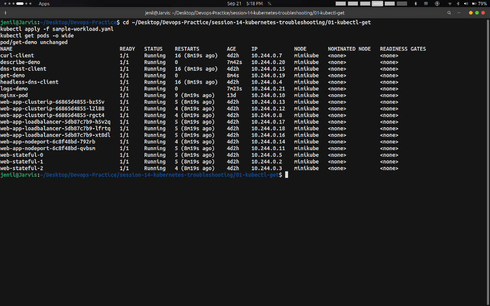

---

## Part 2: `kubectl describe` — Detailed Resource Inspection

### Commands Executed
```bash
cd session-14-kubernetes-troubleshooting/02-kubectl-describe
kubectl apply -f demo-pod.yaml
kubectl describe pod describe-demo
```

### Output Screenshots
#### Pod Specifications & Status
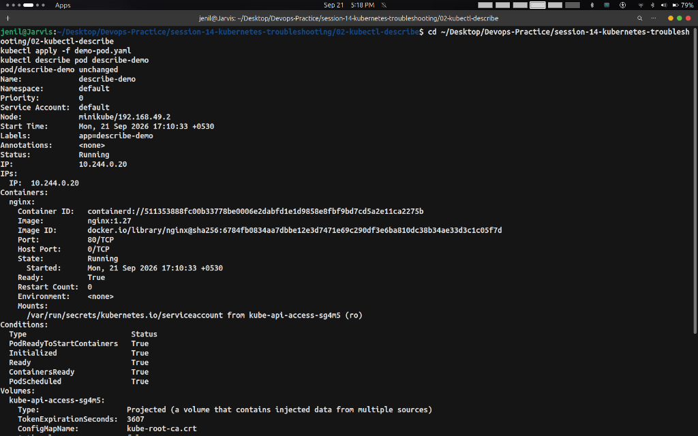

#### Volumes, Tolerations & Lifecycle Events
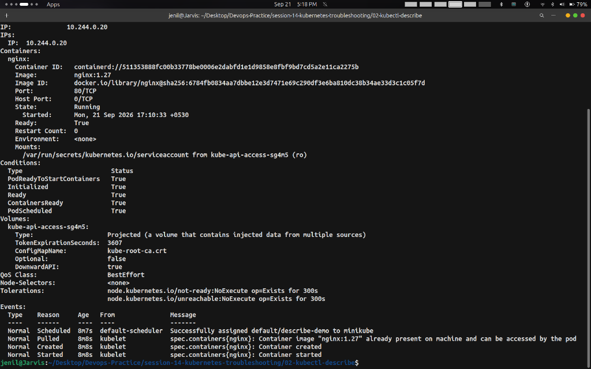

---

## Part 3: `kubectl logs` — Inspecting Container Output

### Commands Executed
```bash
cd session-14-kubernetes-troubleshooting/03-kubectl-logs
kubectl apply -f pod.yaml
kubectl logs logs-demo
```

### Output Screenshot
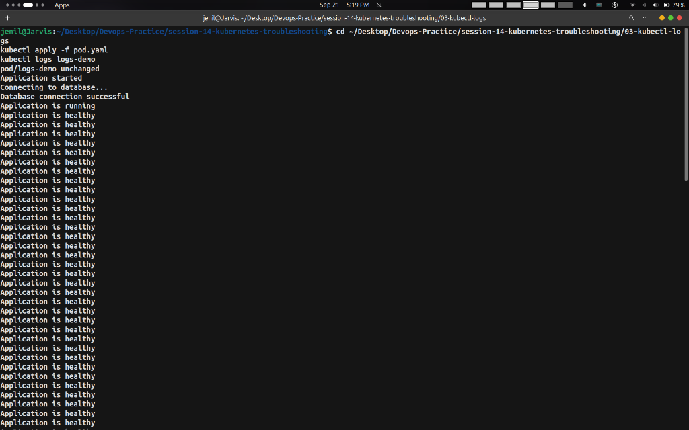

---

## Part 4: `kubectl exec` — Container In-Flight Inspection

### Commands Executed
```bash
cd session-14-kubernetes-troubleshooting/04-kubectl-exec
kubectl apply -f pod.yaml
kubectl exec -it exec-demo -- sh -c "hostname && date"
```

### Output Screenshot
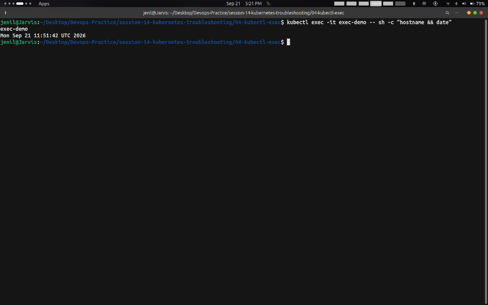

---

## Part 5: `Events` — Cluster Event Inspection

### Commands Executed
```bash
cd session-14-kubernetes-troubleshooting/05-events
kubectl apply -f pod.yaml
kubectl get events --sort-by='.metadata.creationTimestamp'
```

### Output Screenshots
#### Historical Cluster Events
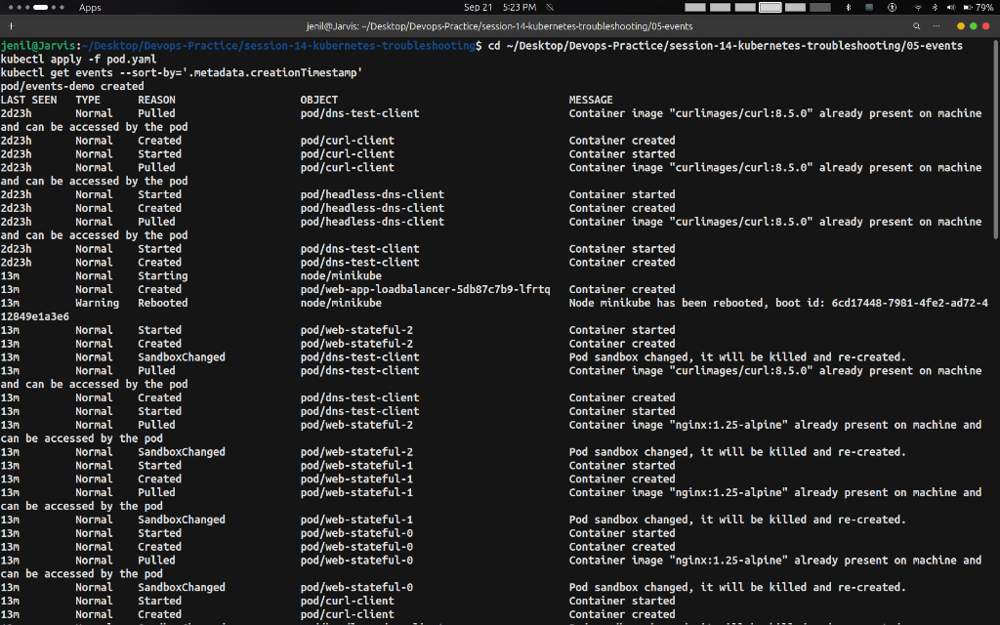

#### Recent Pod Creation & Scheduling Events
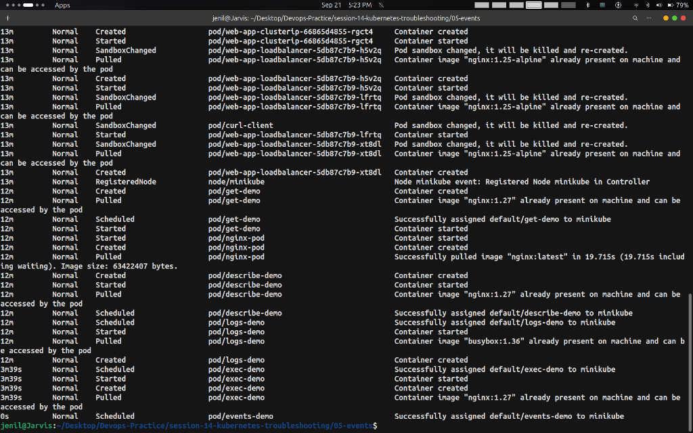

---

## Part 6: `CrashLoopBackOff` — Application Crash Loop Diagnosis

### Commands Executed
```bash
cd session-14-kubernetes-troubleshooting/06-crashloopbackoff
kubectl apply -f broken-pod.yaml
kubectl get pod crash-demo
kubectl logs crash-demo
```

### Output Screenshot
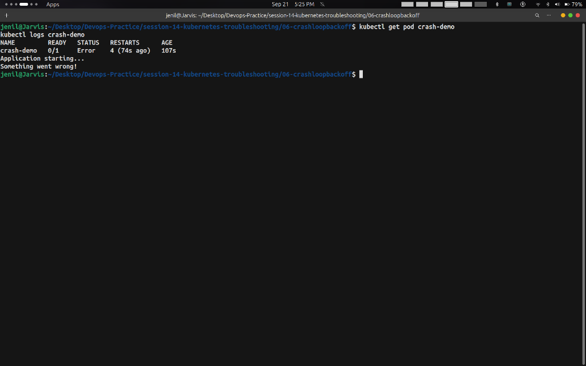

---

## Part 7: `ImagePullBackOff` — Image Retrieval Error Diagnosis

### Commands Executed
```bash
cd session-14-kubernetes-troubleshooting/07-imagepullbackoff
kubectl apply -f broken-pod.yaml
kubectl describe pod image-demo
```

### Output Screenshots
#### Pod Specifications & Non-Existent Image Status
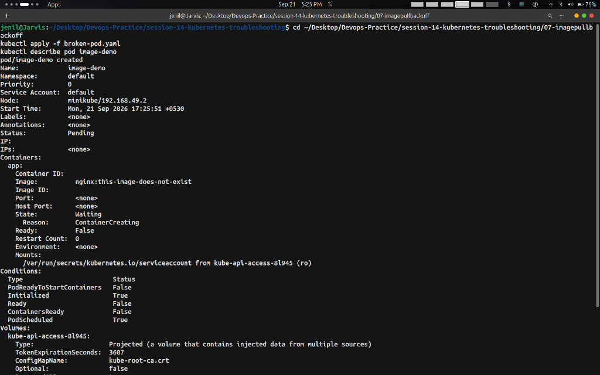

#### Pod Events & Scheduling Log
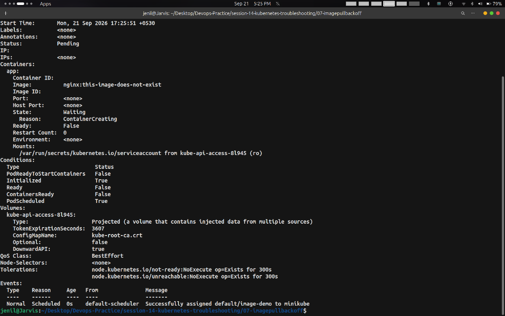

---

## Part 8: `Pending Pods` — Scheduling Failure Diagnosis

### Commands Executed
```bash
cd session-14-kubernetes-troubleshooting/08-pending-pods
kubectl apply -f broken-pod.yaml
kubectl describe pod pending-demo
```

### Output Screenshot
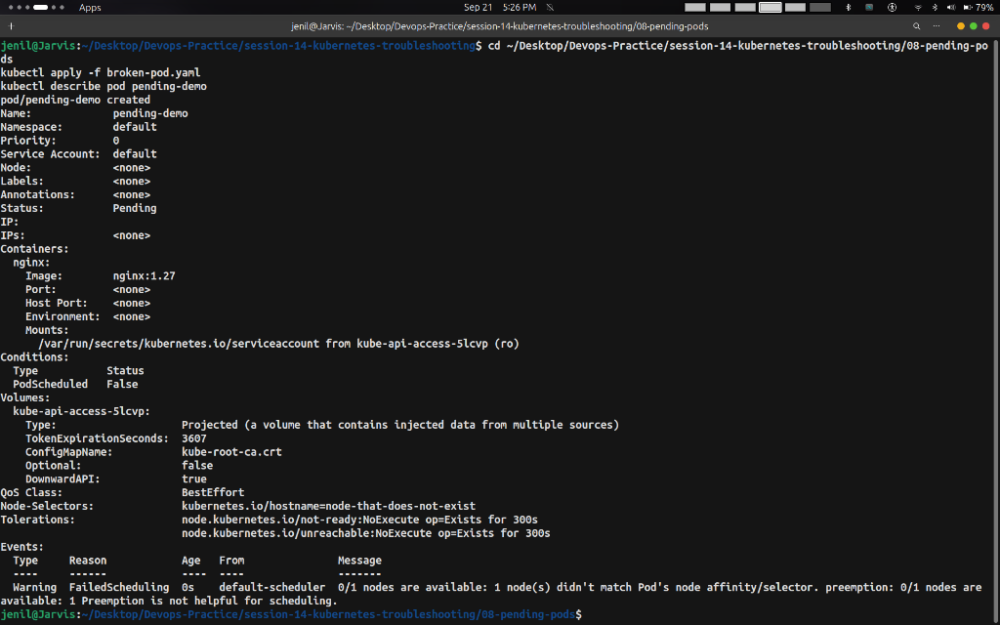

---

## Part 9: `Service & DNS Troubleshooting` — Endpoint & DNS Verification

### Commands Executed
```bash
cd session-14-kubernetes-troubleshooting/09-service-dns-troubleshooting
kubectl apply -f deployment.yaml
kubectl apply -f broken-service.yaml
kubectl get endpoints broken-service
```

### Output Screenshot
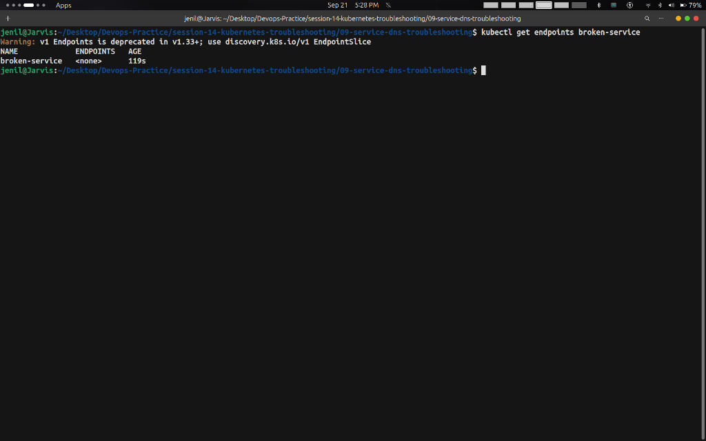
