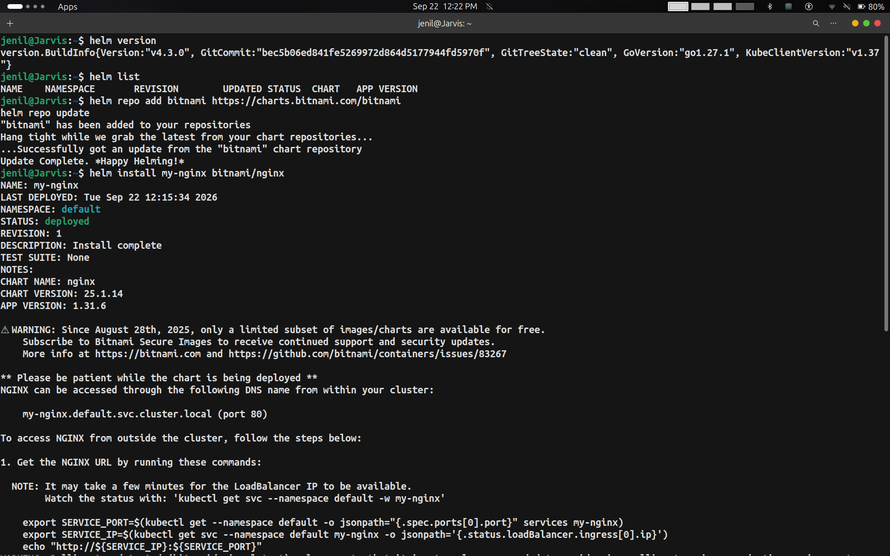
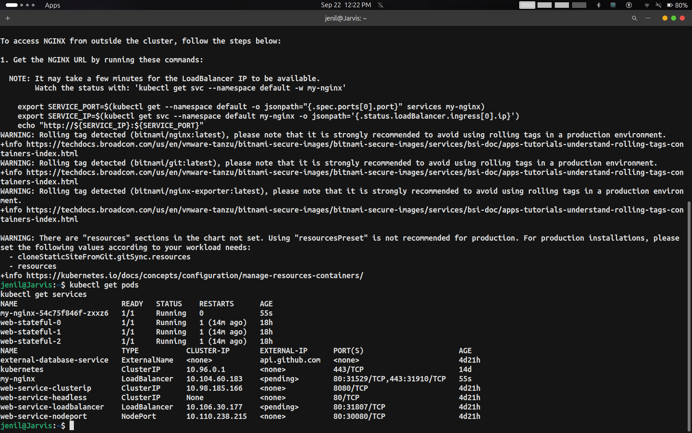
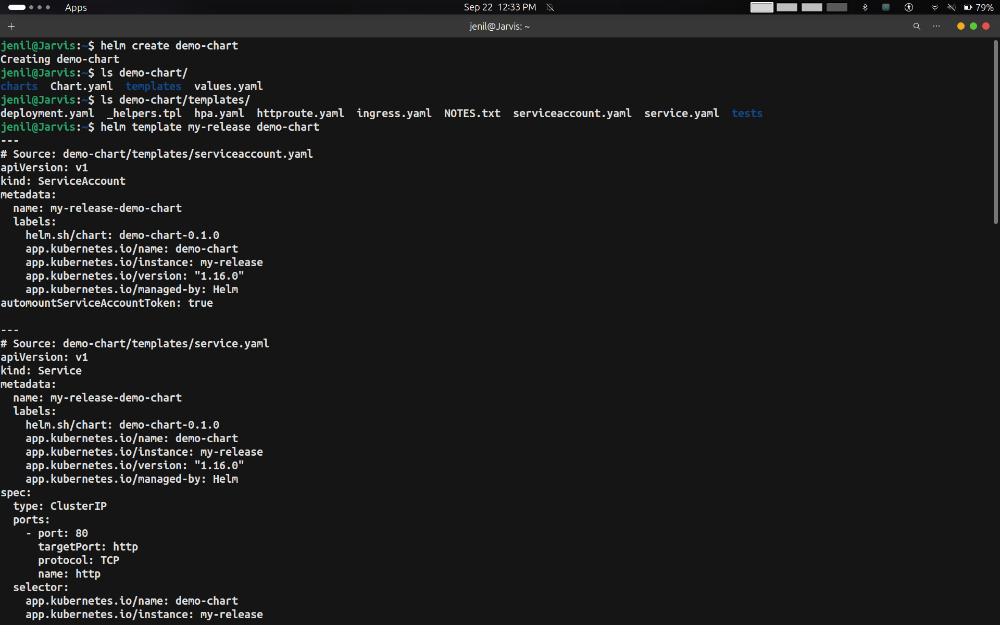
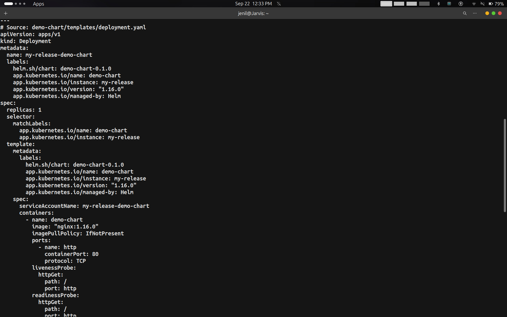
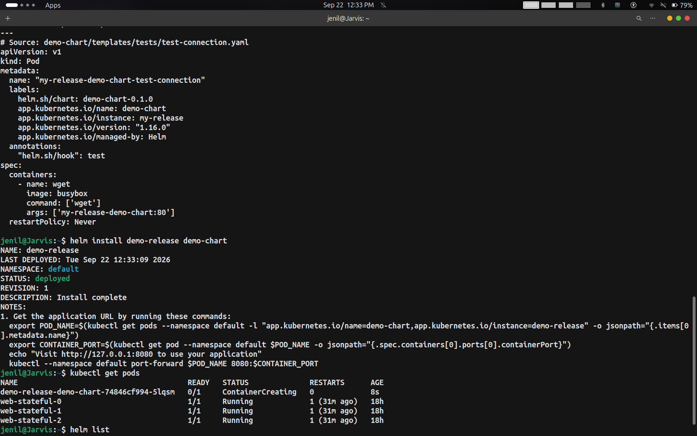
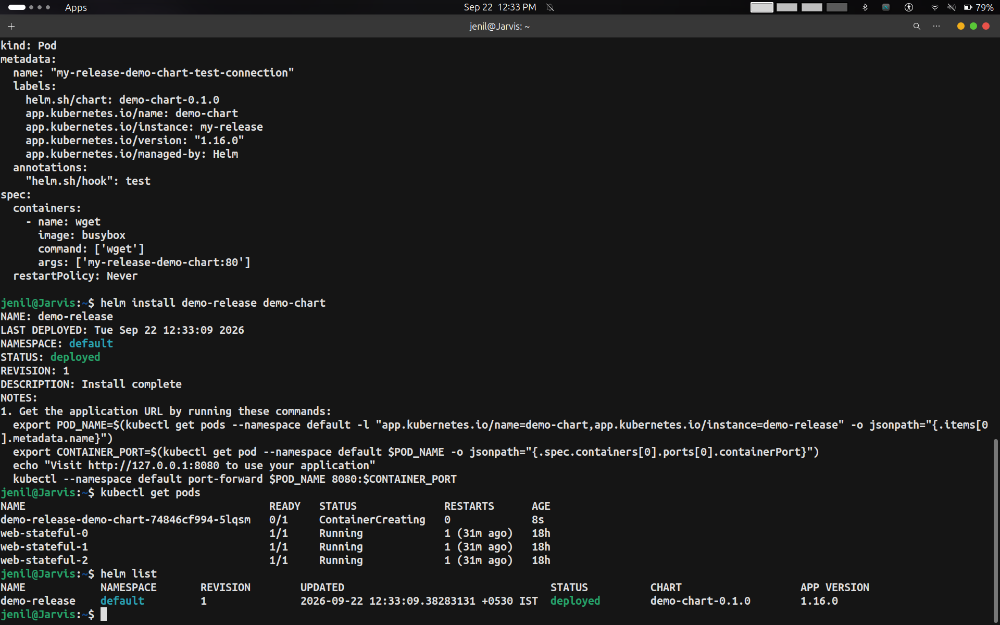
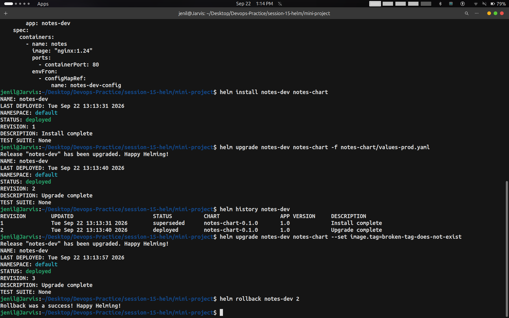
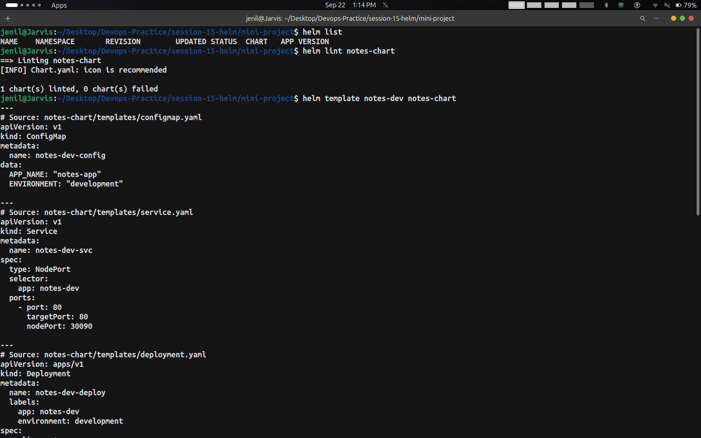
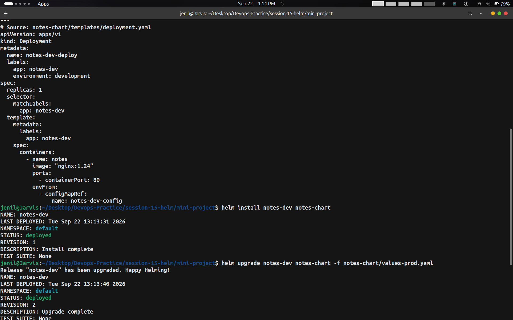

# Session 15: Helm — Hands-on Practice & Mini Project

- **Author / Student:** Jenil
- **Date Executed:** September 22, 2026
- **Session:** Session 15 — Package Management in Kubernetes with Helm
- **Deliverables:**
  - Complete Helm commands demonstration (`create`, `install`, `list`, `status`, `get`, `upgrade`, `history`, `rollback`, `uninstall`, `repo`, `search`)
  - End-to-end Helm rollback workflow (Install → Upgrade → Verify → Broken Upgrade → Rollback → Verify)
  - Helm Mini Project (`notes-chart` with ConfigMaps, Deployments, Services, Multi-environment values)
  - 9 Verified Screenshots captured during hands-on practice

---

## Table of Contents
1. [Overview & Project Structure](#1-overview--project-structure)
2. [Task 1: Helm Commands Hands-on](#2-task-1-helm-commands-hands-on)
   - [2.1 Helm Version & Repository Management (`helm repo`)](#21-helm-version--repository-management-helm-repo)
   - [2.2 Installing Public Charts (`helm install` Bitnami NGINX)](#22-installing-public-charts-helm-install-bitnami-nginx)
   - [2.3 Inspecting Cluster Resources (`kubectl` verification)](#23-inspecting-cluster-resources-kubectl-verification)
   - [2.4 Creating Custom Helm Charts (`helm create`)](#24-creating-custom-helm-charts-helm-create)
   - [2.5 Rendering Manifests Locally (`helm template`)](#25-rendering-manifests-locally-helm-template)
   - [2.6 Deploying Custom Chart & Listing Releases (`helm install` & `helm list`)](#26-deploying-custom-chart--listing-releases-helm-install--helm-list)
   - [2.7 Command Reference Summary (`status`, `get`, `uninstall`, `search`)](#27-command-reference-summary-status-get-uninstall-search)
3. [Task 2: Helm Rollback Workflow](#3-task-2-helm-rollback-workflow)
   - [2.1 Workflow Lifecycle Diagram](#31-workflow-lifecycle-diagram)
   - [2.2 Rollback Execution & Verification](#32-rollback-execution--verification)
4. [Task 3: Helm Mini Project (`notes-chart`)](#4-task-3-helm-mini-project-notes-chart)
   - [4.1 Chart Architecture & Directory Layout](#41-chart-architecture--directory-layout)
   - [4.2 Chart Definition (`Chart.yaml`)](#42-chart-definition-chartyaml)
   - [4.3 Values Files (`values.yaml` vs `values-prod.yaml`)](#43-values-files-valuesyaml-vs-values-prodyaml)
   - [4.4 Kubernetes Templates](#44-kubernetes-templates)
   - [4.5 Linting and Template Validation (`helm lint` & `helm template`)](#45-linting-and-template-validation-helm-lint--helm-template)
   - [4.6 Multi-Environment Deploy & Fault Recovery](#46-multi-environment-deploy--fault-recovery)
5. [Screenshot Evidence Index](#5-screenshot-evidence-index)

---

## 1. Overview & Project Structure

Helm serves as the premier package manager for Kubernetes, packaging multiple related manifests into a single, version-controlled unit known as a **Chart**. By separating declarative templates from variable definitions (`values.yaml`), Helm eliminates duplication across deployment environments, automates release history tracking, and guarantees instantaneous rollbacks.

### Workspace Structure

```text
session-15-helm/
├── README.md
├── 01-what-is-helm/
├── 02-helm-charts/
├── 03-chart-structure/
├── 04-chart-yaml/
├── 05-values-yaml/
├── 06-templates/
├── 07-install-upgrade/
├── 08-rollback/
├── 09-deploying-application/
├── mini-project/
│   ├── README.md
│   └── notes-chart/
│       ├── Chart.yaml
│       ├── values.yaml
│       ├── values-prod.yaml
│       └── templates/
│           ├── configmap.yaml
│           ├── deployment.yaml
│           └── service.yaml
└── task/
    ├── README.md
    └── screenshots/
        ├── 01-helm-version-repo-and-install-bitnami-nginx.png
        ├── 02-nginx-notes-and-kubectl-verification.png
        ├── 03-helm-create-demo-chart-structure-and-template.png
        ├── 04-helm-template-deployment-spec.png
        ├── 05-helm-template-test-and-install-demo-release.png
        ├── 06-demo-release-deployed-and-helm-list.png
        ├── 07-mini-project-helm-lint-and-template.png
        ├── 08-mini-project-helm-install-and-upgrade-prod.png
        └── 09-mini-project-helm-history-broken-upgrade-and-rollback.png
```

---

## 2. Task 1: Helm Commands Hands-on

### 2.1 Helm Version & Repository Management (`helm repo`)

Before deploying charts, Helm must connect to remote artifact registries. The Bitnami repository is added and indexed locally to fetch upstream applications:

```bash
# Check client version
helm version

# Add remote Helm repository
helm repo add bitnami https://charts.bitnami.com/bitnami

# Update repository indexes
helm repo update
```

### 2.2 Installing Public Charts (`helm install` Bitnami NGINX)

Installing a chart deploys an instance ("release") into the Kubernetes cluster:

```bash
helm install my-nginx bitnami/nginx
```


*Figure 2.1: Checking Helm version, adding the Bitnami repo, updating indices, and installing `my-nginx` release.*

---

### 2.3 Inspecting Cluster Resources (`kubectl` verification)

Post-installation notes provide service endpoints and connectivity guidance. The deployment creates a LoadBalancer service and Pods:

```bash
kubectl get pods
kubectl get services
```


*Figure 2.2: Post-install instructions for `my-nginx` and verification of the running Pod and LoadBalancer service.*

---

### 2.4 Creating Custom Helm Charts (`helm create`)

Helm scaffolds complete, idiomatic chart directory structures with the `create` command:

```bash
helm create demo-chart
ls -la demo-chart/
ls -la demo-chart/templates/
```

This generates `Chart.yaml`, `values.yaml`, and templates for Deployments, Services, Ingress, and tests.

---

### 2.5 Rendering Manifests Locally (`helm template`)

`helm template` validates and renders templates locally without interacting with the Kubernetes API server:

```bash
helm template my-release demo-chart
```


*Figure 2.3: `helm create demo-chart`, chart directory inspection, and rendering ServiceAccount/Service manifests.*


*Figure 2.4: Rendered Deployment manifest showing parameterized replicas, image tags, container ports, and probes.*

---

### 2.6 Deploying Custom Chart & Listing Releases (`helm install` & `helm list`)

The rendered chart is installed as release `demo-release`:

```bash
helm install demo-release demo-chart
kubectl get pods
helm list
```


*Figure 2.5: Rendered test connection hook and installation of `demo-release`.*


*Figure 2.6: Active deployment of `demo-release` and release listing (`helm list`) confirming status `deployed`.*

---

### 2.7 Command Reference Summary (`status`, `get`, `uninstall`, `search`)

| Command | Syntax | Purpose / What it Does |
|---------|--------|------------------------|
| `helm create` | `helm create <name>` | Scaffolds a new chart layout with boilerplate templates and values. |
| `helm repo add` | `helm repo add <name> <url>` | Registers an external Helm chart repository. |
| `helm repo update`| `helm repo update` | Synchronizes local cache with the latest remote chart versions. |
| `helm search repo`| `helm search repo <keyword>` | Searches registered repositories for available charts. |
| `helm install` | `helm install <release> <chart>` | Installs a chart into the target Kubernetes cluster. |
| `helm list` | `helm list [-A]` | Lists all deployed Helm releases (or across all namespaces). |
| `helm status` | `helm status <release>` | Displays detailed runtime status, revision, and notes of a release. |
| `helm get all` | `helm get all <release>` | Fetches all rendered values, hooks, and manifests of an active release. |
| `helm upgrade` | `helm upgrade <release> <chart>` | Upgrades a release with updated templates or overridden values. |
| `helm history` | `helm history <release>` | Prints revision history, upgrade timestamps, and descriptions. |
| `helm rollback` | `helm rollback <release> <rev>` | Restores release state and cluster manifests to a specific revision. |
| `helm uninstall`| `helm uninstall <release>` | Deletes all Kubernetes resources associated with the release. |

---

## 3. Task 2: Helm Rollback Workflow

### 3.1 Workflow Lifecycle Diagram

```text
       [1] helm install notes-dev notes-chart
            │ (Revision 1: Dev environment, nginx:1.24, 1 replica)
            ▼
       [2] helm upgrade notes-dev notes-chart -f values-prod.yaml
            │ (Revision 2: Production environment, nginx:1.25, 3 replicas)
            ▼
       [3] helm history notes-dev
            │ (Verify Revision 1 superseded, Revision 2 deployed)
            ▼
       [4] helm upgrade notes-dev notes-chart --set image.tag=broken-tag-does-not-exist
            │ (Revision 3: Simulating failed upgrade / ImagePullBackOff)
            ▼
       [5] helm rollback notes-dev 2
            │ (Rollback to Revision 2)
            ▼
       [6] Cluster restored to healthy Revision 2 state!
```

---

### 3.2 Rollback Execution & Verification

In the mini-project directory, the full rollback lifecycle was performed:

1. **Install Release (Revision 1):**
   ```bash
   helm install notes-dev notes-chart
   ```
   *STATUS: deployed | REVISION: 1 | DESCRIPTION: Install complete*

2. **Upgrade to Production (Revision 2):**
   ```bash
   helm upgrade notes-dev notes-chart -f notes-chart/values-prod.yaml
   ```
   *STATUS: deployed | REVISION: 2 | DESCRIPTION: Upgrade complete*

3. **Check History:**
   ```bash
   helm history notes-dev
   ```

4. **Simulate Broken Upgrade (Revision 3):**
   ```bash
   helm upgrade notes-dev notes-chart --set image.tag=broken-tag-does-not-exist
   ```
   *STATUS: deployed | REVISION: 3 | DESCRIPTION: Upgrade complete (bad image)*

5. **Execute Instant Rollback:**
   ```bash
   helm rollback notes-dev 2
   ```
   *Output: `Rollback was a success! Happy Helming!`*


*Figure 3.1: Complete history audit (`helm history notes-dev`), simulated broken upgrade (`--set image.tag=broken...`), and successful rollback (`helm rollback notes-dev 2`).*

---

## 4. Task 3: Helm Mini Project (`notes-chart`)

### 4.1 Chart Architecture & Directory Layout

The Notes web application is packaged as a custom, lightweight chart located in `session-15-helm/mini-project/notes-chart/`:

```text
notes-chart/
├── Chart.yaml             # Chart metadata
├── values.yaml            # Development values (default)
├── values-prod.yaml       # Production override values
└── templates/
    ├── configmap.yaml     # Application configuration
    ├── deployment.yaml    # Pod deployment spec
    └── service.yaml       # NodePort networking
```

---

### 4.2 Chart Definition (`Chart.yaml`)

```yaml
apiVersion: v2
name: notes-chart
description: A simple Notes application Helm chart
type: application
version: 0.1.0
appVersion: "1.0"
```

---

### 4.3 Values Files (`values.yaml` vs `values-prod.yaml`)

#### Development Values (`values.yaml`):
```yaml
replicaCount: 1

image:
  repository: nginx
  tag: "1.24"

service:
  port: 80
  nodePort: 30090

app:
  name: notes-app
  environment: development
```

#### Production Values (`values-prod.yaml`):
```yaml
replicaCount: 3

image:
  repository: nginx
  tag: "1.25"

service:
  port: 80
  nodePort: 30090

app:
  name: notes-app
  environment: production
```

---

### 4.4 Kubernetes Templates

#### `templates/configmap.yaml`:
```yaml
apiVersion: v1
kind: ConfigMap
metadata:
  name: {{ .Release.Name }}-config
data:
  APP_NAME: {{ .Values.app.name | quote }}
  ENVIRONMENT: {{ .Values.app.environment | quote }}
```

#### `templates/deployment.yaml`:
```yaml
apiVersion: apps/v1
kind: Deployment
metadata:
  name: {{ .Release.Name }}-deploy
  labels:
    app: {{ .Release.Name }}
    environment: {{ .Values.app.environment }}
spec:
  replicas: {{ .Values.replicaCount }}
  selector:
    matchLabels:
      app: {{ .Release.Name }}
  template:
    metadata:
      labels:
        app: {{ .Release.Name }}
    spec:
      containers:
        - name: notes
          image: "{{ .Values.image.repository }}:{{ .Values.image.tag }}"
          ports:
            - containerPort: {{ .Values.service.port }}
          envFrom:
            - configMapRef:
                name: {{ .Release.Name }}-config
```

#### `templates/service.yaml`:
```yaml
apiVersion: v1
kind: Service
metadata:
  name: {{ .Release.Name }}-svc
spec:
  type: NodePort
  selector:
    app: {{ .Release.Name }}
  ports:
    - port: {{ .Values.service.port }}
      targetPort: {{ .Values.service.port }}
      nodePort: {{ .Values.service.nodePort }}
```

---

### 4.5 Linting and Template Validation (`helm lint` & `helm template`)

Before installing, the mini-project chart is validated with `helm lint` and template-rendered:

```bash
helm lint notes-chart
helm template notes-dev notes-chart
```


*Figure 4.1: `helm lint notes-chart` passing (0 failed), and local template rendering of ConfigMap and NodePort Service.*

---

### 4.6 Multi-Environment Deploy & Fault Recovery

The chart was then deployed into development, promoted to production, and verified:

```bash
# 1. Dev deployment (Revision 1)
helm install notes-dev notes-chart

# 2. Production promotion (Revision 2)
helm upgrade notes-dev notes-chart -f notes-chart/values-prod.yaml
```


*Figure 4.2: Completing template render, installing `notes-dev` (Revision 1), and upgrading with `values-prod.yaml` (Revision 2).*

---

## 5. Screenshot Evidence Index

| # | Screenshot Filename | Time Taken (Sep 22, 2026) | Primary Commands Demonstrated |
|---|---------------------|---------------------------|-------------------------------|
| 1 | `01-helm-version-repo-and-install-bitnami-nginx.png` | 12:22:16 PM | `helm version`, `helm list`, `helm repo add bitnami`, `helm repo update`, `helm install my-nginx` |
| 2 | `02-nginx-notes-and-kubectl-verification.png` | 12:22:19 PM | NGINX chart instructions, `kubectl get pods`, `kubectl get services` |
| 3 | `03-helm-create-demo-chart-structure-and-template.png` | 12:33:38 PM | `helm create demo-chart`, directory listing, `helm template` (ServiceAccount, Service) |
| 4 | `04-helm-template-deployment-spec.png` | 12:33:43 PM | `helm template` (Deployment resource with replicas and probes) |
| 5 | `05-helm-template-test-and-install-demo-release.png` | 12:33:50 PM | `helm template` (test hook), `helm install demo-release demo-chart`, `kubectl get pods` |
| 6 | `06-demo-release-deployed-and-helm-list.png` | 12:33:52 PM | `demo-release` deployment complete, `kubectl get pods`, `helm list` |
| 7 | `07-mini-project-helm-lint-and-template.png` | 01:14:12 PM | `helm list`, `helm lint notes-chart`, `helm template notes-dev notes-chart` |
| 8 | `08-mini-project-helm-install-and-upgrade-prod.png` | 01:14:15 PM | `helm template` (Deployment), `helm install notes-dev`, `helm upgrade -f values-prod.yaml` |
| 9 | `09-mini-project-helm-history-broken-upgrade-and-rollback.png` | 01:14:17 PM | `helm history notes-dev`, `helm upgrade --set image.tag=broken...`, `helm rollback notes-dev 2` |

---

## 6. Summary of Learned Competencies

- **Package Architecture:** Understood the distinction between a Chart (package definition), Values (parameter layer), and a Release (deployed runtime instance).
- **Chart Authoring:** Created reusable Helm charts containing Deployments, ConfigMaps, and Services templated using Go templating functions and pipeline operators (`| quote`).
- **Release Lifecycle:** Mastered `helm install`, atomic `helm upgrade`, inspection with `helm history`, and fail-safe recovery via `helm rollback`.
- **Environment Management:** Demonstrated clean separation of environments using base `values.yaml` for development and targeted `-f values-prod.yaml` for production configurations.
