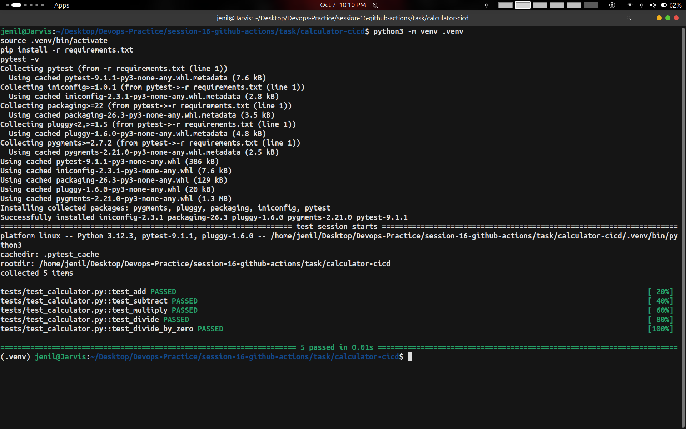
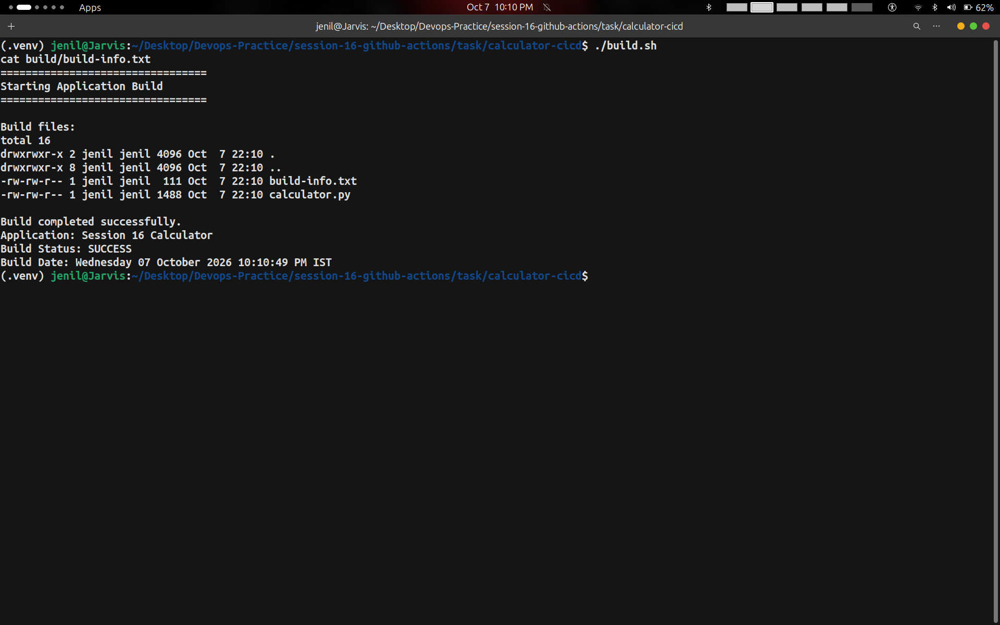
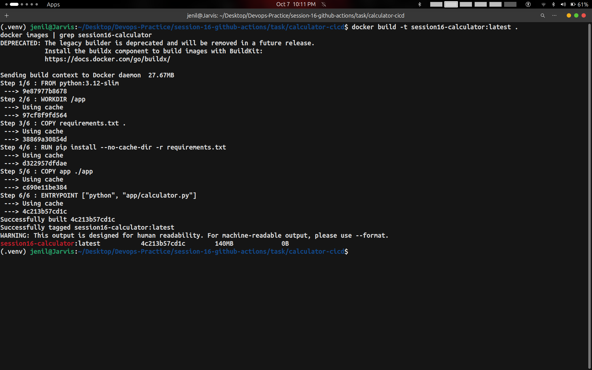
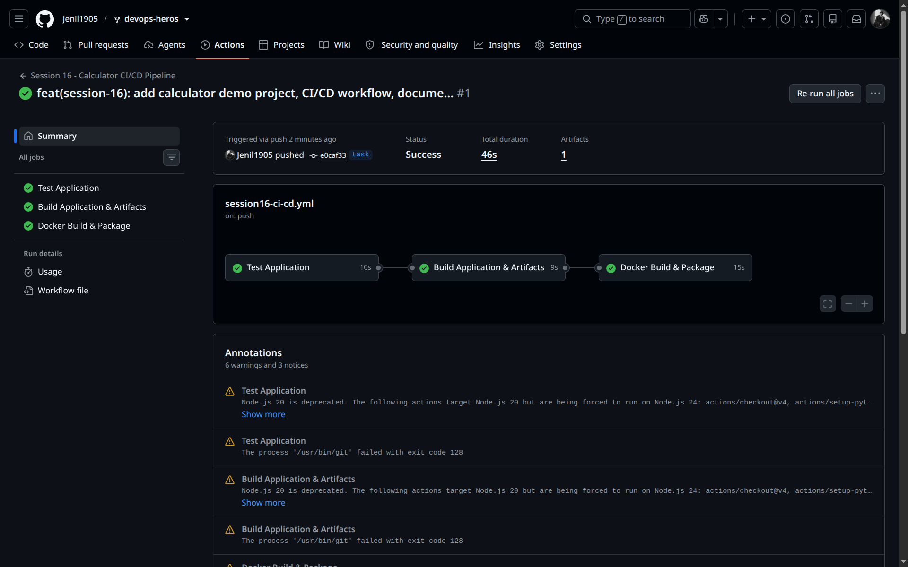

# Session 16: CI/CD & GitHub Actions

- **Student Name:** Jenil
- **Session:** Session 16 — Continuous Integration & Continuous Delivery with GitHub Actions
- **Project:** Calculator Demo CI/CD Pipeline
- **Reference:** `10-final-cicd-pipeline`

---

## Table of Contents
1. [Core Concepts: CI vs CD](#1-core-concepts-ci-vs-cd)
   - [1.1 Continuous Integration (CI)](#11-continuous-integration-ci)
   - [1.2 Continuous Delivery vs Continuous Deployment (CD)](#12-continuous-delivery-vs-continuous-deployment-cd)
   - [1.3 The CI/CD Lifecycle](#13-the-cicd-lifecycle)
2. [GitHub Actions Fundamentals](#2-github-actions-fundamentals)
   - [2.1 Workflows, Events & Triggers](#21-workflows-events--triggers)
   - [2.2 Jobs & Dependency Graph (`needs`)](#22-jobs--dependency-graph-needs)
   - [2.3 Steps & Actions](#23-steps--actions)
   - [2.4 Runners (GitHub-Hosted vs Self-Hosted)](#24-runners-github-hosted-vs-self-hosted)
   - [2.5 Secrets & Contexts](#25-secrets--contexts)
   - [2.6 Build Artifacts (`upload-artifact` & `download-artifact`)](#26-build-artifacts-upload-artifact--download-artifact)
3. [Project Architecture & Directory Layout](#3-project-architecture--directory-layout)
4. [Source Code & Manifests](#4-source-code--manifests)
   - [4.1 Application Logic (`app/calculator.py`)](#41-application-logic-appcalculatorpy)
   - [4.2 Unit Tests (`tests/test_calculator.py`)](#42-unit-tests-teststest_calculatorpy)
   - [4.3 Build Script (`build.sh`)](#43-build-script-buildsh)
   - [4.4 Containerization (`Dockerfile`)](#44-containerization-dockerfile)
   - [4.5 Declarative CI/CD Workflow (`ci-cd.yml`)](#45-declarative-cicd-workflow-ci-cdyml)
5. [Hands-on Execution & Screenshots](#5-hands-on-execution--screenshots)
   - [5.1 Local Verification (Unit Tests)](#51-local-verification-unit-tests)
   - [5.2 Application Build & Artifact Generation](#52-application-build--artifact-generation)
   - [5.3 Container Build Verification](#53-container-build-verification)
   - [5.4 GitHub Actions Cloud Execution](#54-github-actions-cloud-execution)
6. [Summary of Commands](#6-summary-of-commands)

---

## 1. Core Concepts: CI vs CD

### 1.1 Continuous Integration (CI)
Continuous Integration is the software engineering practice where developers frequently commit code changes to a shared repository (often multiple times a day). Every commit triggers an automated build and test pipeline that validates code quality, catches regression bugs early, and ensures that the integration branch remains healthy.

**Key CI Goals:**
- Detect integration issues within minutes of pushing code.
- Prevent broken builds from contaminating the codebase.
- Enforce automated quality gates (unit tests, linters, static checks).

---

### 1.2 Continuous Delivery vs Continuous Deployment (CD)

```text
┌───────────────────────────────────────────────────────────────────────────┐
│                        Continuous Integration (CI)                        │
│           Code Commit  ──►  Automated Build  ──►  Automated Tests         │
└─────────────────────────────────────┬─────────────────────────────────────┘
                                      │
     ┌────────────────────────────────┴────────────────────────────────┐
     ▼                                                                 ▼
┌───────────────────────────────┐               ┌───────────────────────────────┐
│   Continuous Delivery (CD)    │               │  Continuous Deployment (CD)   │
│  Deploy to Staging/Pre-Prod   │               │ Automated Release Directly to │
│               │               │               │          Production           │
│   (Manual Approval Gate)      │               │   (No Human Intervention)     │
│               ▼               │               └───────────────────────────────┘
│      Release to Production    │
└───────────────────────────────┘
```

- **Continuous Delivery:** Automated release preparation. Every build that passes all tests is automatically packaged and deployable to staging, but production deployment requires a manual approval gate.
- **Continuous Deployment:** Full end-to-end automation. Every change that passes test suites is immediately deployed to production without manual sign-off.

---

### 1.3 The CI/CD Lifecycle

```text
Developer ──► Push ──► GitHub Actions ──► Test Job ──► Build Job ──► Docker Package ──► Deployment
```

1. **Code:** Developers implement features and unit tests.
2. **Build:** Automated environment compiles binaries or packages modules.
3. **Test:** Automated test runner executes unit, integration, and security checks.
4. **Package:** Containerizes application using a `Dockerfile`.
5. **Deliver/Deploy:** Publishes container image to registry and deploys to target infrastructure.

---

## 2. GitHub Actions Fundamentals

### 2.1 Workflows, Events & Triggers
A **Workflow** is a configurable automated process defined in YAML files located in `.github/workflows/`.
Workflows run when triggered by GitHub events:
```yaml
on:
  push:
    branches: [main, master]
  pull_request:
    branches: [main, master]
  workflow_dispatch: # Allows manual trigger from GitHub UI
```

---

### 2.2 Jobs & Dependency Graph (`needs`)
A **Job** is a set of steps executed on the same runner. By default, jobs run in **parallel**.
To create sequential execution (e.g., build only after tests pass), use the `needs` keyword:
```yaml
jobs:
  test:
    runs-on: ubuntu-latest
    ...

  build:
    needs: test # Runs only if 'test' passes
    runs-on: ubuntu-latest
    ...

  docker:
    needs: build # Runs only if 'build' passes
    runs-on: ubuntu-latest
    ...
```

---

### 2.3 Steps & Actions
A **Step** is an individual task within a job. Steps execute sequentially and share the same filesystem on the runner.
- **Action:** A reusable standalone command unit (e.g., `actions/checkout@v4`, `actions/setup-python@v5`).
- **Run:** A custom shell command executed directly on the runner (e.g., `pytest -v`, `./build.sh`).

---

### 2.4 Runners
A **Runner** is a virtual server that runs your workflow jobs:
- **GitHub-Hosted Runners:** Fully managed virtual machines provided by GitHub (`ubuntu-latest`, `windows-latest`, `macos-latest`). Automatically cleaned up after each job.
- **Self-Hosted Runners:** Custom machines hosted on your own infrastructure (AWS EC2, local servers) providing full hardware control and customized persistent environments.

---

### 2.5 Secrets & Contexts
Sensitive data like API keys, Docker Hub passwords, and SSH keys must never be hardcoded into Git.
- Configured under **Settings → Secrets and variables → Actions**.
- Referenced securely in workflow YAML:
  ```yaml
  password: ${{ secrets.DOCKERHUB_TOKEN }}
  ```

---

### 2.6 Build Artifacts
Each job in GitHub Actions runs in a fresh, isolated virtual machine. To transfer build outputs between jobs or make them available for download:
- **`actions/upload-artifact@v4`:** Packages files or folders and stores them in GitHub storage.
- **`actions/download-artifact@v4`:** Retrieves previously uploaded artifacts into a downstream job.

---

## 3. Project Architecture & Directory Layout

```text
session-16-github-actions/
└── task/
    ├── README.md
    ├── screenshots/
    │   ├── 01-unit-tests-pytest.png
    │   ├── 02-application-build-and-artifact.png
    │   ├── 03-docker-build-and-image-package.png
    │   └── 04-github-actions-pipeline-run.png
    └── calculator-cicd/
        ├── app/
        │   ├── __init__.py
        │   └── calculator.py
        ├── tests/
        │   └── test_calculator.py
        ├── requirements.txt
        ├── build.sh
        ├── Dockerfile
        └── .github/
            └── workflows/
                └── ci-cd.yml
```

---

## 4. Source Code & Manifests

### 4.1 Application Logic (`app/calculator.py`)
```python
import re

def add(a, b):
    return a + b

def subtract(a, b):
    return a - b

def multiply(a, b):
    return a * b

def divide(a, b):
    if b == 0:
        raise ValueError("Cannot divide by zero")
    return a / b
```

---

### 4.2 Unit Tests (`tests/test_calculator.py`)
```python
import pytest
from app.calculator import add, subtract, multiply, divide

def test_add():
    assert add(10, 5) == 15

def test_subtract():
    assert subtract(10, 5) == 5

def test_multiply():
    assert multiply(10, 5) == 50

def test_divide():
    assert divide(10, 5) == 2

def test_divide_by_zero():
    with pytest.raises(ValueError):
        divide(10, 0)
```

---

### 4.3 Build Script (`build.sh`)
```bash
#!/bin/bash
set -e
echo "================================="
echo "Starting Application Build"
echo "================================="
rm -rf build
mkdir -p build
cp app/calculator.py build/
cat > build/build-info.txt <<EOF
Application: Session 16 Calculator
Build Status: SUCCESS
Build Date: $(date)
EOF
ls -la build
echo "Build completed successfully."
```

---

### 4.4 Containerization (`Dockerfile`)
```dockerfile
FROM python:3.12-slim

WORKDIR /app

COPY requirements.txt .
RUN pip install --no-cache-dir -r requirements.txt

COPY app ./app

ENTRYPOINT ["python", "app/calculator.py"]
```

---

### 4.5 Declarative CI/CD Workflow (`ci-cd.yml`)
```yaml
name: Session 16 - Calculator CI/CD Pipeline

on:
  push:
    paths:
      - 'session-16-github-actions/**'
      - '.github/workflows/session16-ci-cd.yml'
  workflow_dispatch:

defaults:
  run:
    working-directory: session-16-github-actions/task/calculator-cicd

jobs:
  test:
    name: Test Application
    runs-on: ubuntu-latest
    steps:
      - uses: actions/checkout@v4
      - uses: actions/setup-python@v5
        with:
          python-version: "3.12"
      - run: |
          python -m pip install --upgrade pip
          pip install -r requirements.txt
      - run: pytest -v

  build:
    name: Build Application & Artifacts
    needs: test
    runs-on: ubuntu-latest
    steps:
      - uses: actions/checkout@v4
      - uses: actions/setup-python@v5
        with:
          python-version: "3.12"
      - run: |
          chmod +x build.sh
          ./build.sh
      - uses: actions/upload-artifact@v4
        with:
          name: calculator-build
          path: session-16-github-actions/task/calculator-cicd/build/
          retention-days: 7

  docker:
    name: Docker Build & Package
    needs: build
    runs-on: ubuntu-latest
    steps:
      - uses: actions/checkout@v4
      - run: |
          docker build -t session16-calculator:${{ github.sha }} .
          docker tag session16-calculator:${{ github.sha }} session16-calculator:latest
      - run: docker images | grep session16-calculator
```

---

## 5. Hands-on Execution & Screenshots

### 5.1 Local Verification (Unit Tests)

The test suite runs within an isolated Python environment and executes all 5 test assertions:

```bash
cd session-16-github-actions/task/calculator-cicd
source .venv/bin/activate
pip install -r requirements.txt
pytest -v
```


*Figure 5.1: Execution of `pytest -v` verifying all 5 calculator unit tests pass (100% success).*

---

### 5.2 Application Build & Artifact Generation

The automated packaging script generates the release artifacts in `build/`:

```bash
./build.sh
cat build/build-info.txt
```


*Figure 5.2: Build script execution creating release files and writing `build-info.txt` with status `SUCCESS`.*

---

### 5.3 Container Build Verification

Docker encapsulates the application into a portable, lightweight container image:

```bash
docker build -t session16-calculator:latest .
docker images | grep session16-calculator
```


*Figure 5.3: Container build completing successfully and listing `session16-calculator:latest` image.*

---

### 5.4 GitHub Actions Cloud Execution

Upon pushing to GitHub, the workflow triggers automatically, executing the entire CI/CD pipeline on GitHub-hosted runners:


*Figure 5.4: Successful execution of the automated GitHub Actions CI/CD workflow showing all jobs green and the uploaded build artifact.*

---

## 6. Summary of Commands

| Action | Command | Purpose |
| :--- | :--- | :--- |
| **Install Dependencies** | `pip install -r requirements.txt` | Installs pytest and test libraries |
| **Run Tests** | `pytest -v` | Executes test suite with verbose reporting |
| **Run Application** | `python app/calculator.py` | Interactive CLI calculator |
| **Execute Build** | `./build.sh` | Packages build artifacts into `build/` |
| **Build Docker Image** | `docker build -t session16-calculator:latest .` | Creates containerized image |
| **Inspect Image** | `docker images \| grep session16-calculator` | Confirms image registration |
