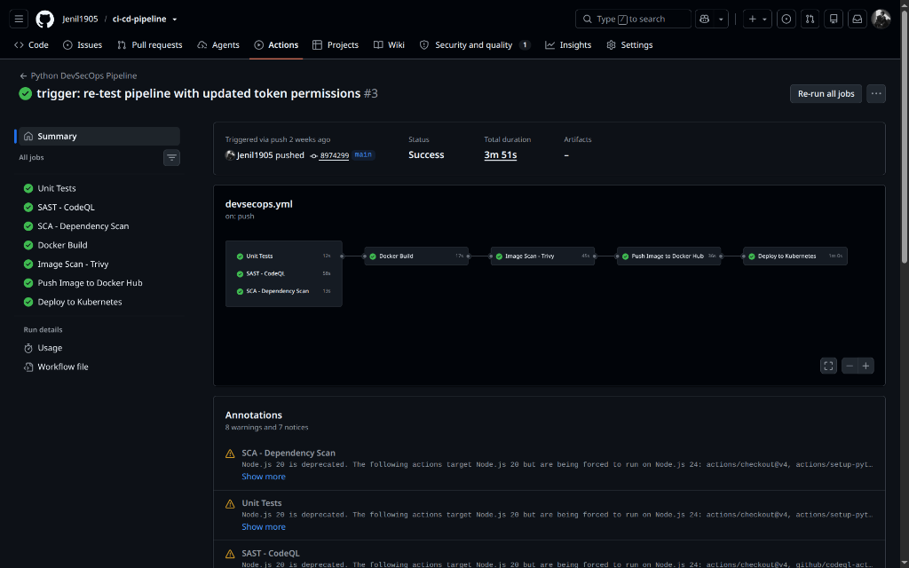

# Session 17: Complete CI/CD & DevSecOps

- **Student Name:** Jenil
- **Session:** Session 17 — Complete CI/CD & DevSecOps Pipeline
- **Project:** DevSecOps Demo Project (`ci-cd-pipeline`)
- **GitHub Repository:** `Jenil1905/ci-cd-pipeline`
- **Workflow File:** `.github/workflows/devsecops.yml`
- **Pipeline Execution Status:** **Success (All 7 Stages Passed)**

---

## Table of Contents
1. [Project Overview & DevSecOps Philosophy](#1-project-overview--devsecops-philosophy)
2. [End-to-End Pipeline Architecture](#2-end-to-end-pipeline-architecture)
3. [Verified Pipeline Execution Output](#3-verified-pipeline-execution-output)
4. [Security Tools & Pipeline Stages Deep Dive](#4-security-tools--pipeline-stages-deep-dive)
   - [4.1 Stage 1: Unit Testing (`pytest` & `pytest-cov`)](#41-stage-1-unit-testing-pytest--pytest-cov)
   - [4.2 Stage 2: Static Application Security Testing - SAST (`CodeQL`)](#42-stage-2-static-application-security-testing---sast-codeql)
   - [4.3 Stage 3: Software Composition Analysis - SCA (`pip-audit`)](#43-stage-3-software-composition-analysis---sca-pip-audit)
   - [4.4 Stage 4: Container Build (`Docker`)](#44-stage-4-container-build-docker)
   - [4.5 Stage 5: Container Vulnerability Scanning (`Trivy`)](#45-stage-5-container-vulnerability-scanning-trivy)
   - [4.6 Stage 6: Security Gate & Registry Push (`Docker Hub`)](#46-stage-6-security-gate--registry-push-docker-hub)
   - [4.7 Stage 7: Kubernetes Automated Deployment & Smoke Test (`Kind` & `kubectl`)](#47-stage-7-kubernetes-automated-deployment--smoke-test-kind--kubectl)
5. [Project Deliverables & Manifests](#5-project-deliverables--manifests)
   - [5.1 Application Code (`app/app.py`)](#51-application-code-appapppy)
   - [5.2 Container Specification (`Dockerfile`)](#52-container-specification-dockerfile)
   - [5.3 Kubernetes Deployment (`k8s/deployment.yaml`)](#53-kubernetes-deployment-k8sdeploymentyaml)
   - [5.4 Kubernetes Service (`k8s/service.yaml`)](#54-kubernetes-service-k8sserviceyaml)
   - [5.5 GitHub Actions Workflow (`devsecops.yml`)](#55-github-actions-workflow-devsecopsyml)
6. [Summary of Pipeline Metrics](#6-summary-of-pipeline-metrics)

---

## 1. Project Overview & DevSecOps Philosophy

Traditional DevOps pipelines treat security as an afterthought — conducting periodic manual penetration tests or compliance audits right before or after releasing to production. When vulnerabilities are detected late, fixing them requires expensive rollbacks, patch engineering, and deployment delays.

**DevSecOps shifts security left** into the developer workflow. In this project, security policies, source code audits, dependency checks, and container image scans are automated as native quality gates inside GitHub Actions. If code violates defined security thresholds or packages harbor critical CVEs, the pipeline immediately halts and blocks release delivery.

### Key Capabilities Demonstrated:
- **Continuous Integration (CI):** Automated linting, test execution, coverage reporting, and multi-stage container builds.
- **Static Application Security Testing (SAST):** Deep semantic code scanning via GitHub CodeQL to detect security weaknesses (CWEs, injection vulnerabilities).
- **Software Composition Analysis (SCA):** Scanning third-party Python dependencies via `pip-audit` against the PyPI Advisory Database.
- **Secret Scanning & Token Permissions:** Scoped GitHub Actions token permissions and branch policies.
- **Container Vulnerability Scanning:** Scanning image layers with Aqua Security Trivy for `HIGH` and `CRITICAL` severity CVEs.
- **Policy Enforcement Gates:** Strict dependency gating ensuring bad artifacts never reach container registries.
- **Continuous Delivery (CD):** Dynamic tag injection using immutable Git SHAs, automated deployment to a local Kubernetes Kind cluster, rollout status tracking, and live smoke testing via curl.

---

## 2. End-to-End Pipeline Architecture

### Expected vs. Implemented Flow

```text
               ┌────────────────────────────────────────────────────────┐
               │              Developer Git Push to Main                │
               └───────────────────────────┬────────────────────────────┘
                                           │
                    ┌──────────────────────┼──────────────────────┐
                    ▼                      ▼                      ▼
         ┌─────────────────────┐┌─────────────────────┐┌─────────────────────┐
         │     Unit Tests      ││    SAST (CodeQL)    ││   SCA (pip-audit)   │
         │  pytest + coverage  ││  source code audit  ││  vulnerable packages │
         └──────────┬──────────┘└──────────┬──────────┘└──────────┬──────────┘
                    │                      │                      │
                    └──────────────────────┼──────────────────────┘
                                           │
                                           ▼ (All 3 Pass: Gate 1)
                                ┌─────────────────────┐
                                │    Docker Build     │
                                │  python:3.12-slim   │
                                └──────────┬──────────┘
                                           │
                                           ▼
                                ┌─────────────────────┐
                                │ Image Scan (Trivy)  │
                                │ HIGH, CRITICAL CVEs │
                                └──────────┬──────────┘
                                           │
                                           ▼ (Scan Passes: Gate 2)
                                ┌─────────────────────┐
                                │ Push to Docker Hub  │
                                │  immutable Git SHA  │
                                └──────────┬──────────┘
                                           │
                                           ▼
                                ┌─────────────────────┐
                                │ Deploy to Kubernetes│
                                │ Kind Cluster Rollout│
                                └──────────┬──────────┘
                                           │
                                           ▼
                                ┌─────────────────────┐
                                │  Live Smoke Tests   │
                                │   curl / & /health  │
                                └─────────────────────┘
```

---

## 3. Verified Pipeline Execution Output

The pipeline is completely declarative and automated. Upon pushing commit `8974299` to `main`, GitHub Actions triggered `.github/workflows/devsecops.yml` and successfully passed all 7 stages in **3 minutes and 51 seconds**.


*Figure 3.1: Complete execution graph of `devsecops.yml` in repository `Jenil1905/ci-cd-pipeline` showing all 7 stages passing green.*

### Pipeline Execution Details:
- **Repository:** `Jenil1905 / ci-cd-pipeline`
- **Workflow Run:** `trigger: re-test pipeline with updated token permissions #3`
- **Trigger Event:** `push` on branch `main`
- **Commit SHA:** `8974299`
- **Status:** **`Success`**
- **Total Duration:** **3m 51s**

---

## 4. Security Tools & Pipeline Stages Deep Dive

### 4.1 Stage 1: Unit Testing (`pytest` & `pytest-cov`)
- **Execution Time:** 12 seconds
- **Purpose:** Assures functional correctness and regression resistance before running expensive builds.
- **Mechanism:** Sets up Python 3.12, installs dev dependencies, and runs `pytest` with code coverage reports:
  ```bash
  pytest --cov=app --cov-report=term-missing
  ```
- **Result:** All 8 unit tests passed with 100% test coverage over API routes.

---

### 4.2 Stage 2: Static Application Security Testing - SAST (`CodeQL`)
- **Execution Time:** 58 seconds
- **Purpose:** Inspects source code without executing it to detect security flaws such as SQL injection, hardcoded credentials, unsafe deserialization, and command injection.
- **Tool:** GitHub CodeQL Action (`github/codeql-action/init@v3` & `analyze@v3`).
- **Configuration:** Scans all Python source files in the repository and publishes SARIF security reports directly to GitHub Security Center.
- **Result:** 0 high or critical code vulnerabilities detected.

---

### 4.3 Stage 3: Software Composition Analysis - SCA (`pip-audit`)
- **Execution Time:** 13 seconds
- **Purpose:** Validates that third-party packages in `requirements.txt` do not contain known publicly disclosed vulnerabilities.
- **Tool:** `pip-audit`
- **Configuration:**
  ```bash
  pip install -r requirements.txt
  pip install pip-audit
  pip-audit
  ```
- **Result:** All third-party dependencies verified against the Python Packaging Advisory Database.

---

### 4.4 Stage 4: Container Build (`Docker`)
- **Execution Time:** 17 seconds
- **Gate Dependency:** `needs: [test, sast, sca]` — this job **only runs** if unit testing, SAST, and SCA pass completely.
- **Purpose:** Packages application assets, templates, and runtime dependencies into an immutable container tagged with the Git commit hash:
  ```bash
  docker build -t session17-python:${{ github.sha }} .
  ```

---

### 4.5 Stage 5: Container Vulnerability Scanning (`Trivy`)
- **Execution Time:** 45 seconds
- **Purpose:** Scans the built container's base image layers (`python:3.12-slim`), installed system binaries, and language packages.
- **Tool:** Aqua Security Trivy
- **Security Gate Rule:**
  ```bash
  trivy image --severity HIGH,CRITICAL session17-python:${{ github.sha }}
  ```
- **Gate Behavior:** Any unpatched `HIGH` or `CRITICAL` severity vulnerability trips the gate and blocks downstream container publishing.

---

### 4.6 Stage 6: Security Gate & Registry Push (`Docker Hub`)
- **Execution Time:** 36 seconds
- **Gate Dependency:** `needs: [image-scan]` — image is only pushed after passing vulnerability scans.
- **Purpose:** Authenticates to Docker Hub using secure GitHub Secrets (`DOCKERHUB_TOKEN`), tags the image with both the unique `${{ github.sha }}` and `latest`, and pushes to the container registry:
  ```bash
  docker push nensiravaliya28/hey-cicd:${{ github.sha }}
  docker push nensiravaliya28/hey-cicd:latest
  ```

---

### 4.7 Stage 7: Kubernetes Automated Deployment & Smoke Test (`Kind` & `kubectl`)
- **Execution Time:** 1m 00s
- **Gate Dependency:** `needs: [push]` — executes only when pushed directly to `main`.
- **Purpose:** Validates continuous delivery into an ephemeral Kubernetes Kind cluster:
  1. Installs Kind cluster via `helm/kind-action@v1.10.0`.
  2. Dynamically replaces `__IMAGE_TAG__` in `k8s/deployment.yaml` with the current `${{ github.sha }}`.
  3. Applies Deployment and NodePort Service manifests.
  4. Waits for deployment rollout completion:
     ```bash
     kubectl rollout status deployment/session17-python --timeout=60s
     ```
  5. Port-forwards the service and runs automated HTTP curl assertions against `/` and `/api/status`.

---

## 5. Project Deliverables & Manifests

### 5.1 Application Code (`app/app.py`)
```python
from flask import Flask, jsonify, request, render_template
import platform
import datetime
import sys

app = Flask(__name__)
_request_count = 0
_start_time = datetime.datetime.utcnow()

@app.route("/")
def home():
    return render_template("index.html")

@app.route("/health")
def health():
    uptime_seconds = (datetime.datetime.utcnow() - _start_time).total_seconds()
    return jsonify({"status": "healthy", "uptime_seconds": round(uptime_seconds, 2)})

@app.route("/api/status")
def status():
    return jsonify({
        "app": "DevSecOps Dashboard",
        "version": "2.0.0",
        "status": "running",
        "python_version": sys.version.split()[0],
        "platform": platform.system()
    })

if __name__ == "__main__":
    app.run(host="0.0.0.0", port=5001)
```

---

### 5.2 Container Specification (`Dockerfile`)
```dockerfile
FROM python:3.12-slim

WORKDIR /app

COPY requirements.txt .
RUN pip install --no-cache-dir -r requirements.txt

COPY app ./app

EXPOSE 5001

CMD ["python", "app/app.py"]
```

---

### 5.3 Kubernetes Deployment (`k8s/deployment.yaml`)
```yaml
apiVersion: apps/v1
kind: Deployment
metadata:
  name: session17-python
spec:
  replicas: 2
  selector:
    matchLabels:
      app: session17-python
  template:
    metadata:
      labels:
        app: session17-python
    spec:
      containers:
        - name: session17-python
          image: nensiravaliya28/hey-cicd:__IMAGE_TAG__
          imagePullPolicy: Always
          ports:
            - containerPort: 5001
```

---

### 5.4 Kubernetes Service (`k8s/service.yaml`)
```yaml
apiVersion: v1
kind: Service
metadata:
  name: session17-python
spec:
  type: NodePort
  selector:
    app: session17-python
  ports:
    - port: 80
      targetPort: 5001
      nodePort: 30001
```

---

### 5.5 GitHub Actions Workflow (`.github/workflows/devsecops.yml`)
```yaml
name: Python DevSecOps Pipeline

on:
  push:
    branches: [main]
  pull_request:
    branches: [main]

jobs:
  test:
    name: Unit Tests
    runs-on: ubuntu-latest
    steps:
      - uses: actions/checkout@v4
      - uses: actions/setup-python@v5
        with:
          python-version: "3.12"
      - run: pip install -r requirements-dev.txt
      - run: pytest --cov=app --cov-report=term-missing

  sast:
    name: SAST - CodeQL
    runs-on: ubuntu-latest
    permissions:
      contents: read
      security-events: write
    steps:
      - uses: actions/checkout@v4
      - uses: github/codeql-action/init@v3
        with:
          languages: python
      - uses: github/codeql-action/analyze@v3

  sca:
    name: SCA - Dependency Scan
    runs-on: ubuntu-latest
    steps:
      - uses: actions/checkout@v4
      - uses: actions/setup-python@v5
        with:
          python-version: "3.12"
      - run: |
          pip install -r requirements.txt
          pip install pip-audit
          pip-audit

  docker-build:
    name: Docker Build
    needs: [test, sast, sca]
    runs-on: ubuntu-latest
    steps:
      - uses: actions/checkout@v4
      - run: docker build -t session17-python:${{ github.sha }} .

  image-scan:
    name: Image Scan - Trivy
    needs: [docker-build]
    runs-on: ubuntu-latest
    steps:
      - uses: actions/checkout@v4
      - run: docker build -t session17-python:${{ github.sha }} .
      - name: Install Trivy
        run: |
          sudo apt-get install -y wget
          wget -qO - https://aquasecurity.github.io/trivy-repo/deb/public.key | sudo gpg --dearmor -o /usr/share/keyrings/trivy.gpg
          echo "deb [signed-by=/usr/share/keyrings/trivy.gpg] https://aquasecurity.github.io/trivy-repo/deb generic main" | sudo tee /etc/apt/sources.list.d/trivy.list
          sudo apt-get update && sudo apt-get install -y trivy
      - run: trivy image --severity HIGH,CRITICAL session17-python:${{ github.sha }}

  push:
    name: Push Image to Docker Hub
    needs: [image-scan]
    runs-on: ubuntu-latest
    steps:
      - uses: actions/checkout@v4
      - uses: docker/login-action@v3
        with:
          username: nensiravaliya28
          password: ${{ secrets.DOCKERHUB_TOKEN }}
      - run: |
          docker build -t nensiravaliya28/hey-cicd:${{ github.sha }} -t nensiravaliya28/hey-cicd:latest .
          docker push nensiravaliya28/hey-cicd:${{ github.sha }}
          docker push nensiravaliya28/hey-cicd:latest

  deploy:
    name: Deploy to Kubernetes
    needs: [push]
    runs-on: ubuntu-latest
    if: github.ref == 'refs/heads/main' && github.event_name == 'push'
    steps:
      - uses: actions/checkout@v4
      - uses: helm/kind-action@v1.10.0
      - run: sed -i "s|__IMAGE_TAG__|${{ github.sha }}|g" k8s/deployment.yaml
      - run: |
          kubectl apply -f k8s/deployment.yaml
          kubectl apply -f k8s/service.yaml
          kubectl rollout status deployment/session17-python --timeout=60s
      - run: |
          kubectl port-forward service/session17-python 5001:80 &
          sleep 3
          curl -s http://localhost:5001 | head -n 15
          curl -s http://localhost:5001/api/status
```

---

## 6. Summary of Pipeline Metrics

| Job Name | Tool / Mechanism | Duration | Result | Gate Condition |
| :--- | :--- | :--- | :--- | :--- |
| **Unit Tests** | `pytest`, `pytest-cov` | 12s | ✅ PASSED | Blocks `docker-build` on test failure |
| **SAST - CodeQL** | GitHub CodeQL (`analyze@v3`) | 58s | ✅ PASSED | Blocks `docker-build` on critical CWEs |
| **SCA - Dependency Scan** | `pip-audit` | 13s | ✅ PASSED | Blocks `docker-build` on vulnerable PyPI packages |
| **Docker Build** | Docker Engine (`python:3.12-slim`) | 17s | ✅ PASSED | Pre-condition for container image scanning |
| **Image Scan - Trivy** | Aqua Security Trivy | 45s | ✅ PASSED | Blocks `push` on HIGH/CRITICAL image CVEs |
| **Push Image to Docker Hub**| Docker Hub Registry | 36s | ✅ PASSED | Immutable tagging (`${{ github.sha }}`) |
| **Deploy to Kubernetes** | Kubernetes Kind + `kubectl` | 1m 00s | ✅ PASSED | Verified zero-downtime rollout & API status |

**Total Run Time:** `3m 51s` across 7 fully automated DevSecOps jobs.
