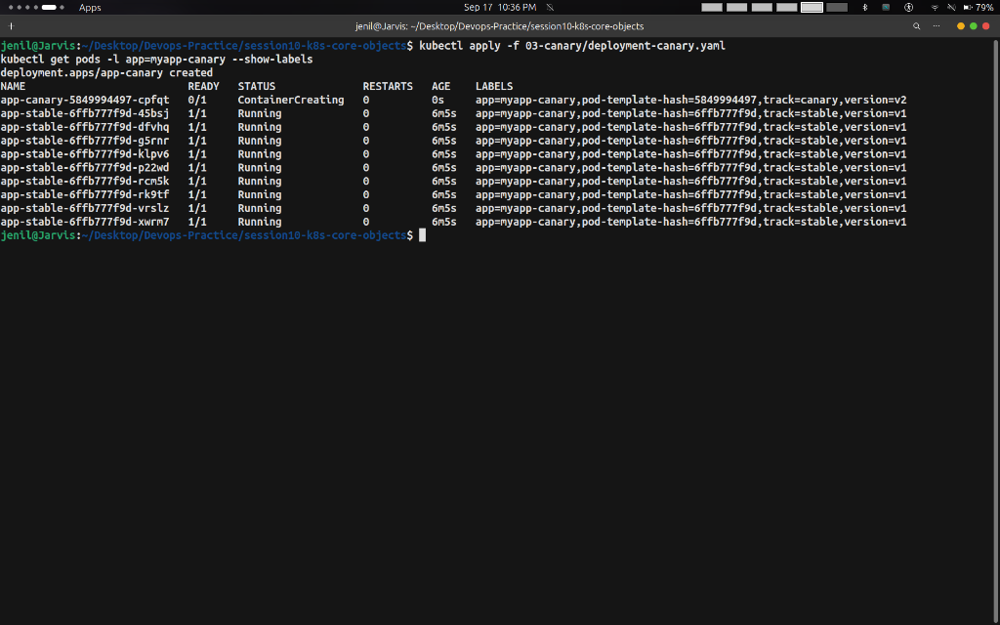
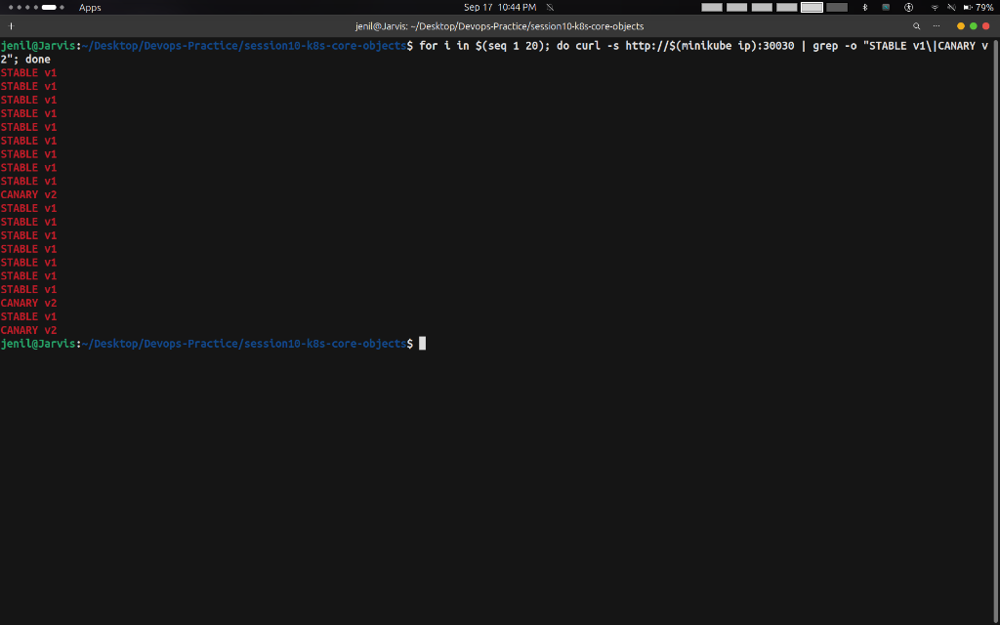
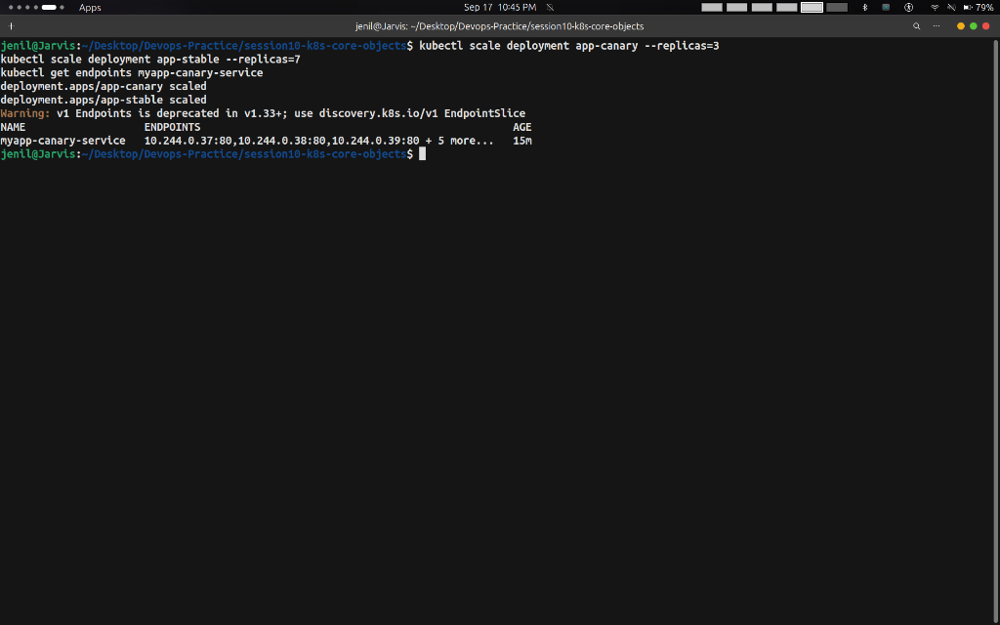

# Task: Canary Deployment Strategy — Hands-on Output

## Overview

This task demonstrates the **Canary Deployment** strategy in Kubernetes.  
A Canary deployment releases a new version to a **small percentage of real users first** (e.g. 10%), monitors it, and gradually promotes it — reducing risk before full rollout.

---

## Commands Run & Output Screenshots

### Step 1 — Deploy Stable v1 (9 Pods = 90% Traffic) + Service

**Commands:**
```bash
kubectl apply -f session10-k8s-core-objects/03-canary/deployment-stable.yaml
kubectl rollout status deployment/app-stable
kubectl apply -f session10-k8s-core-objects/03-canary/service.yaml
```

**Output:**


---

### Step 2 — Test: All Traffic Goes to Stable v1

**Command:**
```bash
for i in $(seq 1 10); do curl -s http://$(minikube ip):30030 | grep -o "STABLE v1\|CANARY v2"; done
```

**Output (all 10 requests hit stable):**


---

### Step 3 — Deploy the Canary v2 Pod (1 Pod = 10% Traffic)

**Commands:**
```bash
kubectl apply -f session10-k8s-core-objects/03-canary/deployment-canary.yaml
kubectl get pods -l app=myapp-canary --show-labels
```

**Output (9 stable + 1 canary = 10 pods total):**



---

### Step 4 — Verify Traffic Split (90% Stable / 10% Canary)

**Command:**
```bash
for i in $(seq 1 20); do curl -s http://$(minikube ip):30030 | grep -o "STABLE v1\|CANARY v2"; done
```

**Output (approximately 1-2 CANARY v2 out of 20):**



---

### Step 5 — Increase Canary to 30% (Scale to 3 canary / 7 stable)

**Commands:**
```bash
kubectl scale deployment app-canary --replicas=3
kubectl scale deployment app-stable --replicas=7
kubectl get endpoints myapp-canary-service
```

**Output:**



---

### Step 6 — Promote Canary to 100% (Canary is Healthy)

**Commands:**
```bash
kubectl scale deployment app-canary --replicas=9
kubectl scale deployment app-stable --replicas=0
for i in $(seq 1 5); do curl -s http://$(minikube ip):30030 | grep -o "STABLE v1\|CANARY v2"; done
```

**Output (all requests now hit canary v2):**


---

### Step 7 — Cleanup

**Commands:**
```bash
kubectl delete -f session10-k8s-core-objects/03-canary/service.yaml
kubectl delete -f session10-k8s-core-objects/03-canary/deployment-canary.yaml
kubectl delete -f session10-k8s-core-objects/03-canary/deployment-stable.yaml
```

**Output:**


---

## Key Takeaways

- Traffic split is controlled purely by **pod count ratio** (no special config needed)
- Only `10%` of users are exposed to the new version initially — minimizing blast radius
- Monitor real production metrics before promoting the canary
- Scale canary to `0` for instant rollback — `90%` of users never see the bug
- Google, Netflix, and Meta use canary deployments for **every single code push**

