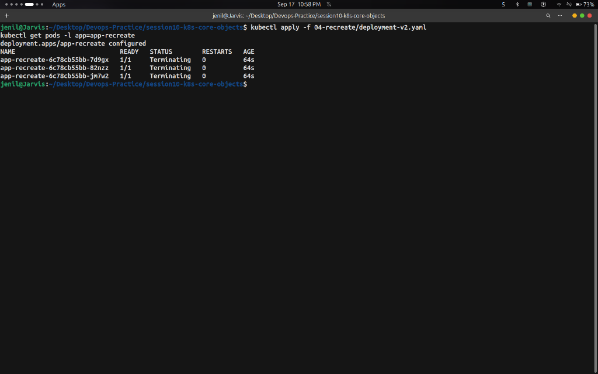
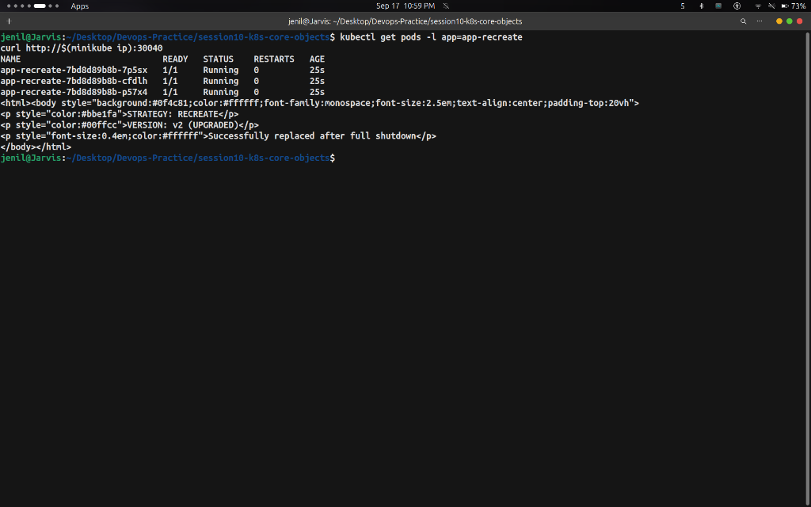

# Task: Recreate Deployment Strategy — Hands-on Output

## Overview

This task demonstrates the **Recreate Deployment Strategy** in Kubernetes.  
Recreate terminates all existing pods before starting new pods. While it introduces a brief **downtime window**, it is essential for database schema migrations, ReadWriteOnce persistent storage, and strict single-instance constraints.

---

## Commands Run & Output Screenshots

### Step 1 — Deploy Version 1 (3 Replicas) + Service

**Commands:**
```bash
kubectl apply -f 04-recreate/deployment-v1.yaml
kubectl apply -f 04-recreate/service.yaml
kubectl get pods -l app=app-recreate
curl http://$(minikube ip):30040
```

**Output (3 pods running v1):**


---

### Step 2 — Trigger Recreate Update to Version 2

**Commands:**
```bash
kubectl apply -f 04-recreate/deployment-v2.yaml
kubectl get pods -l app=app-recreate
```

**Output (Terminating old pods before starting new ones):**



---

### Step 3 — Observe Outage & Verify Version 2 Upgrade

**Commands:**
```bash
kubectl get pods -l app=app-recreate
curl http://$(minikube ip):30040
```

**Output (All pods updated to v2, returning VERSION v2 UPGRADED):**



---

### Step 4 — Cleanup

**Commands:**
```bash
kubectl delete -f 04-recreate/service.yaml
kubectl delete -f 04-recreate/deployment-v2.yaml
```

---

## Key Takeaways

- `type: Recreate` guarantees **zero multi-version overlap** — essential when simultaneous v1 and v2 would corrupt database schemas or file locks.
- Introduces a **downtime window** between pod termination and container creation.
- Uses **0% extra compute surge** during rollout (unlike RollingUpdate or Blue-Green).
- All old pods are killed (`Terminating`) before any new pod (`ContainerCreating`) starts.
