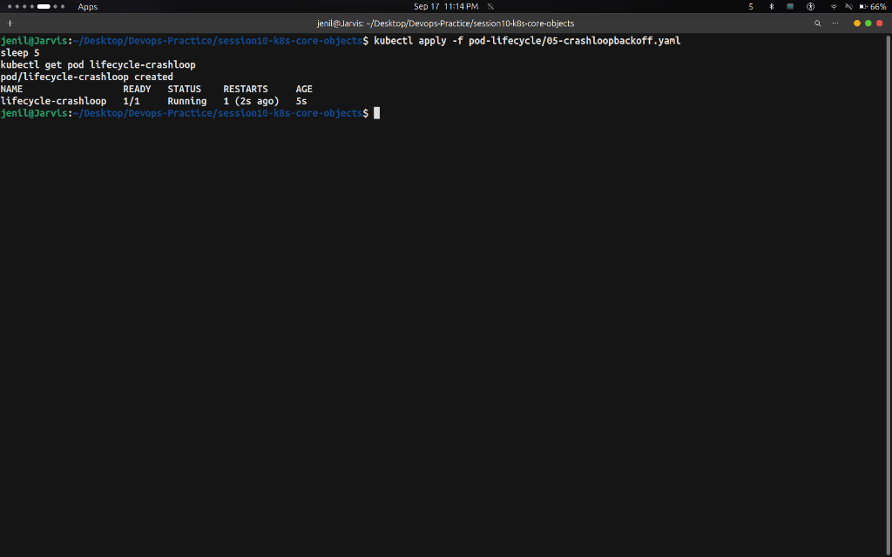
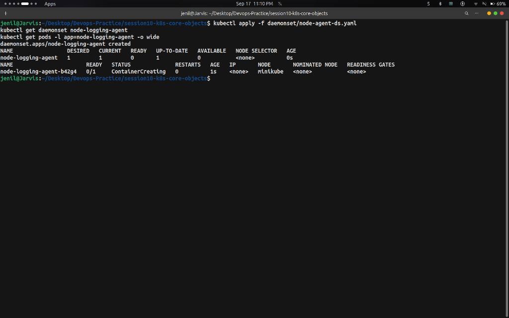
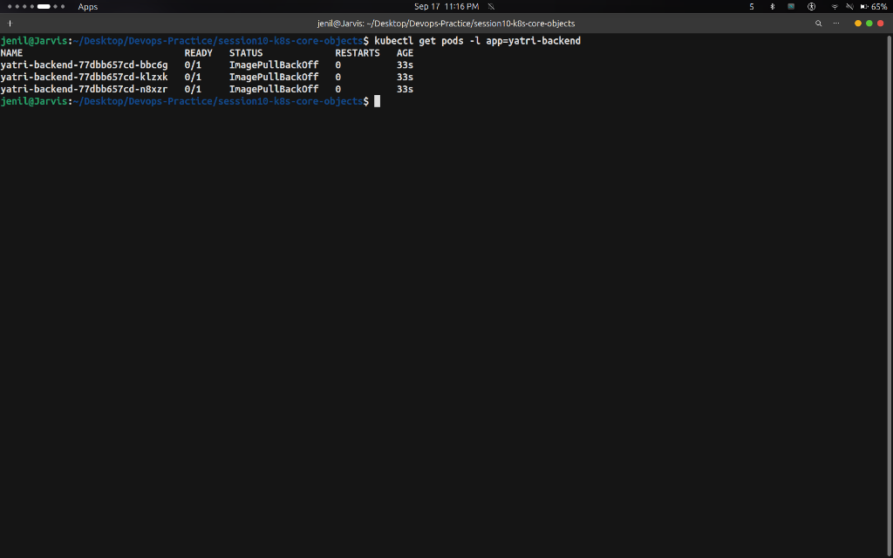

# Task 1: Kubernetes Fundamentals — Hands-on Output Report

- **Student Name:** Jenil
- **Session:** Session 10 — Kubernetes Core Objects & Fundamentals

---

## Overview

This report documents hands-on exercises for **Kubernetes Fundamentals**, covering basic Pod creation, Pod Lifecycle states (Init Containers & CrashLoopBackOff), DaemonSet background node workloads, and manifest error troubleshooting.

---

## 1. Kubernetes Pods

### Overview
A Pod is the smallest deployable unit in Kubernetes. It encapsulates one or more containers sharing network IP, storage volumes, and runtime specification.

### Commands Executed
```bash
kubectl apply -f pod/nginx-pod.yaml
kubectl get pod yatri-demo-pod -o wide
```

### Screenshot Output


---

## 2. Pod Lifecycle, Probes & Init Containers

### Overview
Demonstrates Pod startup stages: **Init Containers** executing prior to main app container startup, and container error recovery entering **`CrashLoopBackOff`**.

### Commands Executed
```bash
# 1. Init Container Phase
kubectl apply -f pod-lifecycle/10-init-container.yaml
kubectl get pod lifecycle-init

# 2. Container Crash & CrashLoopBackOff
kubectl apply -f pod-lifecycle/05-crashloopbackoff.yaml
sleep 5
kubectl get pod lifecycle-crashloop
```

### Screenshot Outputs

#### Init Container Phase (`STATUS Init:0/1`)


#### Crashing Container Restart (`RESTARTS 1`)


---

## 3. Kubernetes DaemonSets

### Overview
A DaemonSet ensures that exactly 1 Pod instance runs on every Node in the cluster. It is commonly used for cluster log collection and host monitoring agents.

### Commands Executed
```bash
# 1. Deploy DaemonSet
kubectl apply -f daemonset/node-agent-ds.yaml
kubectl get daemonset node-logging-agent
kubectl get pods -l app=node-logging-agent -o wide

# 2. Verify Background Metric Logs
kubectl logs -l app=node-logging-agent --tail=5
```

### Screenshot Outputs

#### DaemonSet Deployment on Node `minikube`


#### DaemonSet Background Metric Collection Logs


---

## 4. Kubernetes Troubleshooting & Manifest Error Debugging

### Overview
Demonstrates runtime image errors (**`ImagePullBackOff`**) and API server manifest validation errors (**Selector Mismatch**).

### Commands Executed
```bash
# 1. Non-Existent Image Tag Error
kubectl apply -f troubleshooting/broken-image.yaml
kubectl get pods -l app=yatri-backend

# 2. Immutable Selector Mismatch Error
kubectl apply -f troubleshooting/selector-mismatch.yaml
```

### Screenshot Outputs

#### Non-Existent Image (`STATUS ImagePullBackOff`)


#### Selector Mismatch Validation Error


---

## Summary Key Takeaways

1. **Pods**: Ephemeral compute wrappers sharing network namespace.
2. **Init Containers**: Must exit cleanly before main containers start.
3. **DaemonSets**: Guarantee 1 pod per node for infrastructure monitoring and logging.
4. **Troubleshooting**: `ImagePullBackOff` indicates missing image tags; Selector Mismatch is caught by API server validation.
