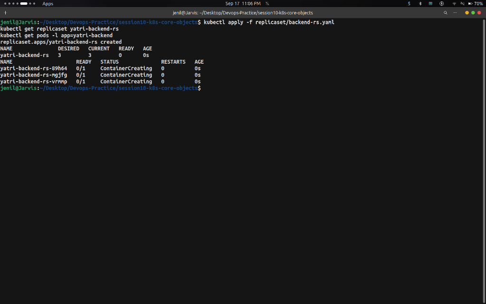
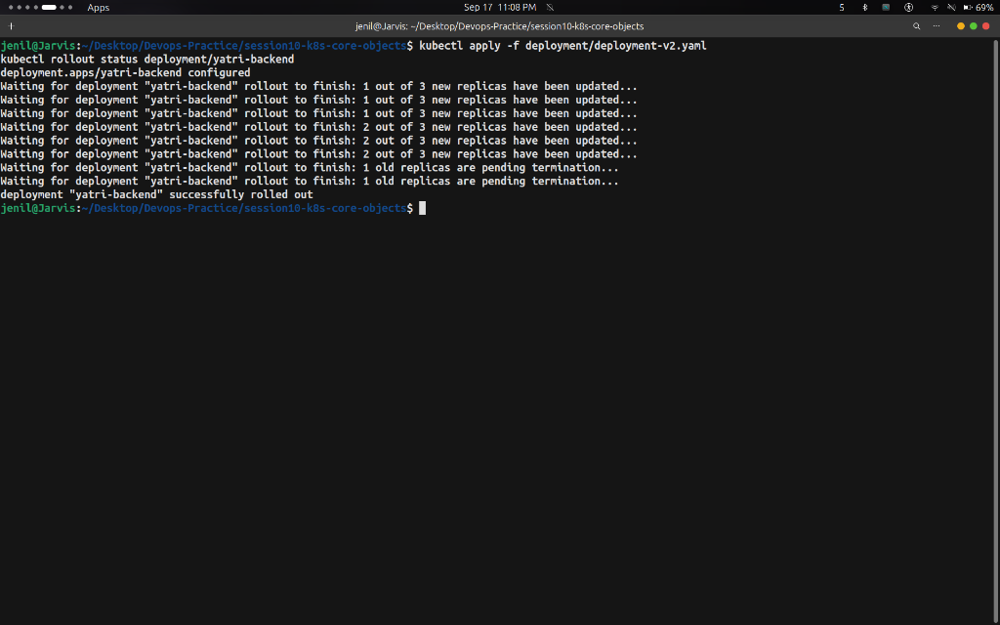
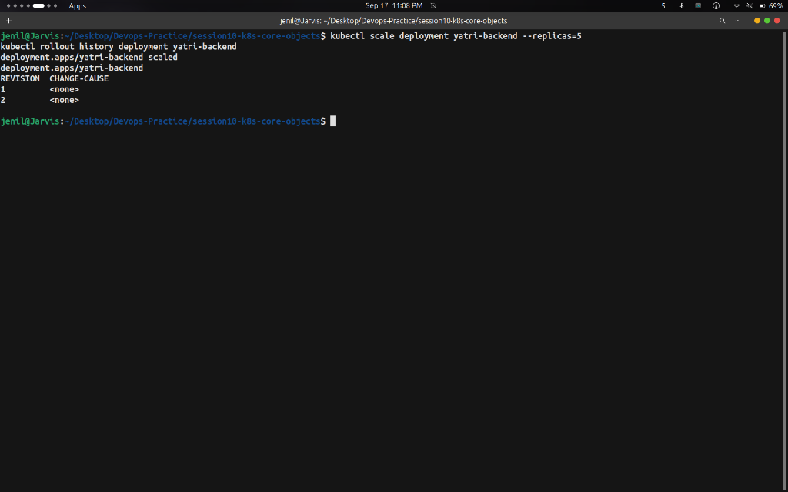
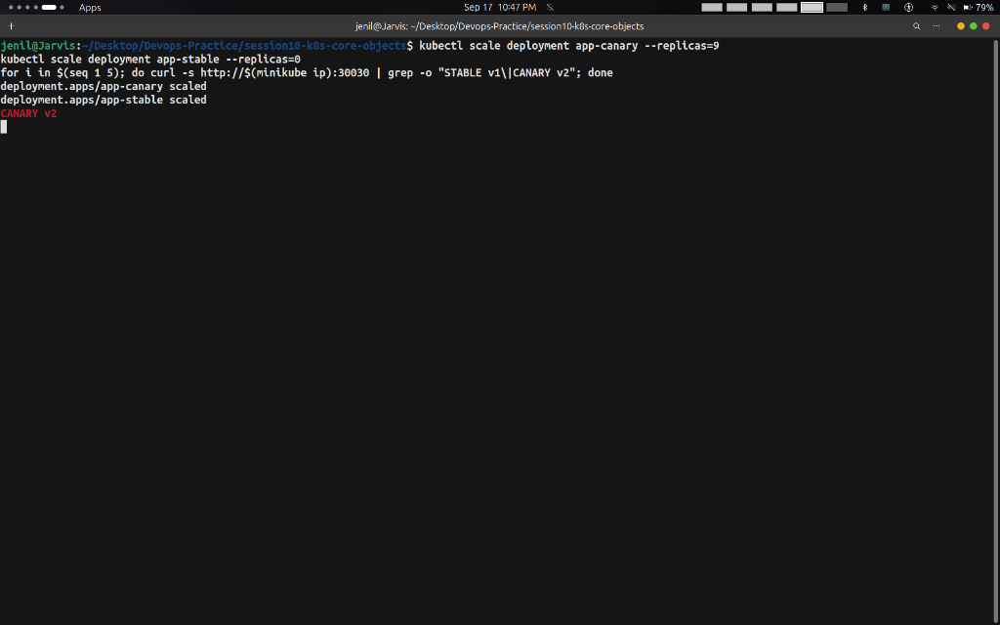
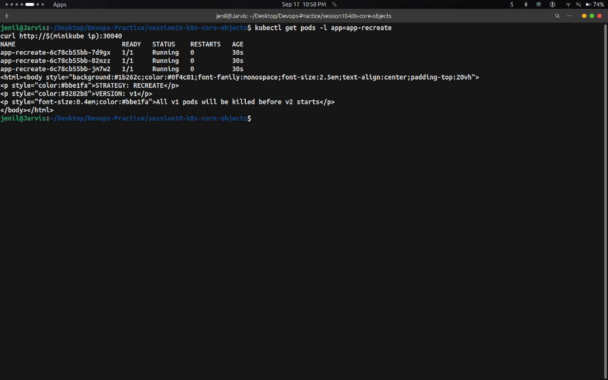

# Task 2: Kubernetes Pods, ReplicaSets & Deployments — Hands-on Output Report

- **Student Name:** Jenil
- **Session:** Session 10 — Kubernetes Core Objects & Deployment Strategies

---

## Overview

This report documents hands-on exercises for **Kubernetes Pods, ReplicaSets & Deployments**, covering ReplicaSets, Deployments with Rolling Updates, Canary Deployments, and Recreate Strategy rollouts.

---

## 1. Kubernetes ReplicaSets

### Overview
A ReplicaSet maintains a stable set of replica Pods running at any given time, providing automated self-healing.

### Commands Executed
```bash
kubectl apply -f replicaset/backend-rs.yaml
kubectl get replicaset yatri-backend-rs
kubectl get pods -l app=yatri-backend
```

### Screenshot Output


---

## 2. Kubernetes Deployments (Rolling Update & Scaling)

### Overview
Deployments manage ReplicaSets and Pods, facilitating declarative updates, zero-downtime rolling upgrades, dynamic scaling, and revision tracking.

### Commands Executed
```bash
# 1. Deploy Version 1
kubectl apply -f deployment/deployment-v1.yaml
kubectl get deployment yatri-backend
kubectl get pods -l app=yatri-backend

# 2. Rolling Update to Version 2
kubectl apply -f deployment/deployment-v2.yaml
kubectl rollout status deployment/yatri-backend

# 3. Scale Replicas & Check History
kubectl scale deployment yatri-backend --replicas=5
kubectl rollout history deployment yatri-backend
```

### Screenshot Outputs

#### Version 1 Deployment


#### Rolling Update to Version 2 (`successfully rolled out`)


#### Scaled to 5 Replicas & Rollout Revision History


---

## 3. Canary Deployment Strategy

### Overview
Releases a new version (v2) to a small percentage of traffic (e.g. 10%) while 90% stays on stable (v1), allowing production validation before full promotion.

### Commands Executed
```bash
# 1. Deploy 9 Stable Pods + 1 Canary Pod (10% Traffic Split)
kubectl apply -f 03-canary/deployment-canary.yaml
kubectl get pods -l app=myapp-canary --show-labels

# 2. Verify Traffic Split (90% v1 / 10% v2)
for i in $(seq 1 20); do curl -s http://$(minikube ip):30030 | grep -o "STABLE v1\|CANARY v2"; done

# 3. Scale Canary Traffic to 30%
kubectl scale deployment app-canary --replicas=3
kubectl scale deployment app-stable --replicas=7
kubectl get endpoints myapp-canary-service

# 4. Full Promotion to 100% Canary v2
kubectl scale deployment app-canary --replicas=9
kubectl scale deployment app-stable --replicas=0
for i in $(seq 1 5); do curl -s http://$(minikube ip):30030 | grep -o "STABLE v1\|CANARY v2"; done
```

### Screenshot Outputs

#### 9 Stable Pods + 1 Canary Pod Running


#### Traffic Split (~10% Canary v2 Hit)


#### Scaled to 3 Canary / 7 Stable Pods (10 Endpoints)


#### Full Promotion (100% Traffic on Canary v2)


---

## 4. Recreate Deployment Strategy

### Overview
Terminates all existing pods before creating new pods. Guarantees zero multi-version overlap during database schema migrations or ReadWriteOnce storage volume mounts.

### Commands Executed
```bash
# 1. Deploy Version 1
kubectl apply -f 04-recreate/deployment-v1.yaml
kubectl apply -f 04-recreate/service.yaml
kubectl get pods -l app=app-recreate
curl http://$(minikube ip):30040

# 2. Trigger Recreate Update to Version 2
kubectl apply -f 04-recreate/deployment-v2.yaml
kubectl get pods -l app=app-recreate

# 3. Verify Version 2 Upgrade
kubectl get pods -l app=app-recreate
curl http://$(minikube ip):30040
```

### Screenshot Outputs

#### Version 1 Serving (`VERSION: v1`)


#### Pod Shutdown Window (`STATUS Terminating`)


#### Version 2 Upgraded (`VERSION: v2 UPGRADED`)


---

## Summary Key Takeaways

1. **ReplicaSet**: Controls pod counts based on label selectors.
2. **Deployment**: Orchestrates zero-downtime rolling updates and rollbacks.
3. **Canary Strategy**: Uses pod-ratio math to route a small fraction of traffic to v2 before full promotion.
4. **Recreate Strategy**: Terminates all v1 pods first, introducing a brief downtime window to prevent database schema conflicts.
