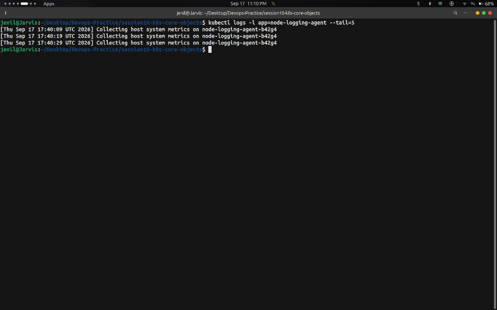

# Task: Kubernetes DaemonSet — Hands-on Output

## Overview

A **DaemonSet** ensures that all (or some) Nodes run a copy of a Pod. As nodes are added to the cluster, Pods are automatically added to them. When nodes are removed from the cluster, those Pods are garbage collected. DaemonSets are typically used for cluster-wide background tasks like log collection (Fluentd/Promtail) or node monitoring (Node Exporter).

---

## Commands Run & Output Screenshots

### Step 1 — Deploy and Inspect the DaemonSet

**Commands:**
```bash
kubectl apply -f daemonset/node-agent-ds.yaml
kubectl get daemonset node-logging-agent
kubectl get pods -l app=node-logging-agent -o wide
```

**Output:**


---

### Step 2 — Verify DaemonSet Background Log Collection

**Command:**
```bash
kubectl logs -l app=node-logging-agent --tail=5
```

**Output:**



---

### Step 3 — Cleanup

**Command:**
```bash
kubectl delete -f daemonset/node-agent-ds.yaml
```

---

## Key Takeaways

- A DaemonSet automatically spawns **exactly 1 Pod per Node** in the cluster.
- When new nodes join the cluster, Kubernetes automatically schedules DaemonSet pods onto them.
- Ideal for node monitoring agents, log collectors, and storage daemons.
