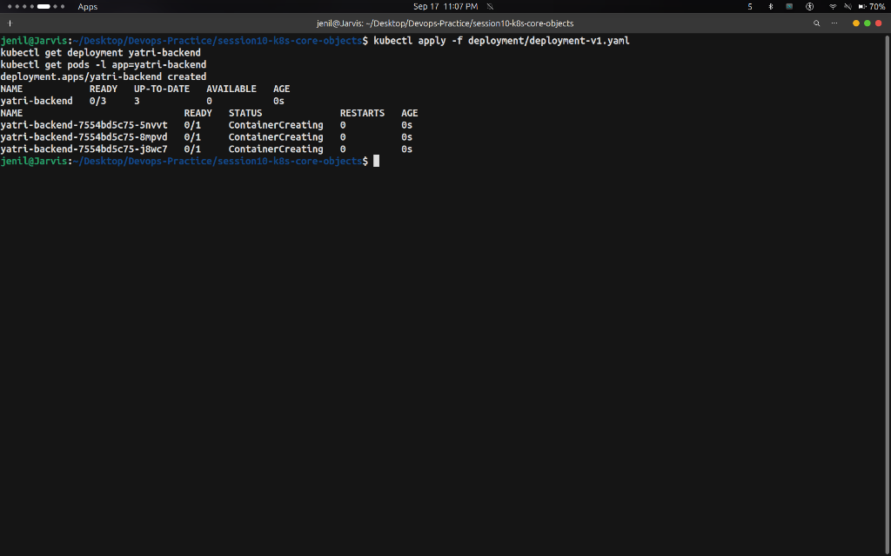

# Task: Kubernetes Deployment — Hands-on Output

## Overview

A **Deployment** provides declarative updates for Pods and ReplicaSets. It manages rolling updates, rollbacks, self-healing, scaling, and revision history for application workloads.

---

## Commands Run & Output Screenshots

### Step 1 — Deploy Version 1 (3 Replicas)

**Commands:**
```bash
kubectl apply -f deployment/deployment-v1.yaml
kubectl get deployment yatri-backend
kubectl get pods -l app=yatri-backend
```

**Output:**



---

### Step 2 — Perform a Rolling Update to Version 2

**Commands:**
```bash
kubectl apply -f deployment/deployment-v2.yaml
kubectl rollout status deployment/yatri-backend
```

**Output:**


---

### Step 3 — Scale Deployment & Inspect Rollout History

**Commands:**
```bash
kubectl scale deployment yatri-backend --replicas=5
kubectl rollout history deployment yatri-backend
```

**Output:**


---

### Step 4 — Cleanup

**Command:**
```bash
kubectl delete -f deployment/deployment-v2.yaml
```

---

## Key Takeaways

- Deployments manage **ReplicaSets**, which in turn manage **Pods**.
- Provides built-in **Rolling Updates** and zero-downtime version changes (`maxSurge` / `maxUnavailable`).
- Allows revision history tracking and instant rollbacks with `kubectl rollout undo`.
- Dynamically scales replicas up or down with zero downtime.
