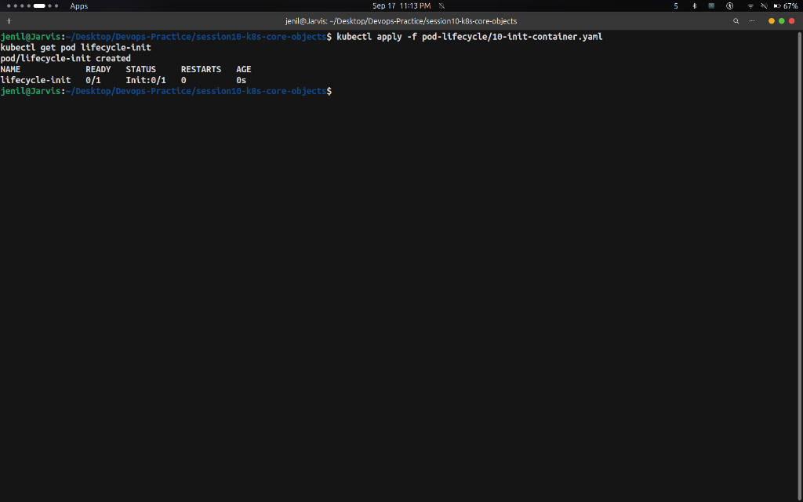

# Task: Pod Lifecycle, Probes & Init Containers — Hands-on Output

## Overview

This task demonstrates the **Pod Lifecycle** in Kubernetes, focusing on Pod initialization states (**Init Containers**), health probes (**Liveness/Readiness Probes**), and container failure recovery (**CrashLoopBackOff**).

---

## Commands Run & Output Screenshots

### Step 1 — Observe Init Container Execution Phase

**Commands:**
```bash
kubectl apply -f pod-lifecycle/10-init-container.yaml
kubectl get pod lifecycle-init
```

**Output:**



---

### Step 2 — Observe Container Crash & CrashLoopBackOff State

**Commands:**
```bash
kubectl apply -f pod-lifecycle/05-crashloopbackoff.yaml
kubectl get pod lifecycle-crashloop
```

**Output:**


---

### Step 3 — Cleanup

**Commands:**
```bash
kubectl delete -f pod-lifecycle/10-init-container.yaml
kubectl delete -f pod-lifecycle/05-crashloopbackoff.yaml
```

---

## Key Takeaways

- **Init Containers** run to completion before any app container starts. If an Init Container fails, Kubernetes restarts the pod until it succeeds.
- **CrashLoopBackOff** occurs when a container continually exits with a non-zero exit code. Kubernetes applies exponential backoff delay (10s, 20s, 40s... up to 5 min) to prevent node resource exhaustion.
