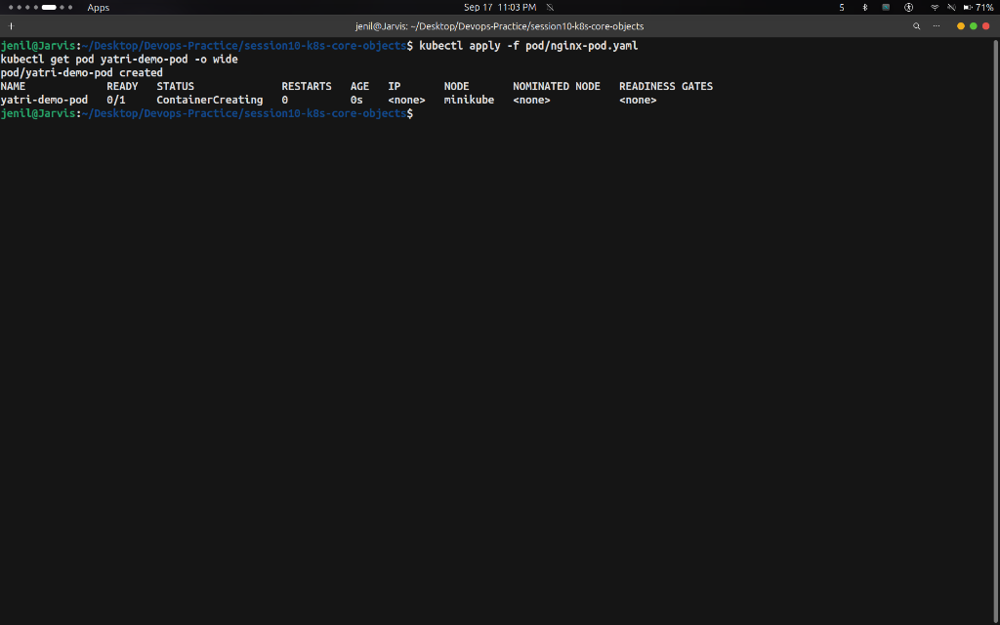

# Task: Kubernetes Pod — Hands-on Output

## Overview

A **Pod** is the smallest and simplest deployable object in Kubernetes. It represents a single instance of a running process in your cluster, wrapping one or more containers, shared storage, and network IP.

---

## Commands Run & Output Screenshots

### Step 1 — Deploy and Inspect the Pod

**Commands:**
```bash
kubectl apply -f pod/nginx-pod.yaml
kubectl get pod yatri-demo-pod -o wide
```

**Output:**



---

### Step 2 — Cleanup

**Command:**
```bash
kubectl delete -f pod/nginx-pod.yaml
```

---

## Key Takeaways

- A Pod is **ephemeral** — if a node dies, the Pod is not rescheduled unless managed by a Controller (ReplicaSet/Deployment).
- Containers within the same Pod share the same network IP (`localhost`) and storage volumes.
- Resource `requests` guarantee minimum CPU/memory, while `limits` cap maximum consumption.
