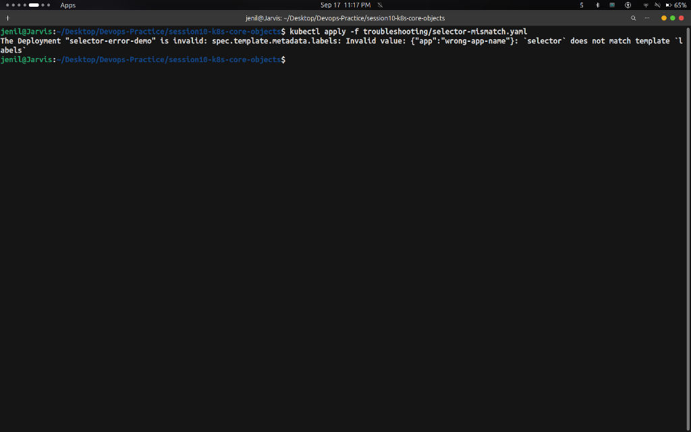

# Task: Kubernetes Troubleshooting & Debugging — Hands-on Output

## Overview

This task demonstrates common Kubernetes manifest errors and runtime deployment failures:
1. **`ImagePullBackOff`**: Deploying a non-existent container image tag.
2. **Selector Mismatch Validation Error**: Specifying a Deployment selector that does not match the Pod template labels.

---

## Commands Run & Output Screenshots

### Step 1 — Broken Image & ImagePullBackOff Failure

**Commands:**
```bash
kubectl apply -f troubleshooting/broken-image.yaml
kubectl get pods -l app=yatri-backend
```

**Output:**


---

### Step 2 — Selector Mismatch Manifest Validation Error

**Command:**
```bash
kubectl apply -f troubleshooting/selector-mismatch.yaml
```

**Output:**



---

### Step 3 — Cleanup

**Commands:**
```bash
kubectl delete -f troubleshooting/broken-image.yaml --ignore-not-found=true
```

---

## Key Takeaways

- **`ImagePullBackOff`** indicates Kubernetes cannot fetch the image from the registry (invalid image name, tag, or missing secret).
- Deployments require **`spec.selector.matchLabels`** to EXACTLY match **`spec.template.metadata.labels`**. If they mismatch, the Kubernetes API server rejects the manifest at submission time.
