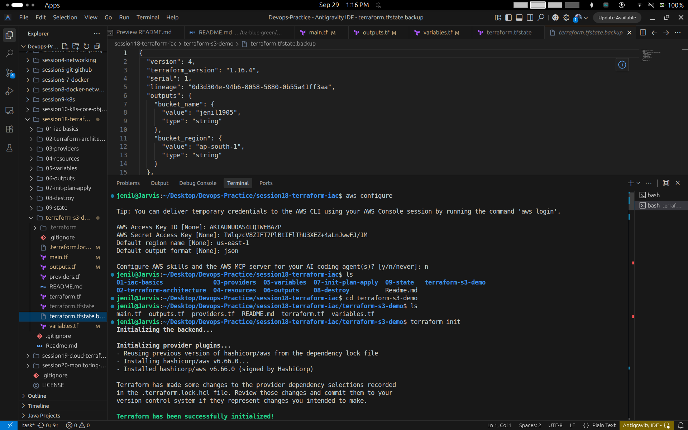
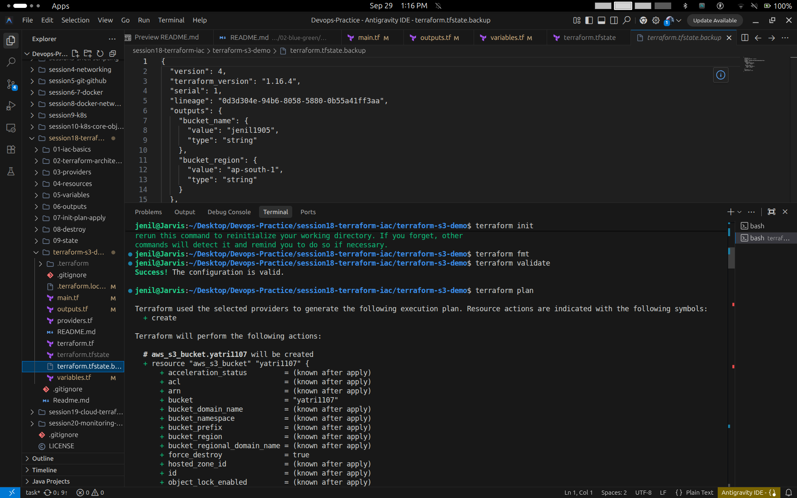
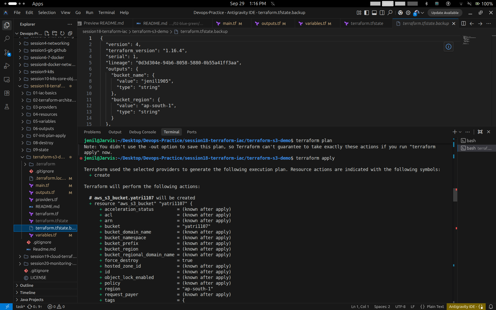
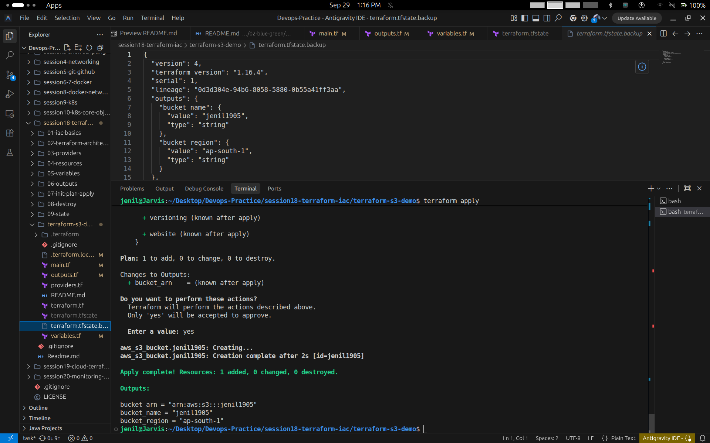
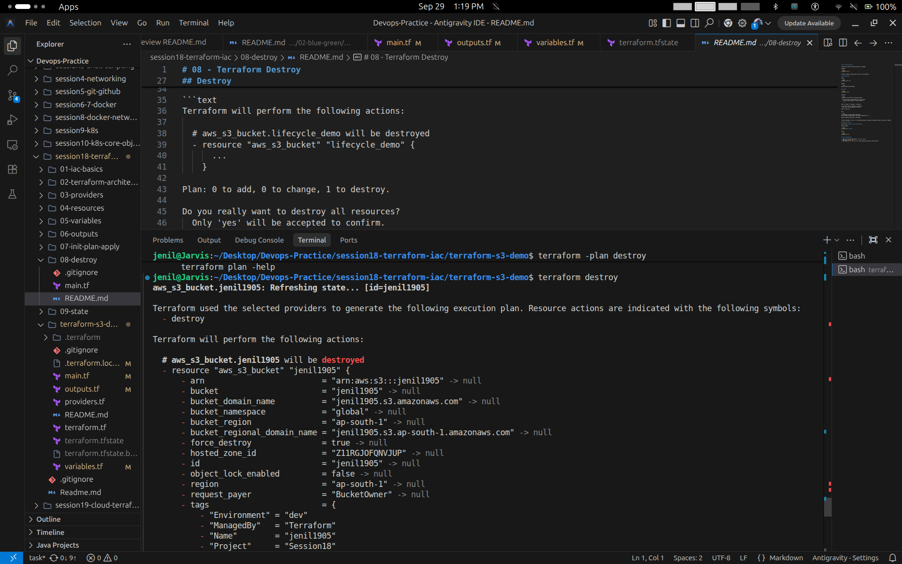
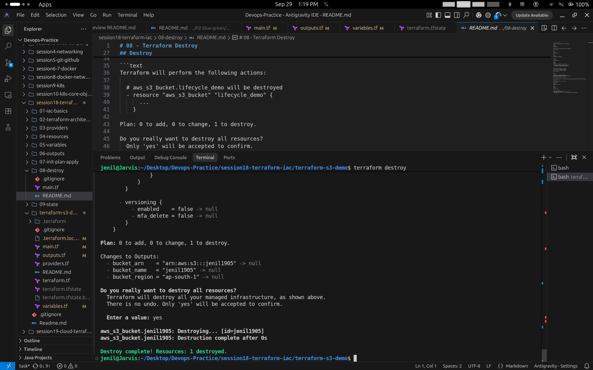

# Session 18 Task: Terraform & Infrastructure as Code

- **Student Name:** Jenil
- **Session:** Session 18 — Terraform & Infrastructure as Code
- **Task:** Task 1 — Terraform AWS S3 Bucket Demo

---

## 1. Project Overview & Structure

This project demonstrates managing cloud storage infrastructure on **Amazon Web Services (AWS)** using **Terraform (Infrastructure as Code)**. It covers provisioning an AWS S3 bucket, parameterizing configuration with variables, enforcing strict formatting and validation, inspecting the state lifecycle, and performing controlled teardown.

### Directory Structure

```text
session18-terraform-iac/
├── task/
│   ├── README.md
│   └── screenshots/
│       ├── 01-aws-configure-terraform-init.png
│       ├── 02-terraform-fmt-validate-plan.png
│       ├── 03-terraform-apply-plan-prompt.png
│       ├── 04-terraform-apply-success-and-outputs.png
│       ├── 05-terraform-destroy-plan.png
│       └── 06-terraform-destroy-success.png
└── terraform-s3-demo/
    ├── .gitignore
    ├── .terraform.lock.hcl
    ├── main.tf
    ├── outputs.tf
    ├── providers.tf
    ├── README.md
    ├── terraform.tf
    ├── terraform.tfvars
    └── variables.tf
```

---

## 2. Infrastructure as Code Manifests

### 2.1 Provider Configuration (`providers.tf` & `terraform.tf`)
Specifies the AWS provider requirement and version constraints:
```hcl
terraform {
  required_version = ">= 1.6.0"
  required_providers {
    aws = {
      source  = "hashicorp/aws"
      version = "~> 6.0"
    }
  }
}

provider "aws" {
  region = var.aws_region
}
```

### 2.2 Variables (`variables.tf` & `terraform.tfvars`)
Declares flexible configuration parameters:
```hcl
variable "aws_region" {
  type        = string
  description = "AWS region for deployment"
  default     = "ap-south-1"
}

variable "bucket_name" {
  type        = string
  description = "Name of the S3 bucket"
  default     = "jenil1905"
}
```

Values set in `terraform.tfvars`:
```hcl
aws_region  = "ap-south-1"
bucket_name = "jenil1905"
```

### 2.3 S3 Bucket Resource (`main.tf`)
Declares the target AWS S3 bucket with force-destroy enabled and production tagging:
```hcl
resource "aws_s3_bucket" "jenil1905" {
  bucket        = var.bucket_name
  force_destroy = true

  tags = {
    Name        = var.bucket_name
    Environment = "dev"
    Project     = "Session18"
    ManagedBy   = "Terraform"
  }
}
```

### 2.4 Outputs (`outputs.tf`)
Exposes bucket attributes upon creation:
```hcl
output "bucket_name" {
  type        = string
  description = "Name of the S3 bucket."
  value       = aws_s3_bucket.jenil1905.bucket
}

output "bucket_arn" {
  type        = string
  description = "ARN of the S3 bucket."
  value       = aws_s3_bucket.jenil1905.arn
}

output "bucket_region" {
  type        = string
  description = "AWS region of the S3 bucket."
  value       = aws_s3_bucket.jenil1905.region
}
```

---

## 3. Hands-on Execution & Output Guide

### Step 1: AWS Credentials & Terraform Initialization (`init`)
- Configured AWS CLI access credentials and default region.
- Initialized Terraform backend and downloaded the `hashicorp/aws` provider plugin (`v6.66.0`).
- Validated state synchronization in `terraform.tfstate.backup`.

```bash
aws configure
cd terraform-s3-demo
terraform init
```
**Screenshot Output:**


---

### Step 2: Code Formatting, Validation & Execution Planning (`fmt`, `validate`, `plan`)
- Formatted HCL code according to canonical standards (`terraform fmt`).
- Verified syntax, types, and resource schemas (`terraform validate`).
- Generated speculative execution plan predicting resource creation (`terraform plan`).

```bash
terraform fmt
terraform validate
terraform plan
```
**Screenshot Output:**


---

### Step 3: Terraform Apply Confirmation Prompt
Executed `terraform apply` to review the proposed action plan (`+ create`) before modifying live AWS cloud infrastructure.

```bash
terraform apply
```
**Screenshot Output:**


---

### Step 4: S3 Bucket Creation & Outputs (`apply`)
- Confirmed execution (`yes`).
- Successfully created S3 bucket `jenil1905` in region `ap-south-1`.
- Emitted output variables:
  - `bucket_arn = "arn:aws:s3:::jenil1905"`
  - `bucket_name = "jenil1905"`
  - `bucket_region = "ap-south-1"`

```bash
# Apply complete! Resources: 1 added, 0 changed, 0 destroyed.
terraform output
```
**Screenshot Output:**


---

### Step 5: State & Output Inspection (`show`, `output`)
Inspecting state details stored in `terraform.tfstate` and querying declared output values:

```bash
terraform show
terraform output
```
Attributes verified:
- ARN: `arn:aws:s3:::jenil1905`
- Bucket Name: `jenil1905`
- Region: `ap-south-1`
- Tags: `Environment=dev`, `ManagedBy=Terraform`, `Project=Session18`

---

### Step 6: Terraform Destroy Plan
Executing `terraform destroy` to refresh state and calculate dependency-safe removal actions:

```bash
terraform destroy
```
- Refreshes live state for `aws_s3_bucket.jenil1905`.
- Identifies resource to be deleted (`- destroy`).

**Screenshot Output:**


---

### Step 7: Resource Destruction Confirmation
Confirming teardown with `yes`:

```bash
Enter a value: yes
```
- `aws_s3_bucket.jenil1905: Destroying... [id=jenil1905]`
- `aws_s3_bucket.jenil1905: Destruction complete after 0s`
- `Destroy complete! Resources: 1 destroyed.`

**Screenshot Output:**


---

## 4. Key Terraform Commands Summary

| Command | Purpose | Lifecycle Phase |
| :--- | :--- | :--- |
| `aws configure` | Sets up AWS CLI authentication keys and region | Configuration |
| `terraform init` | Downloads providers and initializes state backend | Setup |
| `terraform fmt` | Rewrites code in canonical style | Development |
| `terraform validate` | Checks configuration for internal consistency | Verification |
| `terraform plan` | Compares configuration against state to create execution plan | Planning |
| `terraform apply` | Provisions declared resources against cloud provider | Execution |
| `terraform show` | Reads and presents human-readable state data | Inspection |
| `terraform output` | Reads and extracts declared output values from state | Inspection |
| `terraform destroy` | Deletes all infrastructure tracked by Terraform state | Teardown |
