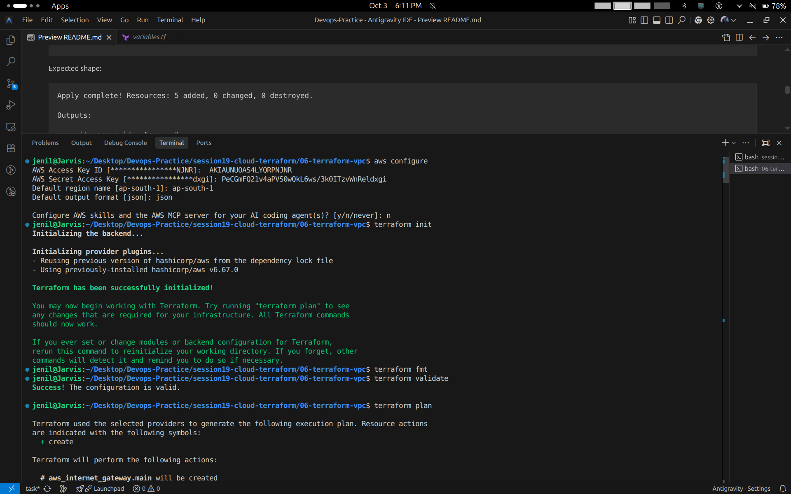
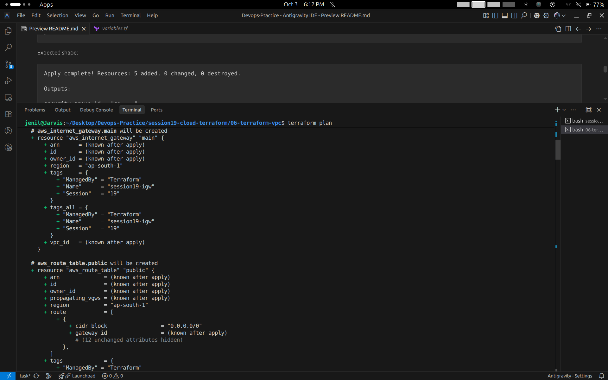
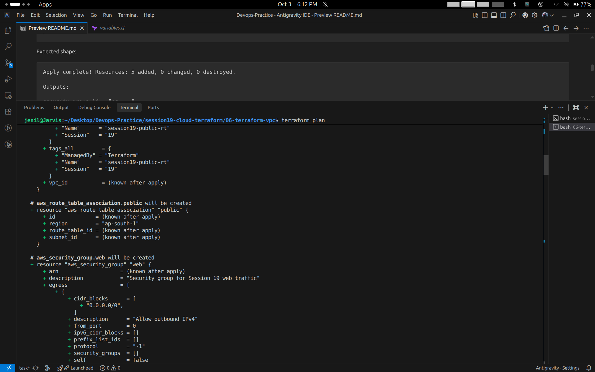
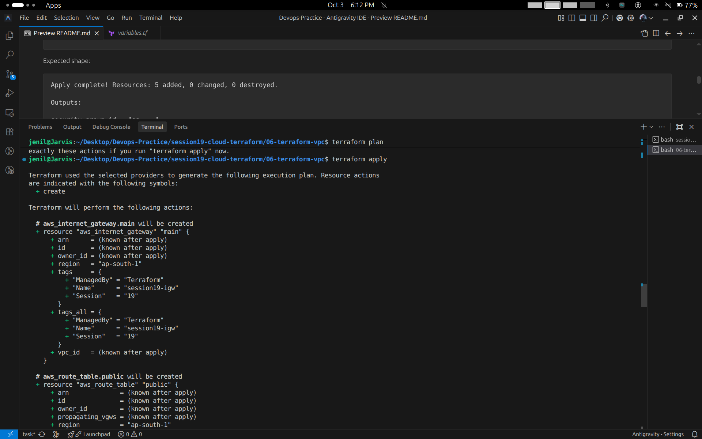
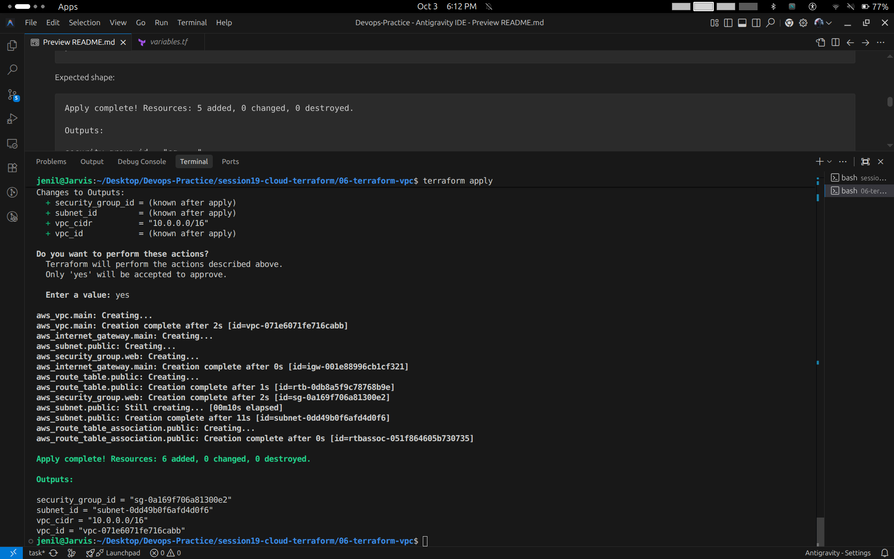
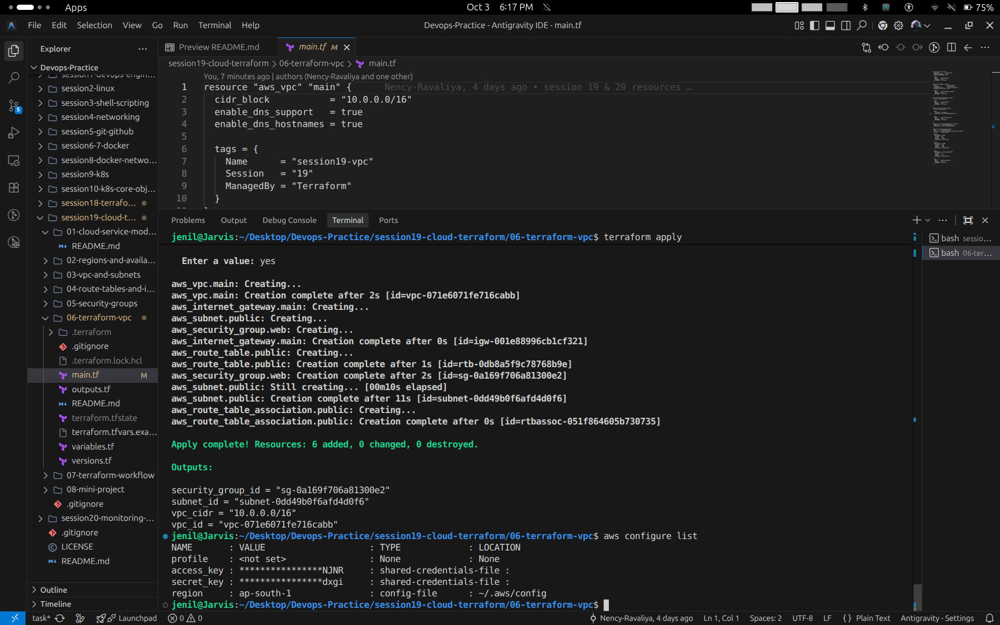
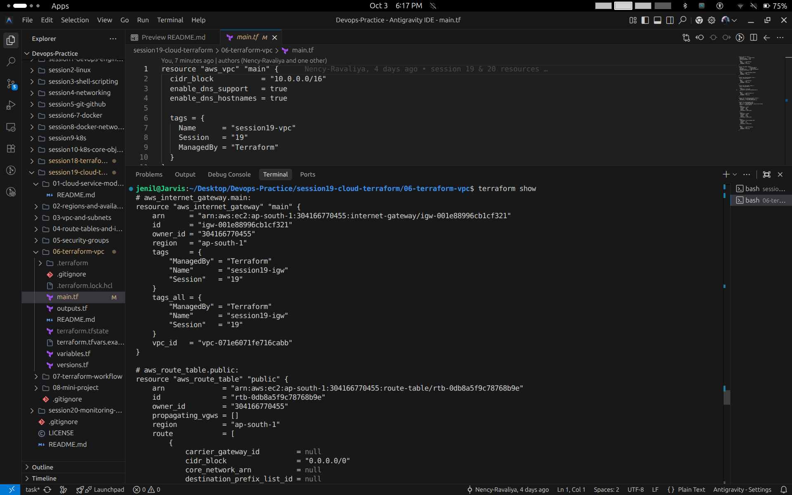
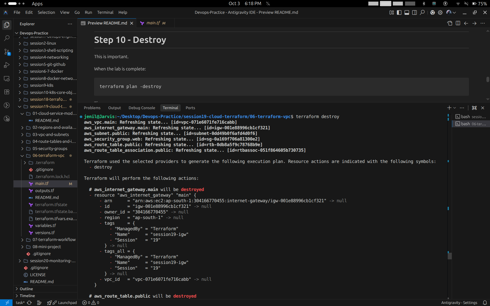

# Session 19 Task: Cloud & Terraform in Action

- **Student Name:** Jenil
- **Session:** Session 19 — Cloud & Terraform in Action
- **Topic:** End-to-End AWS Cloud Infrastructure Project using Terraform

---

## 1. Project Overview & Architecture

This project demonstrates the complete end-to-end lifecycle of infrastructure provisioning on **Amazon Web Services (AWS)** using **Terraform (Infrastructure as Code - IaC)**. 

The provisioned architecture creates a production-grade VPC network topology in the `ap-south-1` (Mumbai) region:

```
+---------------------------------------------------------------------------------+
|                                AWS REGION: ap-south-1                           |
|                                                                                 |
|  +---------------------------------------------------------------------------+  |
|  |                 Virtual Private Cloud (VPC): 10.0.0.0/16                  |  |
|  |                 Name: session19-vpc                                       |  |
|  |                                                                           |  |
|  |   +-------------------------------------------------------------------+   |  |
|  |   |            Public Subnet: 10.0.1.0/24 (AZ: ap-south-1a)           |   |  |
|  |   |            Name: session19-public-subnet                          |   |  |
|  |   |                                                                   |   |  |
|  |   |   +-----------------------------------------------------------+   |   |  |
|  |   |   | Security Group: session19-web-sg                          |   |  |
|  |   |   | Ingress: Ports 80 (HTTP), 443 (HTTPS), 22 (SSH)           |   |  |
|  |   |   | Egress: All Outbound IPv4 (0.0.0.0/0)                     |   |  |
|  |   |   +-----------------------------------------------------------+   |   |  |
|  |   +---------------------------------|---------------------------------+   |  |
|  |                                     |                                     |  |
|  |   +---------------------------------v---------------------------------+   |  |
|  |   | Route Table: session19-public-rt                                  |   |  |
|  |   | Destination: 0.0.0.0/0 ---> Target: Internet Gateway              |   |  |
|  |   +---------------------------------|---------------------------------+   |  |
|  +-------------------------------------|-------------------------------------+  |
|                                        |                                        |
|  +-------------------------------------v-------------------------------------+  |
|  | Internet Gateway (IGW): session19-igw                                     |  |
|  +---------------------------------------------------------------------------+  |
+---------------------------------------------------------------------------------+
```

---

## 2. Core Terraform Concepts Demonstrated

1. **Terraform Providers:** Configured official `hashicorp/aws (~> 6.0)` provider plugin to communicate with AWS APIs.
2. **Variables:** Centralized configuration parameters via `variables.tf` (e.g., `aws_region = "ap-south-1"`).
3. **Resources:** Declarative declarations for 6 AWS infrastructure components (`aws_vpc`, `aws_subnet`, `aws_internet_gateway`, `aws_route_table`, `aws_route_table_association`, `aws_security_group`).
4. **Outputs:** Exposed essential resource attributes in `outputs.tf` (`vpc_id`, `vpc_cidr`, `subnet_id`, `security_group_id`).
5. **Dependencies:** Implicit dependency resolution via resource attribute references (e.g., Subnet references `aws_vpc.main.id`, Route Table references `aws_internet_gateway.main.id`).
6. **AWS Infrastructure:** Complete network stack isolated within the configured AWS account.
7. **Terraform State:** Maintained real-world state synchronization in `terraform.tfstate` and validated with `terraform show`.
8. **Execution Workflow (`plan`, `apply`, `destroy`):** Safe, predictable workflow lifecycle.

---

## 3. Hands-on Execution & Output Guide

### Step 1: AWS Credentials & Terraform Initialization (`init`, `fmt`, `validate`)
- Configured AWS CLI access credentials and default region (`ap-south-1`).
- Initialized backend and downloaded the `hashicorp/aws` provider plugin (`v6.67.0`).
- Validated configuration syntax and structure.

```bash
aws configure
terraform init
terraform fmt
terraform validate
```
**Screenshot Output:**


---

### Step 2: Terraform Plan — Resource Planning (Part 1)
Inspecting the execution plan for resources to be created:
- `aws_internet_gateway.main`
- `aws_route_table.public`

```bash
terraform plan
```
**Screenshot Output:**


---

### Step 3: Terraform Plan — Route Table Association & Security Group (Part 2)
Continuing plan inspection for network routing and firewall rules:
- `aws_route_table_association.public`
- `aws_security_group.web` (Inbound HTTP/HTTPS/SSH, Outbound all IPv4)

**Screenshot Output:**


---

### Step 4: Terraform Apply — Execution Plan Confirmation
Executing `terraform apply` to review the final action summary before committing cloud resources.

```bash
terraform apply
```
**Screenshot Output:**


---

### Step 5: Terraform Apply — Resource Creation & Outputs
Approving execution (`yes`) and creating all 6 AWS resources, followed by output variable generation.

- **Resources Added:** 6 added, 0 changed, 0 destroyed.
- **Outputs Displayed:**
  - `security_group_id` = `"sg-0a169f706a81300e2"`
  - `subnet_id` = `"subnet-0dd49b0f6afd4d0f6"`
  - `vpc_cidr` = `"10.0.0.0/16"`
  - `vpc_id` = `"vpc-071e6071fe716cabb"`

**Screenshot Output:**


---

### Step 6: Code Structure & AWS Credential Verification
Reviewing the HCL resource definitions in `main.tf` alongside active identity confirmation with `aws configure list`.

```bash
aws configure list
```
**Screenshot Output:**


---

### Step 7: Terraform State Inspection (`terraform show`)
Inspecting the actual recorded state attributes stored in `terraform.tfstate`.

```bash
terraform show
```
**Screenshot Output:**


---

### Step 8: Clean Teardown — Terraform Destroy (`terraform destroy`)
Executing controlled destruction of all provisioned cloud resources to prevent ongoing cloud charges.

```bash
terraform destroy
```
- Refreshes live state for all 6 resources.
- Confirms dependency-ordered removal plan (`- destroy`).

**Screenshot Output:**


---

## 4. Key Terraform Commands Summary

| Command | Description |
| :--- | :--- |
| `aws configure` | Sets AWS access keys, default region, and output format |
| `terraform init` | Initializes provider plugins and backend storage |
| `terraform validate` | Verifies syntax and configuration correctness |
| `terraform fmt` | Formats HCL code according to canonical styling conventions |
| `terraform plan` | Generates a speculative execution plan predicting changes |
| `terraform apply` | Provisions declared resources against the cloud provider API |
| `terraform show` | Reads and displays human-readable attributes from state file |
| `terraform destroy` | Terminates and cleans up all managed infrastructure resources |
