# Session 20 Task: Monitoring & Observability

- **Student Name:** Jenil
- **Session:** Session 20 — Monitoring, Observability & GitOps
- **Topics:** Monitoring Core Signals (Metrics, Logs, Alerts, CPU/Memory, Health) & The Three Pillars of Observability (Metrics, Logs, Traces, Tools & Kubernetes Observability)

---

## Task 1: Monitoring

### 1.1 Conceptual Foundations

Monitoring is the operational practice of collecting, analyzing, and using information to track applications and infrastructure in order to answer:
> **"Is the system working correctly right now?"**

Key monitoring concepts include:
- **Metrics:** Numeric values captured at regular intervals representing system health (e.g., request rate, CPU usage percentage, latency).
- **Logs:** Timestamped event records generated by applications and system components describing specific events and errors.
- **Alerts:** Automated notifications triggered when metrics exceed predefined thresholds (e.g., CPU > 85% for 5 minutes, error rate > 5%).
- **CPU Utilization:** Measurement of processor compute capacity consumed by processes (`process_cpu_seconds_total`, container CPU throttles).
- **Memory Utilization:** Resident set size, heap allocations, and memory limits (`process_resident_memory_bytes`, OOMKilled risks).
- **Application Health:** Availability status of services and endpoints (e.g., the Prometheus `up` metric where `1` = reachable, `0` = down).

---

### 1.2 Hands-on Monitoring Demonstrations

#### Demonstration 1: Launching the Prometheus & Grafana Monitoring Stack
Deploying the local monitoring stack using Docker Compose with preconfigured port mappings (`9090` for Prometheus, `3000` for Grafana).

```bash
cd session20-monitoring-observability-gitops/04-grafana
docker compose up -d --build
docker compose ps
```
**Screenshot Output:**
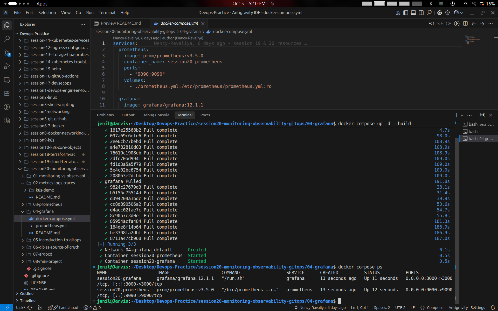

---

#### Demonstration 2: Accessing Grafana Web Authentication Interface
Accessing the Grafana visualization portal at `http://localhost:3000/login`.

**Screenshot Output:**
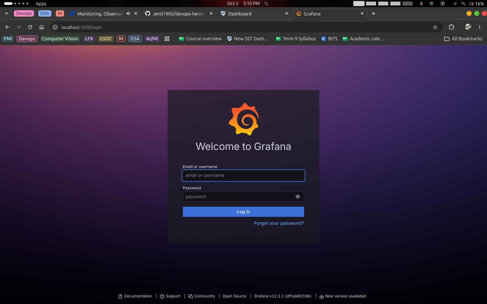

---

#### Demonstration 3: Navigating the Grafana Home Dashboard
Exploring the main dashboard interface containing links for Dashboards, Data Sources, Alerts, and Administration.

**Screenshot Output:**
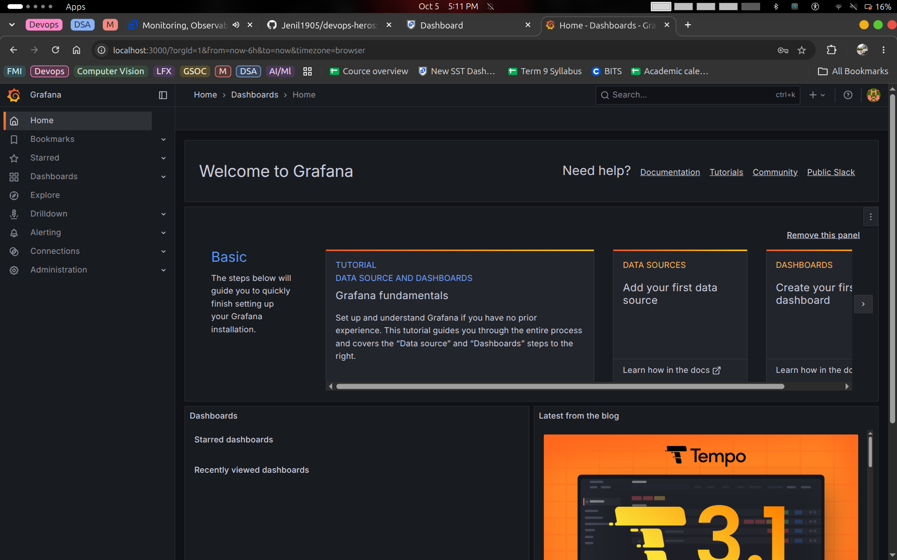

---

#### Demonstration 4: Accessing Prometheus Time-Series Query Engine
Accessing the native Prometheus query browser interface at `http://localhost:9090/query`.

**Screenshot Output:**
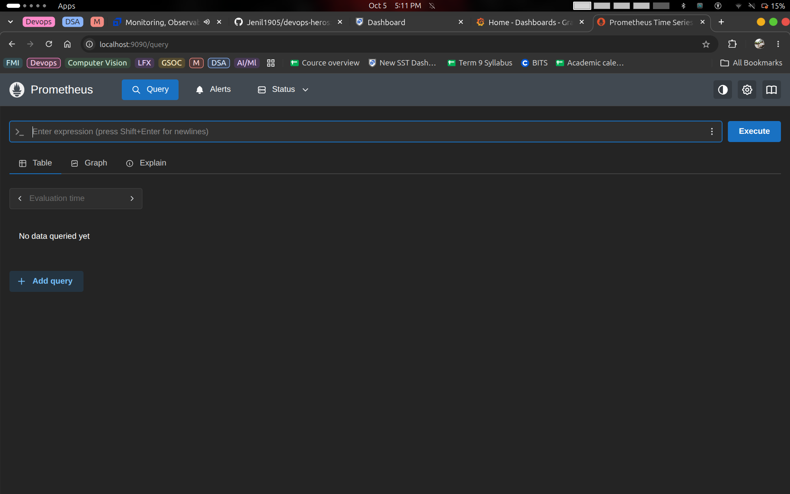

---

#### Demonstration 5: Querying Application Health via the `up` Metric
Running a PromQL query for service target readiness:
```promql
up
```
Evaluation result shows `{instance="prometheus:9090", job="prometheus"} => 1` confirming the target is healthy and actively scraped.

**Screenshot Output:**
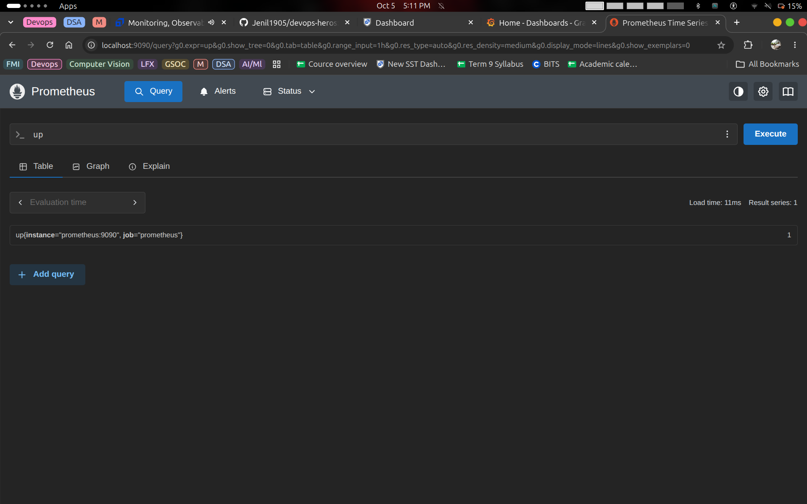

---

#### Demonstration 6: Connecting Data Sources in Grafana
Opening the Grafana Data Source manager to integrate Prometheus as the time-series backend.

**Screenshot Output:**
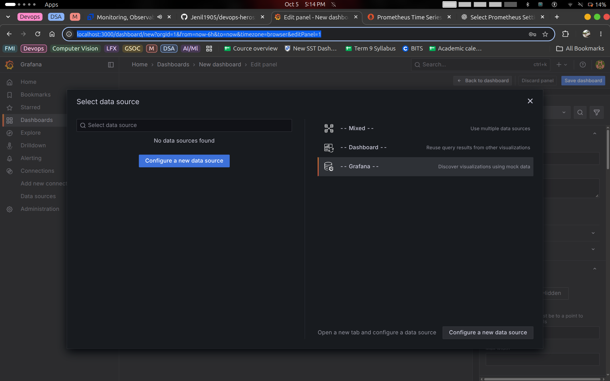

---

#### Demonstration 7: Configuring the Prometheus HTTP Connection
Configuring Prometheus server endpoint URL `http://localhost:9090` and establishing connection test.

**Screenshot Output:**
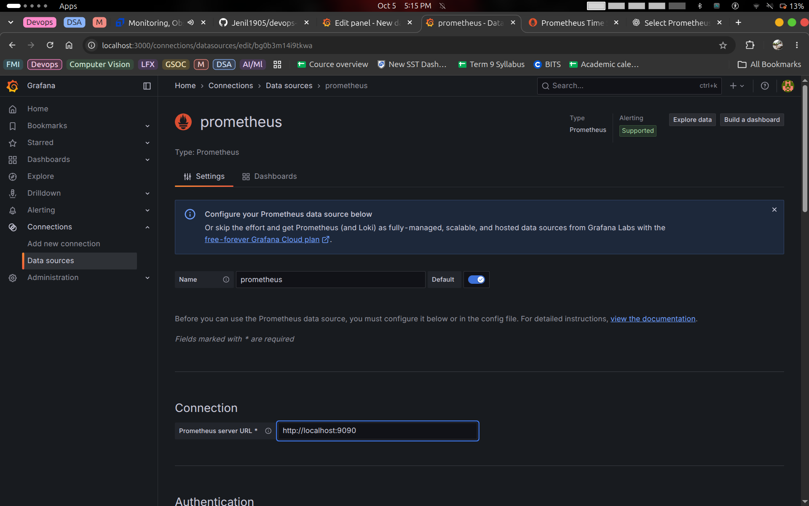

---

#### Demonstration 8: Creating Dashboard Panel & Alert Configuration
Opening the Grafana Panel Editor with Query builder, Transformation pipelines, and Alert threshold configuration tabs.

**Screenshot Output:**
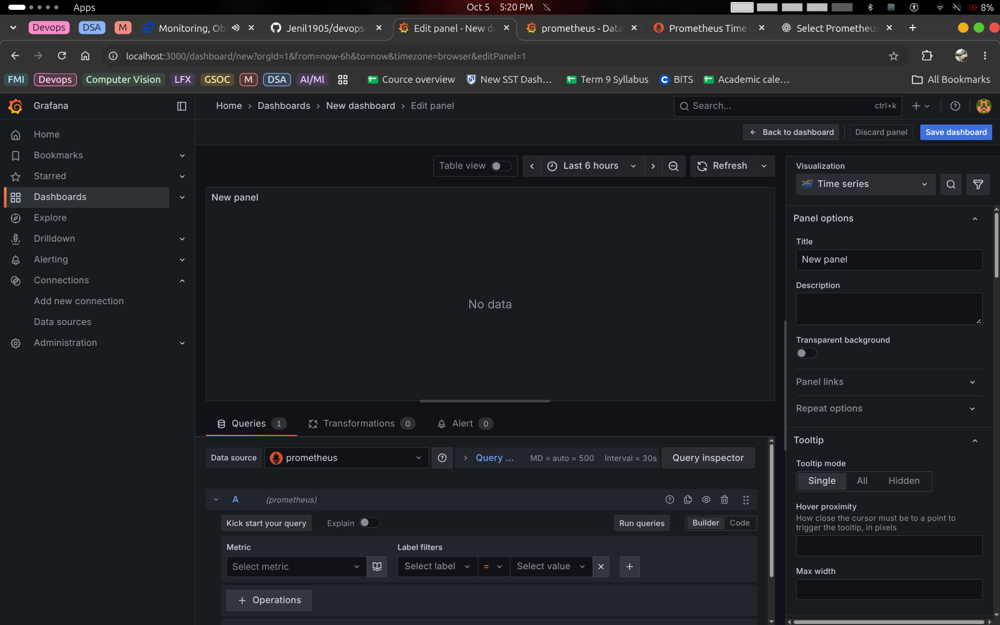

---

#### Demonstration 9: Visualizing Application Health on a Time Series Graph
Plotted time series representation of the application health status metric (`up` = 1) over time.

**Screenshot Output:**
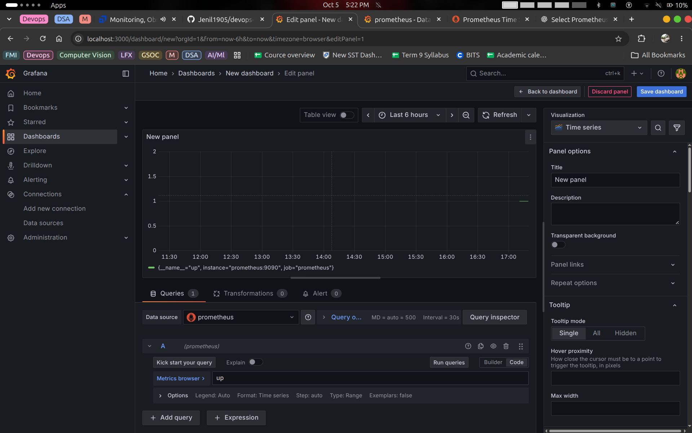

---

#### Demonstration 10: Application Health Status Indicator (Stat Panel)
Displaying real-time health indicator using a single Stat visual with color-coded threshold (`1` in green).

**Screenshot Output:**
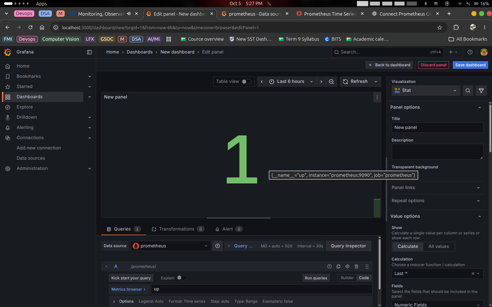

---

#### Demonstration 11: Tracking CPU Utilization (`process_cpu_seconds_total`)
Monitoring process CPU usage consumption counter metric in seconds:
```promql
process_cpu_seconds_total
```
Value shows `2.73` seconds of total CPU compute consumed.

**Screenshot Output:**
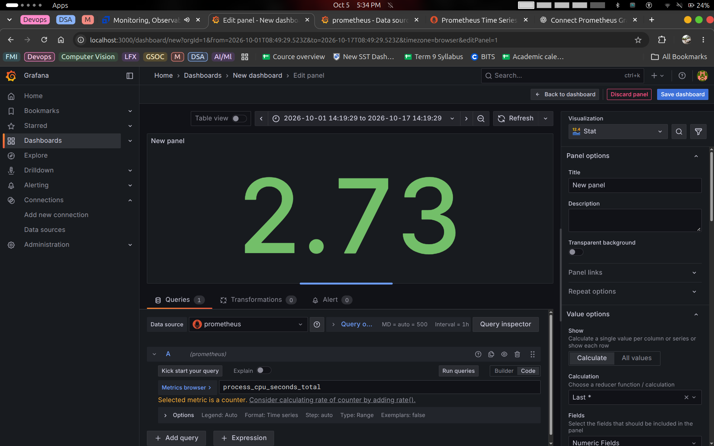

---

## Task 2: Observability

### 2.1 The Three Major Pillars of Observability

Observability is a measure of how well internal states of a system can be inferred from knowledge of its external outputs.

```
                  +--------------------------------+
                  |    PILLARS OF OBSERVABILITY    |
                  +---------------+----------------+
                                  |
         +------------------------+------------------------+
         |                        |                        |
         v                        v                        v
   +-----------+            +-----------+            +-----------+
   |  METRICS  |            |   LOGS    |            |  TRACES   |
   |           |            |           |            |           |
   | Aggregated|            | Detailed  |            | Request   |
   | Numerical |            | Event     |            | Lifecycle |
   | Data      |            | Records   |            | Flow      |
   +-----+-----+            +-----+-----+            +-----+-----+
         |                        |                        |
         | "Is there              | "What                  | "Where did
         |  a problem?"           |  happened?"            |  it happen?"
```

#### 1. Metrics (Numerical Aggregations)
- **Definition:** Numeric values measured over time intervals. Highly compressible and cost-effective for alerting and graphing trends.
- **Key Types:**
  - *Counter:* Monotonically increasing number (e.g., total requests served).
  - *Gauge:* Value that goes up and down (e.g., memory usage, active connections).
  - *Histogram / Summary:* Sample observations bucketed into percentiles (e.g., p95/p99 request latency).
- **Answers:** *"Is there a spike in errors or latency?"*

#### 2. Logs (Context-Rich Discrete Events)
- **Definition:** Text or structured JSON messages emitted by applications when specific events occur.
- **Contents:** Timestamp, severity level (`INFO`, `WARN`, `ERROR`), service name, transaction ID, error stack trace.
- **Answers:** *"What specific error or exception occurred at that exact timestamp?"*

#### 3. Traces (Distributed Request Flow)
- **Definition:** Follows the path of a single transaction or request as it flows through various services and databases in a distributed microservices architecture.
- **Components:**
  - *Trace ID:* Globally unique identifier correlating all steps in one request.
  - *Span:* A single unit of work within a trace with start/end time and tags (e.g., SQL query execution, HTTP call).
- **Answers:** *"Which specific downstream service or database query caused the delay or bottleneck?"*

---

### 2.2 Why Observability is Required

| Dimension | Traditional Monitoring | Modern Observability |
| :--- | :--- | :--- |
| **Problem Type** | Detects **Known Unknowns** (predefined alerts) | Diagnoses **Unknown Unknowns** (unexpected system behaviors) |
| **System Architecture** | Monolithic, static servers | Dynamic microservices, containers, serverless |
| **Question Addressed** | *"Is the service up or down?"* | *"Why is the checkout flow failing for 2% of users in region EU?"* |
| **Resolution Time** | Slower; relies on guesswork and fragmented logs | Faster; correlates metrics to logs and traces (drastically lowers MTTR) |

---

### 2.3 Common Observability Tools

| Pillar | Open-Source Standards | Managed / Enterprise Platforms |
| :--- | :--- | :--- |
| **Metrics** | Prometheus, VictoriaMetrics, InfluxDB | AWS CloudWatch, Datadog, New Relic |
| **Logs** | Grafana Loki, Fluent Bit, Fluentd, OpenSearch / Elasticsearch | Splunk, Datadog Log Management |
| **Traces** | Jaeger, Grafana Tempo, Zipkin, OpenTelemetry (OTel) | Dynatrace, Honeycomb, Datadog APM |
| **Visualization** | Grafana | Grafana Cloud, Datadog Dashboards |

---

### 2.4 Kubernetes Observability Demonstrations

Observing Kubernetes requires tracking cluster control plane health, worker node resources, namespace workloads, and Pod lifecycle states.

#### Demonstration 12: Creating Local Kubernetes Cluster with Kind
Creating a local multi-layer Kubernetes cluster (`session20`) for hosting cloud-native workloads.

```bash
kind create cluster --name session20
```
**Screenshot Output:**
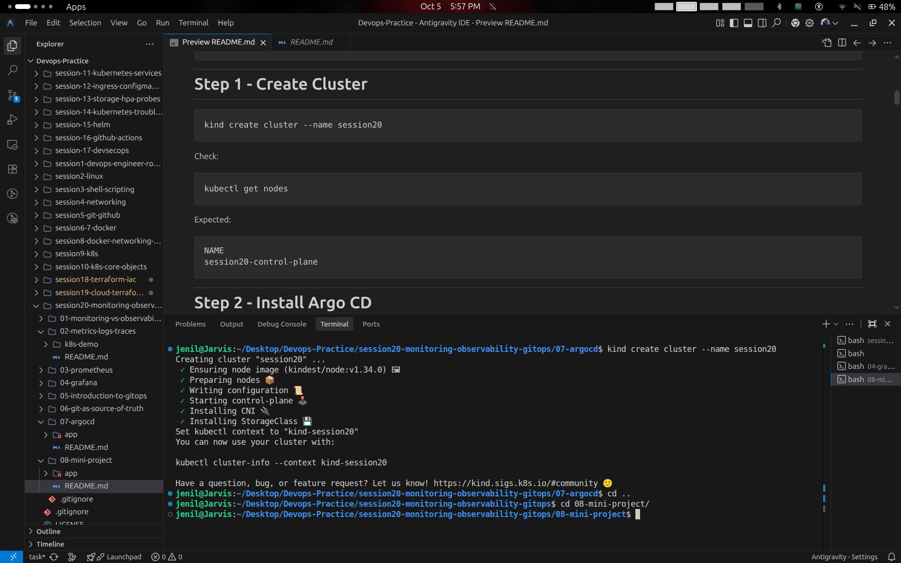

---

#### Demonstration 13: Verifying Kubernetes Node Readiness & Version
Checking node status, role, uptime, and Kubernetes version:
```bash
kubectl get nodes
```
Control plane node is in `Ready` state running version `v1.34.0`.

**Screenshot Output:**
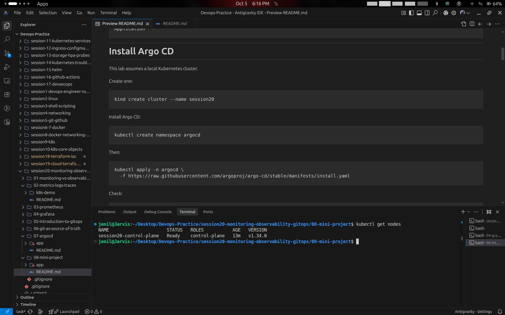

---

#### Demonstration 14: Installing Workload Controllers & Manifests
Creating dedicated namespace and applying infrastructure controller manifests for Argo CD.

```bash
kubectl create namespace argocd
kubectl apply -n argocd -f https://raw.githubusercontent.com/argoproj/argo-cd/stable/manifests/install.yaml
```
**Screenshot Output:**
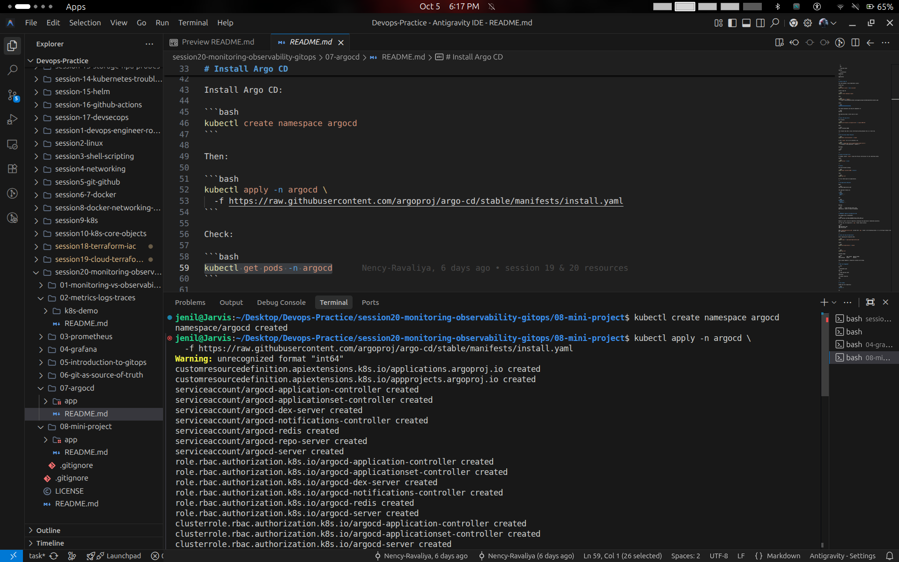

---

#### Demonstration 15: Observing Pod Lifecycle States & Workload Health
Monitoring rollout states, container creation phases, and readiness across namespace pods:
```bash
kubectl get pods -n argocd
```
Demonstrates real-time observation of Kubernetes pod lifecycle phases (`ContainerCreating`, `Init:0/1`, `Running`).

**Screenshot Output:**
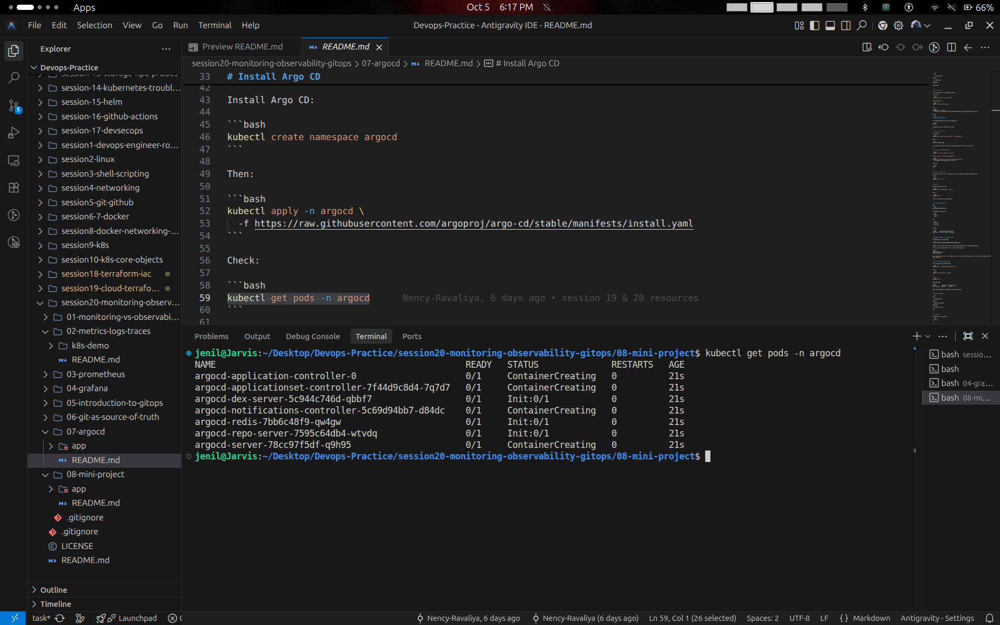

---

## 3. Summary & Quick Reference

| Tool / Command | Purpose | Observability Signal |
| :--- | :--- | :--- |
| `docker compose up -d` | Launches Prometheus & Grafana stack | Monitoring Infrastructure |
| `up` | Evaluates service health status | Metrics / Application Health |
| `process_cpu_seconds_total` | Measures compute utilization over time | System Resource Metric |
| Grafana Stat & Time Series | Visualizes metric trends and threshold states | Dashboarding / Alerting |
| `kind create cluster` | Spins up local Kubernetes environment | Infrastructure Host |
| `kubectl get nodes` | Verifies node health and readiness | Infrastructure Status |
| `kubectl get pods -n <ns>` | Inspects workload phases and health | Container Lifecycle Observability |
