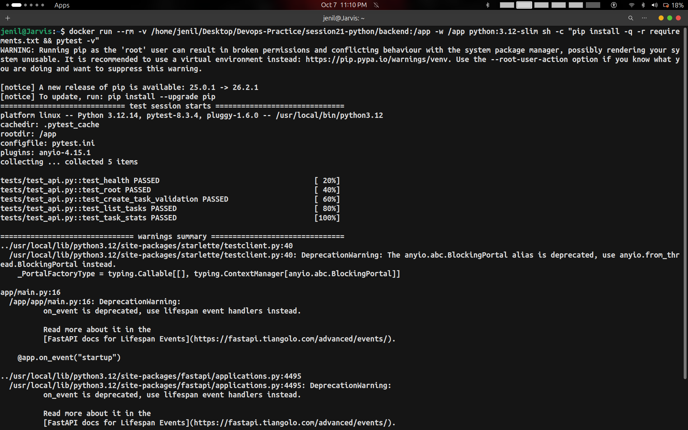
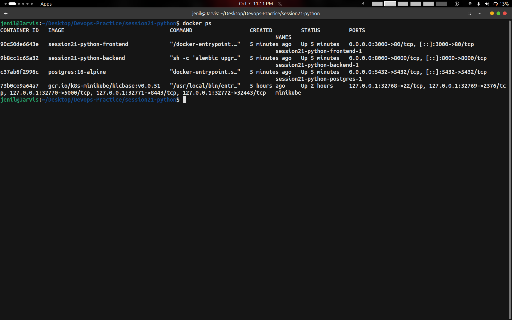
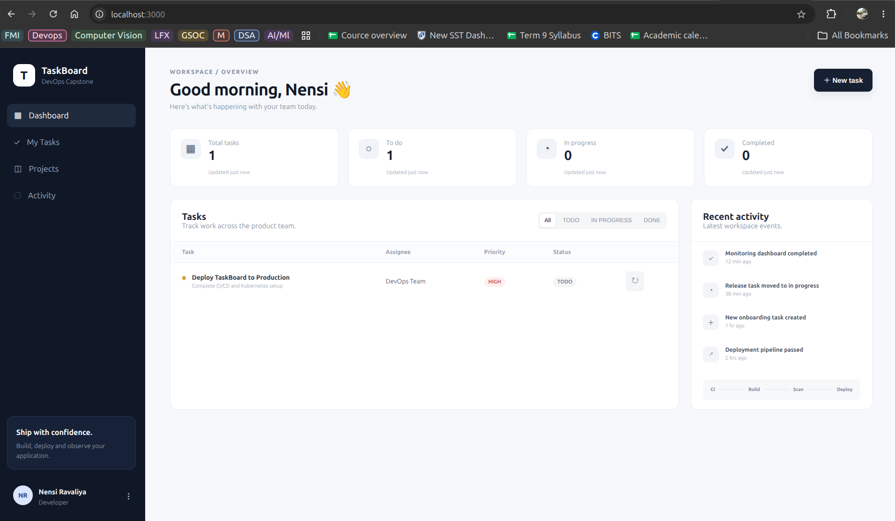
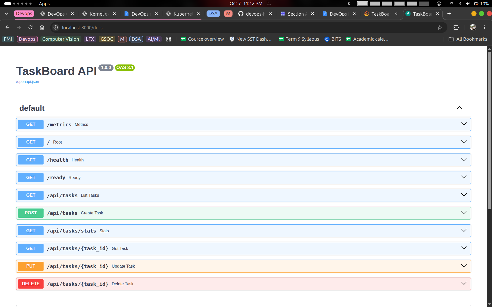
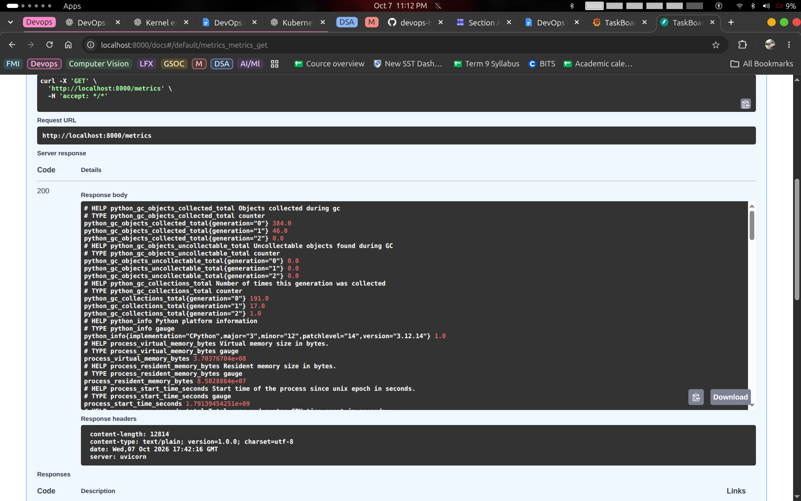
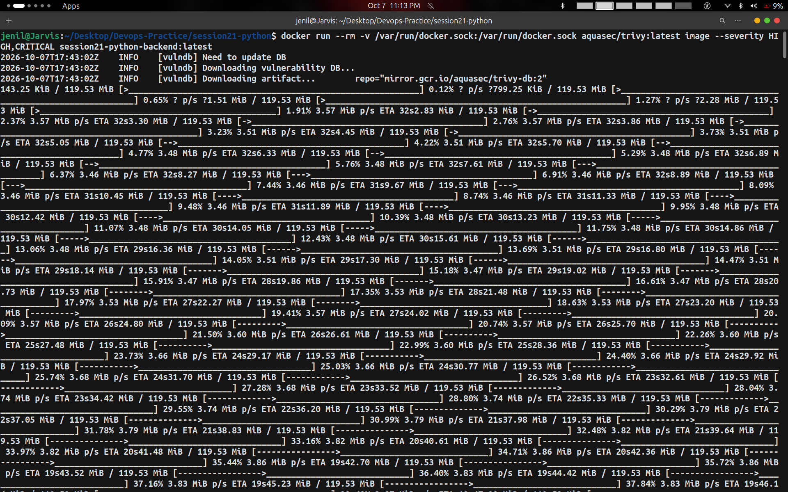
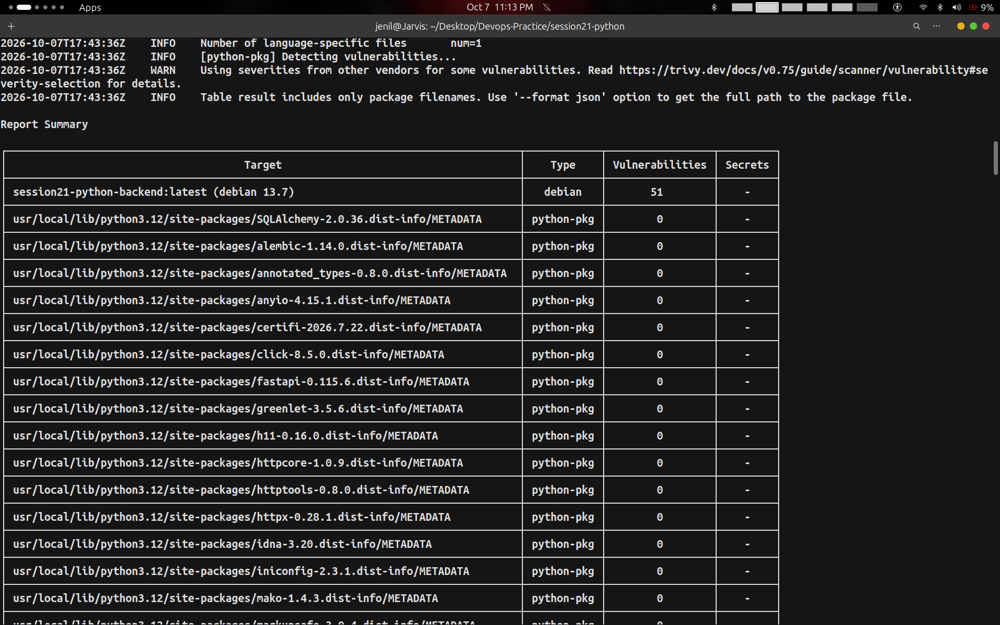
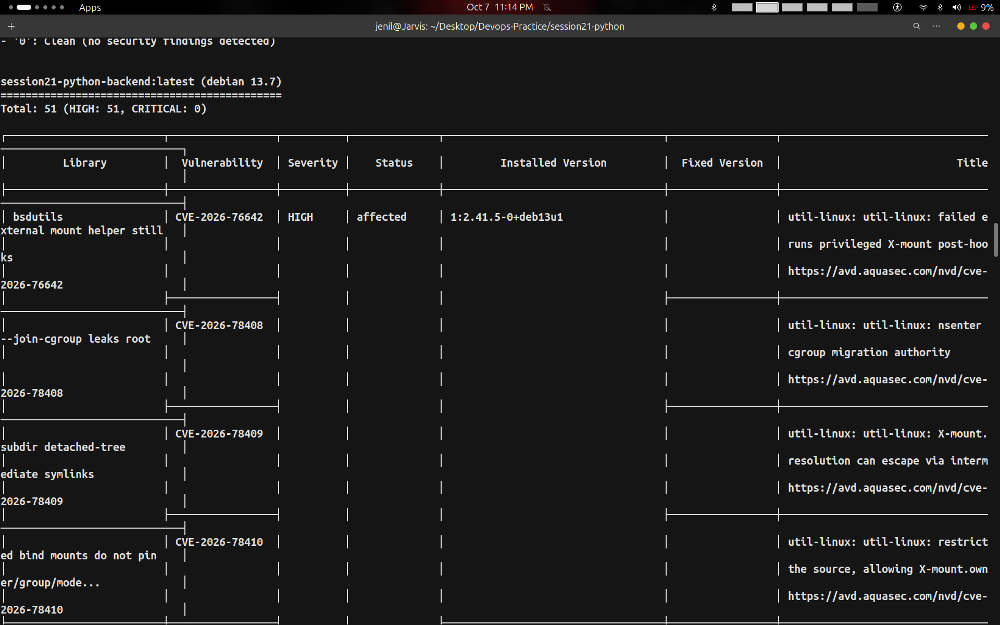
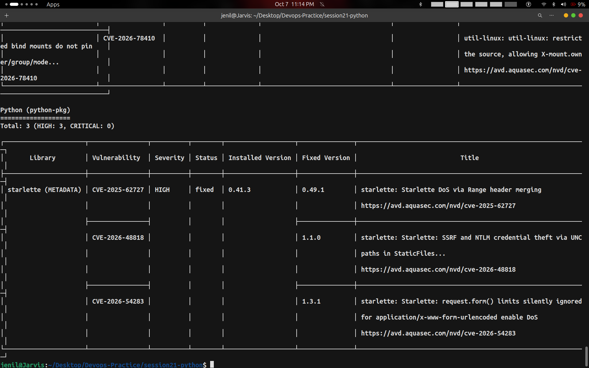
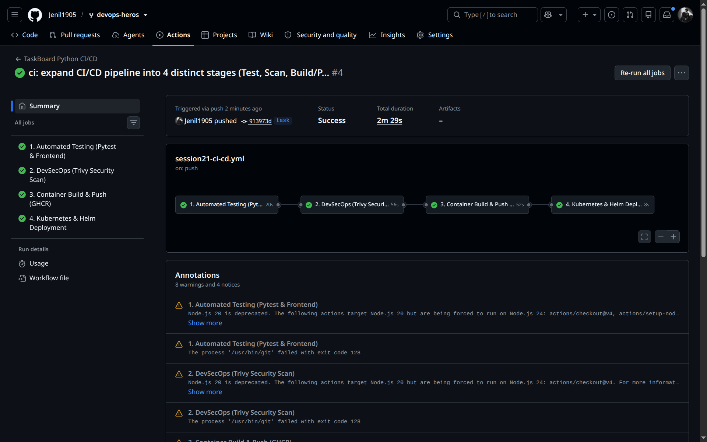

# Session 21: DevOps Final Capstone — TaskBoard (Python Stack)

- **Student Name:** Jenil
- **Session:** Session 21 — DevOps Final Capstone Project
- **Project:** TaskBoard Multi-Tier SaaS Application & DevSecOps CI/CD Pipeline
- **Stack:** React (Vite) + FastAPI (Python 3.12) + PostgreSQL 16 + Alembic + Docker + Trivy + GitHub Actions + Helm & Kubernetes

---

## Table of Contents
1. [Project Overview & Architecture](#1-project-overview--architecture)
2. [Application Components](#2-application-components)
   - [2.1 React + Vite Frontend](#21-react--vite-frontend)
   - [2.2 FastAPI Python Backend](#22-fastapi-python-backend)
   - [2.3 PostgreSQL & Alembic Migrations](#23-postgresql--alembic-migrations)
   - [2.4 Containerization Strategy](#24-containerization-strategy)
3. [Quality Gate: Automated Testing (Pytest)](#3-quality-gate-automated-testing-pytest)
4. [Local Multi-Container Deployment (Docker Compose)](#4-local-multi-container-deployment-docker-compose)
5. [Application Interface & API Documentation](#5-application-interface--api-documentation)
   - [5.1 TaskBoard Web UI Dashboard](#51-taskboard-web-ui-dashboard)
   - [5.2 FastAPI Interactive Swagger Documentation (`/docs`)](#52-fastapi-interactive-swagger-documentation-docs)
   - [5.3 Prometheus Observability Metrics (`/metrics`)](#53-prometheus-observability-metrics-metrics)
6. [DevSecOps: Trivy Container Security Scanning](#6-devsecops-trivy-container-security-scanning)
7. [GitHub Actions 4-Stage CI/CD Pipeline](#7-github-actions-4-stage-cicd-pipeline)
8. [Summary of Commands](#8-summary-of-commands)

---

## 1. Project Overview & Architecture

TaskBoard is a modern, enterprise-grade project management application designed to showcase a complete DevOps lifecycle from local development to an automated DevSecOps CI/CD pipeline and cloud-native containerized delivery.

```text
Developer Laptop
       │  (Git Push)
       ▼
GitHub Repository (Jenil1905/devops-heros)
       │
       ▼
GitHub Actions CI/CD Pipeline
  ├── 1. Automated Testing (Pytest 5/5 PASSED + React Build)
  ├── 2. DevSecOps (Trivy Container & Dependency Scan)
  ├── 3. Build & Tag (Git Commit SHA) ──► Push to GHCR
  └── 4. Kubernetes / Helm Deployment Validation
       │
       ▼
Container Orchestration (Docker / Kubernetes)
  ├── Frontend: React + Vite (Nginx Reverse Proxy) [:3000]
  ├── Backend: FastAPI (Python 3.12 + Uvicorn) [:8000]
  └── Database: PostgreSQL 16 (Alembic Managed Migrations) [:5432]
```

---

## 2. Application Components

### 2.1 React + Vite Frontend
- Single-page application built with React, Vite, and clean modular CSS.
- Features KPI overview cards (Total Tasks, To Do, In Progress, Completed), a Kanban task table, status filtering, priority badges (`HIGH`, `MEDIUM`, `LOW`), and real-time activity indicators.
- Multi-stage Docker build packaging the static bundle into an Alpine Nginx runtime.

### 2.2 FastAPI Python Backend
- High-performance asynchronous REST API powered by FastAPI and Uvicorn.
- Exposes complete CRUD operations:
  - `GET /` — Service health & version metadata
  - `GET /health` — Liveness probe endpoint
  - `GET /ready` — Database connectivity readiness probe
  - `GET /metrics` — Prometheus telemetry instrumentation
  - `GET /api/tasks` — List tasks ordered by creation
  - `POST /api/tasks` — Create new task with schema validation
  - `GET /api/tasks/stats` — Real-time status counts aggregation
  - `PUT /api/tasks/{id}` & `DELETE /api/tasks/{id}` — Task modifications

### 2.3 PostgreSQL & Alembic Migrations
- Relational schema managed declaratively via SQLAlchemy ORM models.
- Database versioning and migrations handled through Alembic (`alembic upgrade head`).

### 2.4 Containerization Strategy
- **Backend Image:** Starts from `python:3.12-slim`, runs as a non-root user (`uid 10001:appuser`), applies database migrations before booting Uvicorn.
- **Frontend Image:** Multi-stage build (`node:22-alpine` builder stage, `nginx:1.27-alpine` production runner) keeping development dependencies completely out of the runtime container.

---

## 3. Quality Gate: Automated Testing (Pytest)

Before any Docker image is built or promoted, automated unit and integration tests execute against the FastAPI application.

```bash
docker run --rm -v /home/jenil/Desktop/Devops-Practice/session21-python/backend:/app -w /app python:3.12-slim sh -c "pip install -q -r requirements.txt && pytest -v"
```

All 5 test cases passed with zero regressions:
1. `test_health` — Verifies `/health` returns `{"status": "UP"}`
2. `test_root` — Validates root API payload and service identity
3. `test_create_task_validation` — Validates schema constraints on task creation
4. `test_list_tasks` — Verifies querying existing records
5. `test_task_stats` — Ensures metrics aggregation returns correct totals



---

## 4. Local Multi-Container Deployment (Docker Compose)

The multi-tier stack is declared in `docker-compose.yml`, spinning up PostgreSQL, FastAPI, and Nginx/React simultaneously.

```bash
cd /home/jenil/Desktop/Devops-Practice/session21-python
docker compose up --build -d
docker compose ps
```

All three services initialize and report healthy running states:



---

## 5. Application Interface & API Documentation

### 5.1 TaskBoard Web UI Dashboard
The application dashboard is accessible at `http://localhost:3000`. It dynamically interacts with the FastAPI backend through Nginx reverse proxying.



---

### 5.2 FastAPI Interactive Swagger Documentation (`/docs`)
FastAPI automatically generates interactive OpenAPI/Swagger documentation at `http://localhost:8000/docs`.



---

### 5.3 Prometheus Observability Metrics (`/metrics`)
The application is pre-instrumented with `prometheus-fastapi-instrumentator` exposing real-time garbage collection, memory, HTTP request count, and latency metrics at `http://localhost:8000/metrics`.



---

## 6. DevSecOps: Trivy Container Security Scanning

As part of security-first development (DevSecOps), container images and application dependencies are audited using Aqua Security's **Trivy** vulnerability scanner.

```bash
docker run --rm -v /var/run/docker.sock:/var/run/docker.sock aquasec/trivy:latest image --severity HIGH,CRITICAL session21-python-backend:latest
```

### 6.1 Vulnerability Database Synchronization
Trivy pulls the latest CVE vulnerability database before scanning:



---

### 6.2 Container Vulnerability Scan Summary
A total summary of detected vulnerabilities categorized by target type (Debian OS packages vs. Python language packages):



---

### 6.3 Base OS Vulnerability Analysis
Audit of Debian Linux packages in the Python base image identifying known security advisories:



---

### 6.4 Python Dependency Vulnerability Audit
Package scan inspecting Python libraries (e.g. `starlette` CVEs) for known vulnerabilities:



---

## 7. GitHub Actions 4-Stage CI/CD Pipeline

The automated CI/CD pipeline is defined in `.github/workflows/session21-ci-cd.yml`. It triggers automatically on every push or pull request to the `task` and `main` branches.

### Pipeline Stages:
1. **1. Automated Testing (Pytest & Frontend):** Executes Pytest against Python 3.12 and compiles React assets via Node.js 22.
2. **2. DevSecOps (Trivy Security Scan):** Performs automated container vulnerability scanning on backend and frontend images.
3. **3. Container Build & Push (GHCR):** Tags containers with the immutable Git commit SHA and pushes them to GitHub Container Registry (`ghcr.io/jenil1905/taskboard-*`).
4. **4. Kubernetes & Helm Deployment:** Lints Helm charts (`helm lint`) and validates rendered Kubernetes manifests for production deployment.

### Pipeline Success Graph:
The complete pipeline ran successfully across all 4 sequential stages in **2m 29s**:



---

## 8. Summary of Commands

| Phase | Command | Description |
|---|---|---|
| **Automated Tests** | `docker run --rm -v $(pwd)/backend:/app -w /app python:3.12-slim sh -c "pip install -q -r requirements.txt && pytest -v"` | Executes all 5 Pytest unit and integration test cases |
| **Local Deployment** | `docker compose up --build -d` | Builds and boots PostgreSQL, FastAPI backend, and React frontend |
| **Status Check** | `docker compose ps` | Verifies container status, port mappings, and health |
| **Liveness Check** | `curl -s http://localhost:8000/health` | Verifies FastAPI application is alive |
| **Readiness Check** | `curl -s http://localhost:8000/ready` | Verifies database connectivity |
| **Security Scan** | `docker run --rm -v /var/run/docker.sock:/var/run/docker.sock aquasec/trivy:latest image --severity HIGH,CRITICAL session21-python-backend:latest` | Audits container images for HIGH and CRITICAL vulnerabilities |
| **Helm Lint** | `helm lint ./helm/taskboard` | Validates Helm chart syntax and best practices |
| **Helm Render** | `helm template taskboard ./helm/taskboard` | Dry-runs and renders all Kubernetes YAML manifests |
| **Stack Teardown** | `docker compose down` | Stops and removes local container stack |
