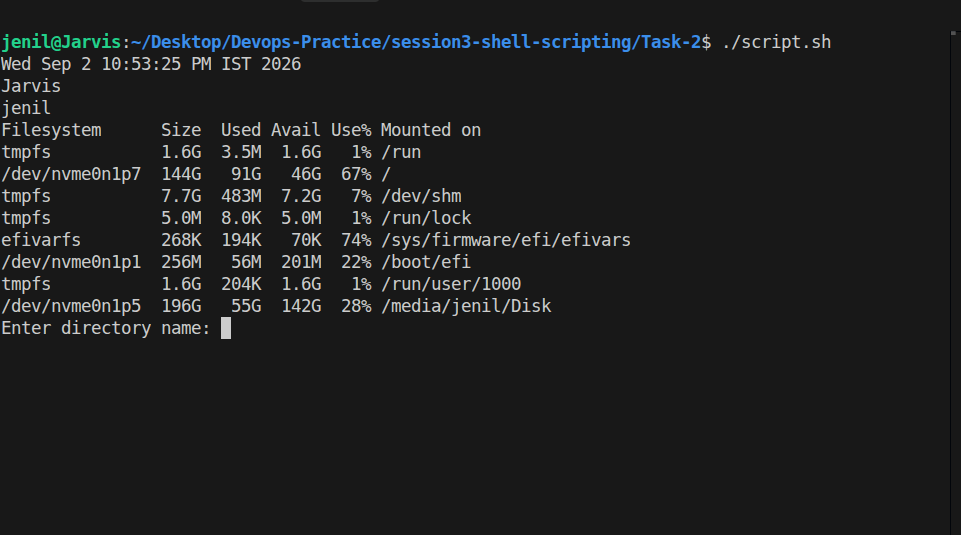

# Task 2 Output



```text
Wed Sep 2 10:53:25 PM IST 2026
Jarvis
jenil
Filesystem      Size  Used Avail Use% Mounted on
tmpfs           1.6G  3.5M  1.6G   1% /run
/dev/nvme0n1p7  144G   91G   46G  67% /
tmpfs           7.7G  483M  7.2G   7% /dev/shm
tmpfs           5.0M  8.0K  5.0M   1% /run/lock
efivarfs        268K  194K   70K  74% /sys/firmware/efi/efivars
/dev/nvme0n1p1  256M   56M  201M  22% /boot/efi
tmpfs           1.6G  204K  1.6G   1% /run/user/1000
/dev/nvme0n1p5  196G   55G  142G  28% /media/jenil/Disk

Enter directory name: test_dir
Enter file name: process.log
```
