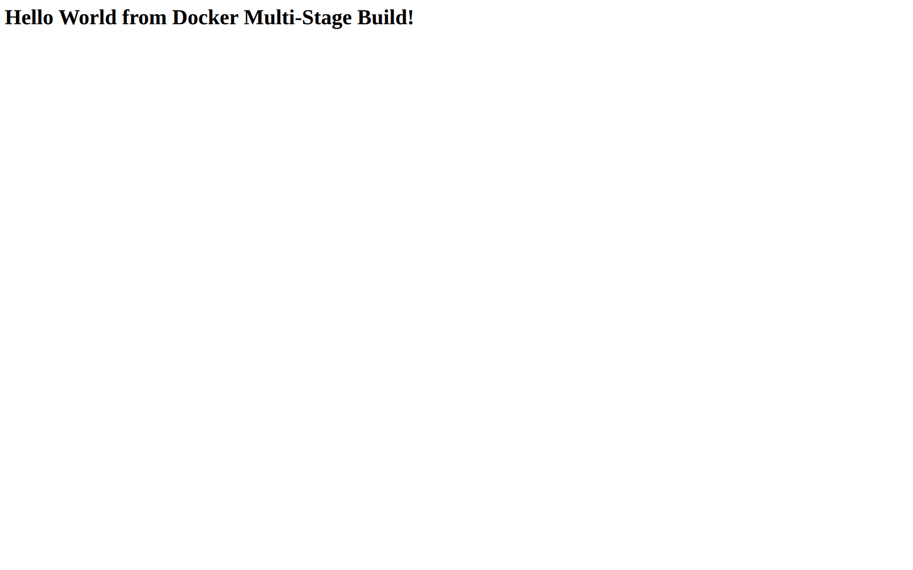
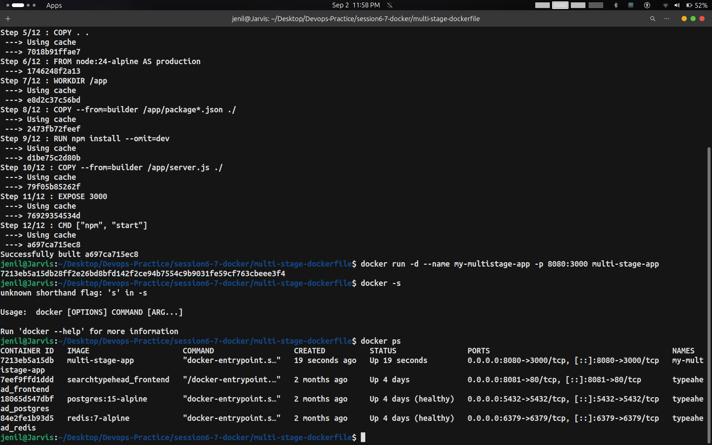

# Task 2: Multi-Stage Docker Build

- Name: Jenil
- Enrollment No: 10323

---

## Steps Done

1. Navigated into the cloned repository:
   ```bash
   cd ~/Desktop/Devops-Practice/session6-7-docker/multi-stage-dockerfile
   ```

2. Built the Docker image using multi-stage Dockerfile:
   ```bash
   docker build -t multi-stage-app .
   ```

3. Ran container on host port 8080 mapping to container port 3000:
   ```bash
   docker run -d --name my-multistage-app -p 8080:3000 multi-stage-app
   ```

---

## Outputs & Verification

### 1. Web Output Check


```html
Hello World from Docker Multi-Stage Build!
```

### 2. Docker PS & Terminal Output


```text
CONTAINER ID   IMAGE             COMMAND                  CREATED          STATUS          PORTS                                         NAMES
7213eb5a15db   multi-stage-app   "docker-entrypoint.s…"   19 seconds ago   Up 19 seconds   0.0.0.0:8080->3000/tcp, [::]:8080->3000/tcp   my-multistage-app
```
