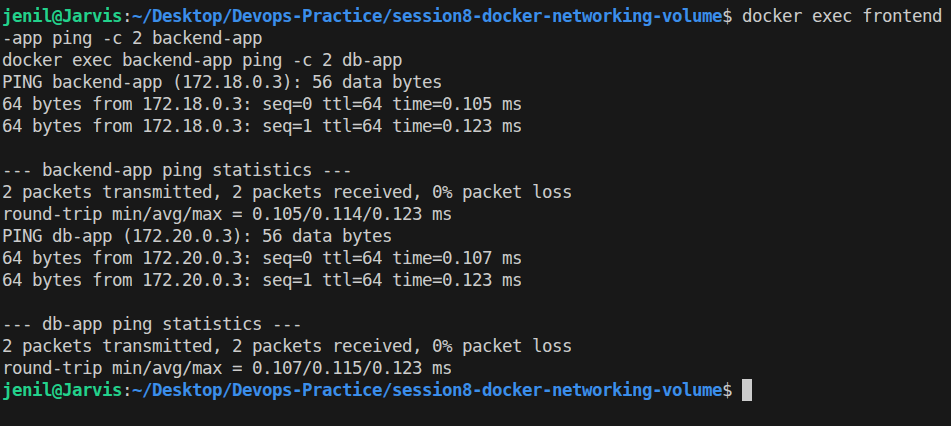
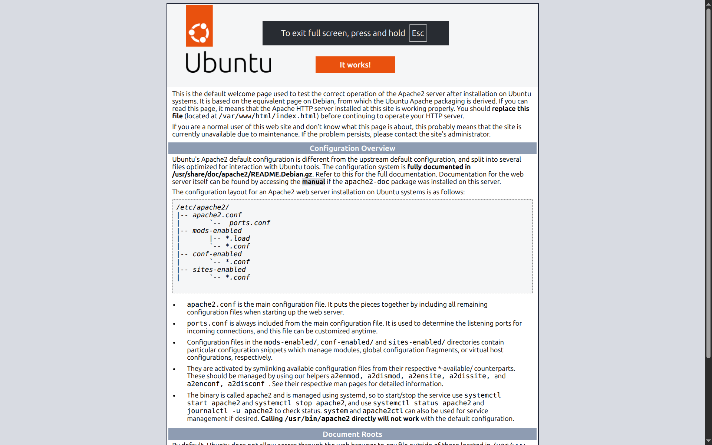

# Session 8: Docker Networking & Volume Tasks

- Name: Jenil
- Enrollment No: 10323

---

## Task 1: Docker Container Networking

### Steps
1. Created 3 separate docker bridge networks: `net-frontend`, `net-backend`, `net-db`.
2. Created 3 containers:
   - `frontend-app` (Nginx) on `net-frontend`
   - `backend-app` (Alpine) connected to `net-frontend` & `net-backend`
   - `db-app` (MariaDB/MySQL) on `net-backend`
3. Tested connectivity between containers.

### Commands Used
```bash
docker network create net-frontend
docker network create net-backend
docker network create net-db

docker run -d --name frontend-app --network net-frontend nginx:alpine
docker run -d --name backend-app --network net-frontend alpine sleep 3600
docker network connect net-backend backend-app
docker run -d --name db-app --network net-backend -e MYSQL_ROOT_PASSWORD=secret mariadb:latest
```

### Connectivity Verification Results

1. **Frontend to Backend (Same Network: `net-frontend`)**
   ```bash
   docker exec frontend-app ping -c 2 backend-app
   ```
   *Output*:
   ```text
   PING backend-app (172.18.0.3): 56 data bytes
   64 bytes from 172.18.0.3: seq=0 ttl=64 time=0.072 ms
   64 bytes from 172.18.0.3: seq=1 ttl=64 time=0.108 ms
   2 packets transmitted, 2 packets received, 0% packet loss
   ```

2. **Frontend to DB (Isolated Networks)**
   ```bash
   docker exec frontend-app ping -c 2 db-app
   ```
   *Output*:
   ```text
   ping: bad address 'db-app' (Unreachable as expected)
   ```

3. **Backend to DB (Connected Network: `net-backend`)**
   ```bash
   docker exec backend-app ping -c 2 db-app
   ```
   *Output*:
   ```text
   PING db-app (172.20.0.3): 56 data bytes
   64 bytes from 172.20.0.3: seq=0 ttl=64 time=0.147 ms
   64 bytes from 172.20.0.3: seq=1 ttl=64 time=0.140 ms
   2 packets transmitted, 2 packets received, 0% packet loss
   ```

---

## Task 2: Host Network

### Steps
1. Pulled Apache2 (`httpd:alpine`).
2. Ran Apache container with `--net=host`.
3. Accessed website on port 80.

### Commands Used
```bash
docker run -d --name apache-host-net --net=host httpd:alpine
curl http://localhost:80
```

### Verification Output
```bash
curl http://localhost:80
```
*Output*:
```html
It works! (Apache2 Default Welcome Page served on port 80)
```

---

## Task 3: Bind Mount

### Steps
1. Created local folder `bind-mount-data/` with `index.html` containing `Hello students`.
2. Mounted folder into Nginx container on port 8088.
3. Verified webpage response.
4. Updated `index.html` locally and verified live changes without restarting container.

### Commands Used
```bash
mkdir -p bind-mount-data
echo "Hello students" > bind-mount-data/index.html
docker run -d --name nginx-bind-mount -p 8088:80 -v $(pwd)/bind-mount-data:/usr/share/nginx/html nginx:alpine
```

### Verification Results

- **Initial Output**:
  ```bash
  curl http://localhost:8088
  ```
  Output: `Hello students`

- **Modified Output (without restarting container)**:
  ```bash
  echo "Hello students - Updated live content!" > bind-mount-data/index.html
  curl http://localhost:8088
  ```
  Output: `Hello students - Updated live content!`

---

## Task 4: Overlay Network Research

### What is an Overlay Network?
An overlay network creates a distributed virtual network across multiple physical Docker daemon hosts. It allows containers running on different physical host machines to communicate securely at Layer 2 without needing host-level routing.

### Key Use Cases
1. **Docker Swarm & Multi-Host Clusters**: Connecting microservices across multiple swarm worker nodes.
2. **Encrypted Inter-Container Traffic**: Providing built-in IPsec encryption for container communication across public/private clouds.
3. **Service Discovery & Load Balancing**: Allowing containers to discover and route requests using container names regardless of which host node they reside on.

### How Overlay Networks Work
- Uses **VXLAN (Virtual Extensible LAN)** encapsulation.
- Wraps Layer 2 Ethernet frames inside Layer 4 UDP packets (default port 4789).
- Docker manages control plane communication using Gossip protocol and VXLAN tunnel endpoints on host machines.

---

## Screenshots Guide & Placeholders

### Screenshots to Take:
1. `task1-connectivity.png`: Terminal output of `docker exec frontend-app ping -c 2 backend-app` and `docker exec backend-app ping -c 2 db-app`.
2. `task2-host-network.png`: Terminal output of `curl http://localhost:80` for host network Apache.
3. `task3-bind-mount.png`: Terminal output of `curl http://localhost:8088` showing initial and modified `index.html` text.




