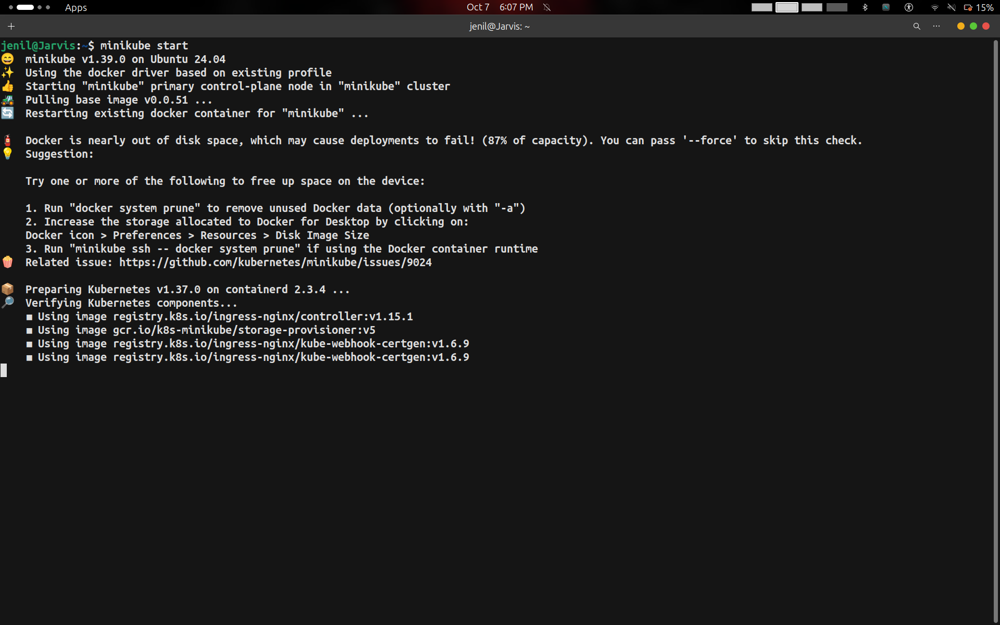
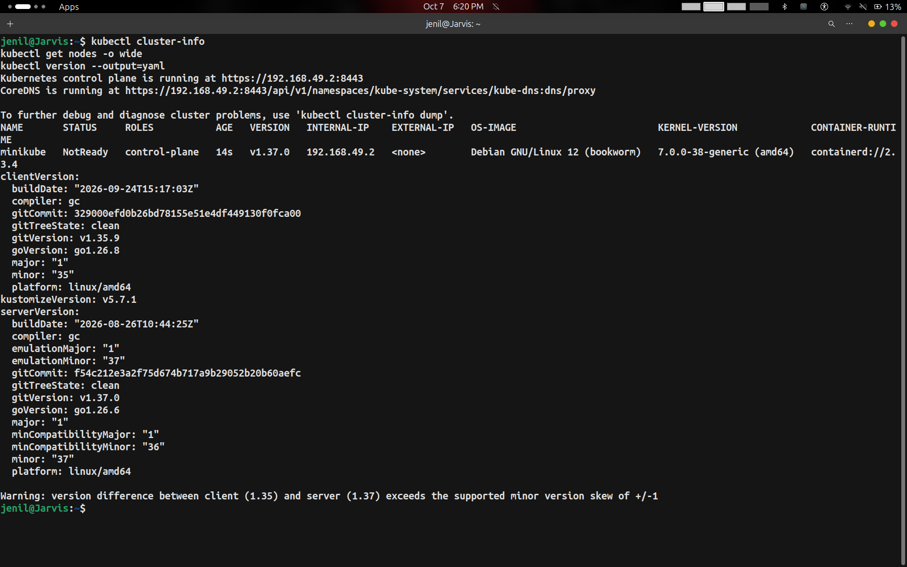
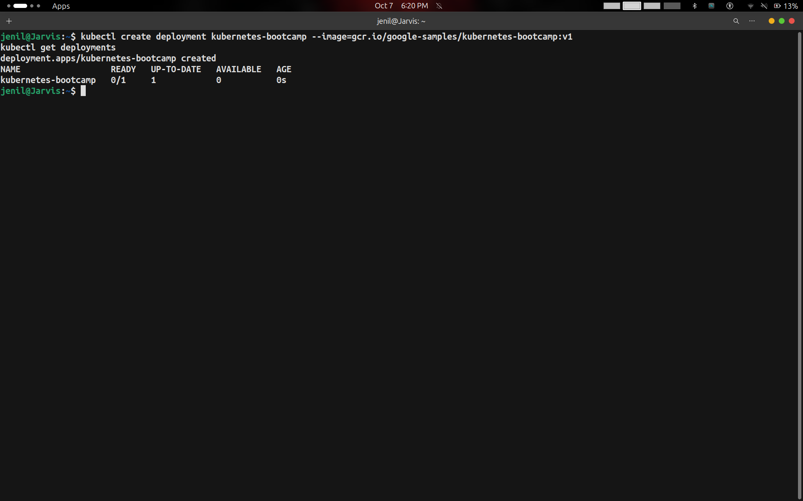
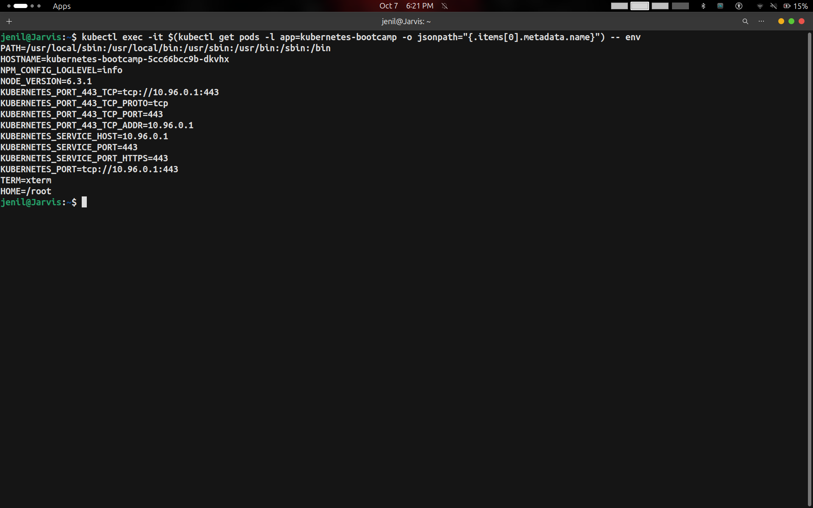
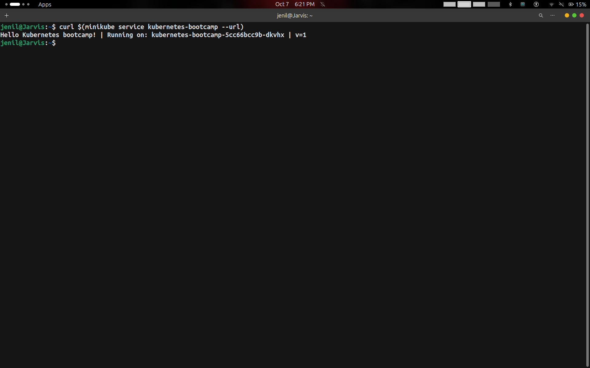
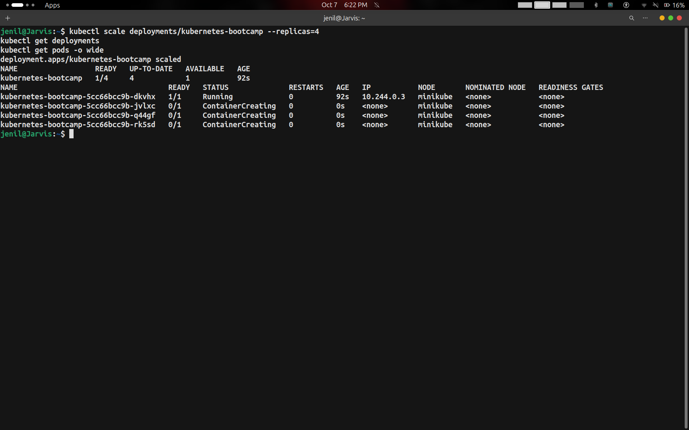
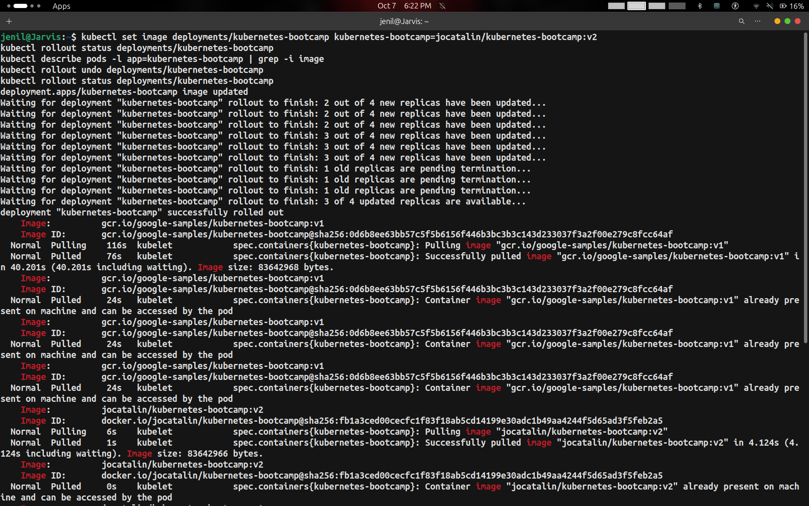
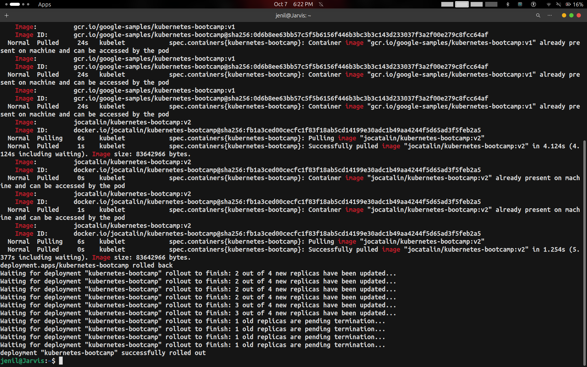
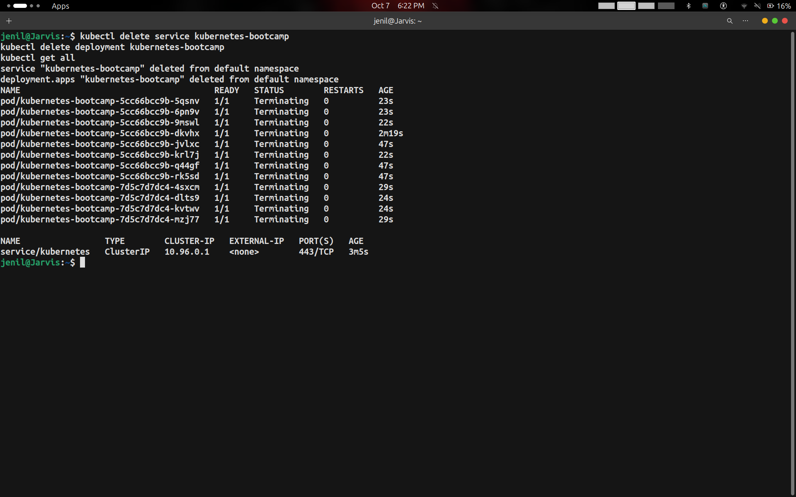

# Session 9 Task: Kubernetes Fundamentals & Minikube Hands-on

- **Student Name:** Jenil
- **Session:** Session 9 — Kubernetes Fundamentals
- **Topic:** Minikube Installation, Cluster Verification, K8s Architecture & Kubernetes Basics Tutorial

---

## 1. Kubernetes Architecture Overview

Kubernetes is an open-source container orchestration platform designed to automate deploying, scaling, and managing containerized applications. It follows a **master-worker (Control Plane - Data Plane)** architecture.

```
+-----------------------------------------------------------------------+
|                         KUBERNETES CLUSTER                            |
|                                                                       |
|  +-----------------------------------------------------------------+  |
|  |                 CONTROL PLANE (Master Components)               |  |
|  |                                                                 |  |
|  |   +-------------------+       +---------------------------+     |  |
|  |   | kube-apiserver    |<----->|           etcd            |     |  |
|  |   +---------^---------+       | (Key-Value State Store)   |     |  |
|  |             |                 +---------------------------+     |  |
|  |             +------------+                                      |  |
|  |             |            |                                      |  |
|  |   +---------v---------+  +-------------------------------+      |  |
|  |   |  kube-scheduler   |  | kube-controller-manager       |      |  |
|  |   +-------------------+  +-------------------------------+      |  |
|  +-------------|---------------------------------------------------+  |
|                | (Directs Work)                                       |
|  +-------------v---------------------------------------------------+  |
|  |                   WORKER NODE(S) (Data Plane)                   |  |
|  |                                                                 |  |
|  |   +------------------+         +----------------------------+   |  |
|  |   |     kubelet      |         |         kube-proxy         |   |  |
|  |   +--------|---------+         +--------------|-------------+   |  |
|  |            |                                  |                 |  |
|  |   +--------v----------------------------------v-------------+   |  |
|  |   |             Container Runtime (Docker / containerd)     |   |  |
|  |   |                                                         |   |  |
|  |   |   +--------------------+      +---------------------+   |   |  |
|  |   |   |     Pod 1 (App)    |      |     Pod 2 (App)     |   |   |  |
|  |   |   +--------------------+      +---------------------+   |   |  |
|  |   +---------------------------------------------------------+   |  |
|  +-----------------------------------------------------------------+  |
+-----------------------------------------------------------------------+
```

### Control Plane Components (Master Node)
1. **kube-apiserver**: The central management entity that exposes the Kubernetes API (`kubectl` and all components communicate through it).
2. **etcd**: Consistent, distributed, highly-available key-value store holding the complete state and configuration of the cluster.
3. **kube-scheduler**: Watches for newly created Pods without assigned nodes and selects the optimal node based on resource requirements, constraints, and affinity rules.
4. **kube-controller-manager**: Runs core controller background processes (Node Controller, Replication Controller, Endpoints Controller, ServiceAccount Controller).
5. **cloud-controller-manager**: Integrates with underlying cloud provider APIs (load balancers, storage volumes, routes) when running on cloud infrastructure.

### Worker Node Components (Data Plane)
1. **kubelet**: An agent that runs on each node in the cluster. It ensures containers described in `PodSpecs` are running and healthy.
2. **kube-proxy**: Network proxy maintaining network rules on nodes, enabling Pod-to-Pod and Service-to-Pod communication across cluster networks.
3. **Container Runtime**: The underlying software that executes containers (e.g., `containerd`, `CRI-O`, `Docker`).

### Fundamental Kubernetes Objects
- **Pod**: Smallest deployable compute unit in Kubernetes. Encapsulates one or more containers sharing network namespace (IP) and storage volumes.
- **Deployment**: Declarative controller that manages ReplicaSets and provides declarative updates, rolling deployments, and rollback capabilities for Pods.
- **ReplicaSet**: Ensures a specified number of identical Pod replicas are running at any given time.
- **Service**: An abstract way to expose an application running on a set of Pods as a network service with a stable IP and DNS name (ClusterIP, NodePort, LoadBalancer).
- **Namespace**: Virtual clusters backed by the same physical cluster, used for isolating environments (e.g., dev, staging, prod) and team boundaries.

---

## 2. Hands-on Tasks & Command Output Guide

### Step 1: Start and Configure Minikube
```bash
minikube start
```
**Screenshot Output:**


---

### Step 2: Verify Cluster Status & Node Information
```bash
kubectl cluster-info
kubectl get nodes -o wide
kubectl version --output=yaml
```
**Screenshot Output:**


---

### Step 3: Deploy an Application (Kubernetes Basics Module 2)
```bash
kubectl create deployment kubernetes-bootcamp --image=gcr.io/google-samples/kubernetes-bootcamp:v1
kubectl get deployments
```
**Screenshot Output:**


---

### Step 4: Explore the Application Pod Environment (Kubernetes Basics Module 3)
```bash
kubectl exec -it $(kubectl get pods -l app=kubernetes-bootcamp -o jsonpath="{.items[0].metadata.name}") -- env
```
**Screenshot Output:**


---

### Step 5: Expose the Application via Service & Test Access (Kubernetes Basics Module 4)
```bash
curl $(minikube service kubernetes-bootcamp --url)
```
**Screenshot Output:**


---

### Step 6: Scale the Application (Kubernetes Basics Module 5)
```bash
kubectl scale deployments/kubernetes-bootcamp --replicas=4
kubectl get deployments
kubectl get pods -o wide
```
**Screenshot Output:**


---

### Step 7: Perform Rolling Update (Kubernetes Basics Module 6)
```bash
kubectl set image deployments/kubernetes-bootcamp kubernetes-bootcamp=jocatalin/kubernetes-bootcamp:v2
kubectl rollout status deployments/kubernetes-bootcamp
kubectl describe pods -l app=kubernetes-bootcamp | grep -i image
```
**Screenshot Output:**


---

### Step 8: Rollback the Deployment Revision
```bash
kubectl rollout undo deployments/kubernetes-bootcamp
kubectl rollout status deployments/kubernetes-bootcamp
```
**Screenshot Output:**


---

### Step 9: Clean Up Resources
```bash
kubectl delete service kubernetes-bootcamp
kubectl delete deployment kubernetes-bootcamp
kubectl get all
```
**Screenshot Output:**


---

## 3. Summary of Key `kubectl` Commands

| Command | Description |
| :--- | :--- |
| `minikube start` | Initializes local single-node cluster with container runtime |
| `kubectl cluster-info` | Displays control plane and core service endpoints |
| `kubectl get nodes -o wide` | Lists all cluster nodes with OS, kernel, and runtime details |
| `kubectl create deployment <name> --image=` | Creates a new Deployment controller managing Pods |
| `kubectl get deployments` | Displays status of deployments and replica readiness |
| `kubectl exec -it <pod> -- <cmd>` | Executes an interactive or one-off command inside a container |
| `minikube service <service> --url` | Generates a directly routable local URL for a NodePort service |
| `kubectl scale deployment <name> --replicas=<n>` | Scales the number of Pod replicas up or down |
| `kubectl set image deployment <name> <container>=<new-image>` | Performs a rolling update on container image |
| `kubectl rollout status deployment <name>` | Tracks the live status of an ongoing rollout |
| `kubectl rollout undo deployment <name>` | Reverts deployment to the previous revision |
| `kubectl delete deployment <name>` | Removes the deployment and terminates its managed Pods |
